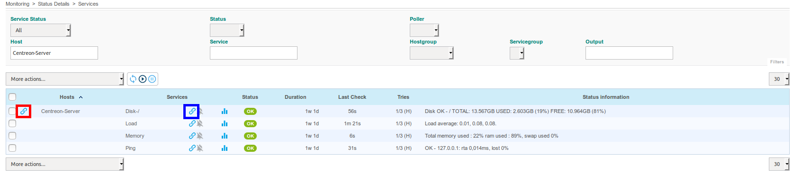

## Introduction

Since version 2.8.0, in the Centreon Open Source suite, the **Knowledge Base** module allows you

to easily associate a wiki with Centreon Web.

It creates links between hosts and services and specific procedures on the wiki.

To make things more flexible, procedures can be associated with templates.

**Knowledge Base** is the solution to easily link a Wiki to Centreon.

## Prerequisites

**Centreon Knowledge Base** requires **MediaWiki** to be installed (version =
1.31) on your system.

You can [download MediaWiki
here](http://www.mediawiki.org/wiki/MediaWiki) and access the [documentation
here](http://www.mediawiki.org/wiki/User_hub).

## Configure the access to the wiki

Before starting with **Knowledge Base**, you need to configure it to access the
wiki database.

To do this, go to **Administration > Parameters > Knowledge Base** and complete
the form

## User guide

### Definition

A procedure is basically a technical document that tells operators
what to do when an alert is raised in Centreon.

There are different types of procedure:

  - Describe actions to solve a problem,
  - Escalate the issue to another team,
  - Open a support ticket,
  - Warn users that a specific service is down.

A procedure can be defined for a host or a service.

### Displayed procedure: template and overload

To avoid a heavy workload caused by the deployment of the procedure, the functionality allows
the administrator to set up a single procedure for hosts/services.

This means that a procedure can be specified for a given host/service, but it can also be specified 
for a host/service template.

If a procedure is defined at template level, all children of the template will
have the procedure attached as well, unless overloaded by a specific one. The
mechanism is identical to the template system in Centreon with inheritance.

The **Knowledge Base** function is designed to avoid manually adding or updating
the same procedure in the knowledge base several times.

When a user clicks a host procedure:

  - if a specific procedure is defined for this host, its wiki page is displayed
  - if no specific procedure is defined but the host template has a procedure,
    the host template wiki page is displayed
  - if the host template has no procedure defined, the parent template will be checked
    for a defined procedure
  - finally, if no procedure is defined in the template tree, a message will warn
    that there is no procedure defined for this host

The same applies to services.

### Create / Update / Delete a procedure

Navigate in the **Configuration > Knowledge Base** sub-menus

to:

  - List Hosts / Services / Host Templates / Service Templates and attached
    procedures
  - Create / View / Edit / View history for a Host / Services / Host Templates /
    Service Templates
  - List Hosts / Services / Host Templates / Service Templates without defined
    procedures

### Link from monitoring front end

The technical procedure is available in Centreon front-end through a link icon:

By clicking the link icon, the user is redirected to the corresponding procedure.

If the link icon is on the left of a host name, the wiki page containing the
procedure for the host will be displayed.

If the link icon is on the right of a service name, the wiki page containing the
procedure for the service will be displayed.

### Synchronization

There is a cron job that updates hosts, services and hosts/services template
configurations.

For example, if you create a page in the wiki using the usual pattern (e.g.:
`Host:Centreon-Server` or `Service:Centreon-Server Disk-/`), the cron will add
the link to the page in the **URL** field of object's extended information.

### Best practice for deployment

To deploy procedures in the best way, we strongly advise you to use the multi
level inheritance system.

The best practice is to define procedures at template level as much as you can.

Here is an example of a host template configuration tree:

  - Linux \> Generic-hosts
  - Windows \> Generic-hosts
  - RedHat \> Linux
  - Debian \> Linux
  - Active-Directory \> Windows
  - LDAP \> Linux

To set up procedures for the *RedHat* host template, just proceed as indicated in
[Link from monitoring front end](#link-from-monitoring-front-end).

In the template tree, we see that the **RedHat** template inherits from two other
templates: **Linux** and **Generic-hosts**. In this example, all hosts using the
*RedHat* host template will have the new procedure defined attached.

We could set up a procedure at a higher level in the template tree, and it will
impact more hosts.

For example, if we define a procedure for a **Linux** host template, all hosts
using **RedHat**, **Debian** and **LDAP** host templates will have the procedure
attached by inheritance. This is because **Linux** is the parent template.

Service templates behave in the same way.

> To delete a procedure link for a specific host / service / template, edit the object and empty the **URL** field on the **Extended Information** tab.
> If the object inherits of a procedure from any template, the empty value will overload and delete the procedure link.
