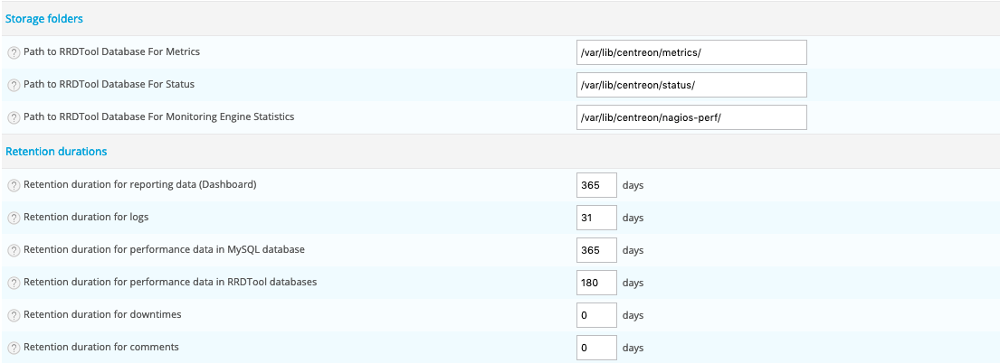

By accessing the **Administration > Parameters > Options** menu, you can define
retention durations for the Centreon platform:

## Performance data storage

This setting is for the folders for storing performance data. Performance data
make it possible to view the performance graphs of the metrics collected by
the monitoring, to track the evolution of the status of the services, or to
follow certain indicators concerning the collection engines.

> These values were set during the installation process; it is not recommended to
> change them.

- **Path to RRDTool Database For Metrics**: by default
**/var/lib/centreon/metrics/**.
- **Path to RRDTool Database For Status**: by default
**/var/lib/centreon/status/**.
- **Path to RRDTool Database For Monitoring Engine Statistics**: by default
**/var/lib/centreon/nagios-perf/**.

## Retention durations

Setting the retention time limits the size of the database:

- **Retention duration for reporting data (Dashboard)**: availability report
data, by default **365 days**.
- **Retention duration for logs**: activity log of the monitoring engines, by
default **31 days**.
- **Retention duration for performance data in MySQL database**: performance
data stored into database, by default **365 days**
- **Retention duration for performance data in RRDTool databases**: graphs of
performance data, by default **180 days**.
- **Retention duration for downtimes**: downtime data, unlimited by default
(0 day).
- **Retention duration for comments**: comment data, unlimited by default (0
day).
- **Retention duration for audit logs**: audit log data, unlimited by default
(0 day).

> It is possible not to save performance data to the MariaDB database if you are not
> using extraction to add on software such as Centreon MBI.

> If you change the retention time for performance charts, this value will only be
> used for newly added services.
