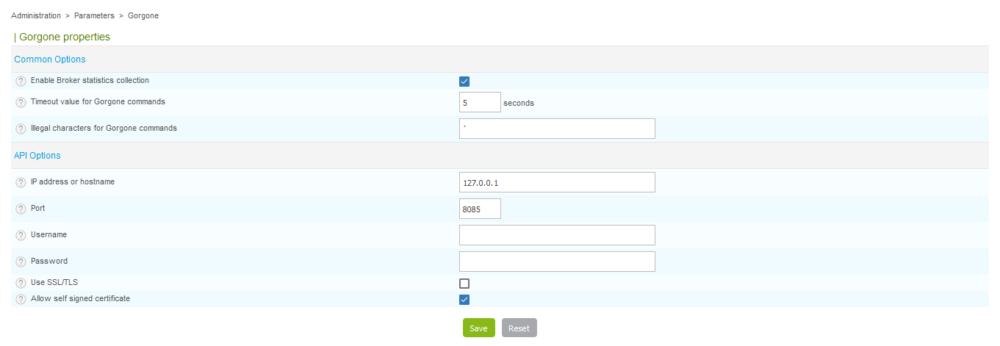

This lets you set the parameters needed by Centreon to interact with Gorgone.

Go to **Administration > Parameters > Gorgone**.

- The **Enable Broker statistics collection** field enables the retrieval of
statistics from the Centreon Broker.
- The **Timeout value for Gorgone commands** field can be used to define a global
timeout for commands run by Gorgone.
- The **Illegal characters for Gorgone commands** field lets you define
characters that will be removed from commands forwarded by the process.
- The **IP address or hostname** field lets you define the IP Address or hostname
to communicate with Gorgone API.
- The **Port** field lets you define the port to communicate with Gorgone API.
- The **Username** field lets you define the username used to connect to
Gorgone API.
- The **Password** field lets you define the password used to connect to
Gorgone API.
- **Use SSL/TLS** lets you define whether SSL/TLS must be used to communicate
with Gorgone API.
- **Allow self signed certificate** lets you define whether self-signed
certificates are allowed.
