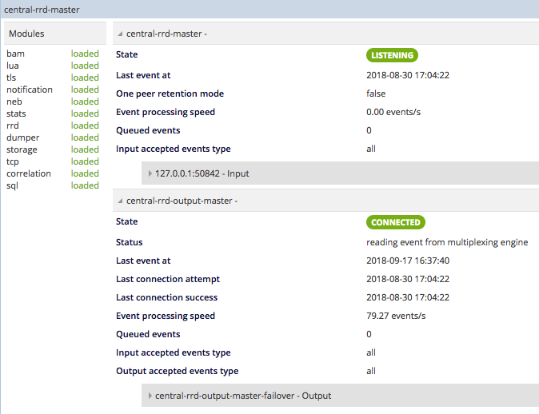
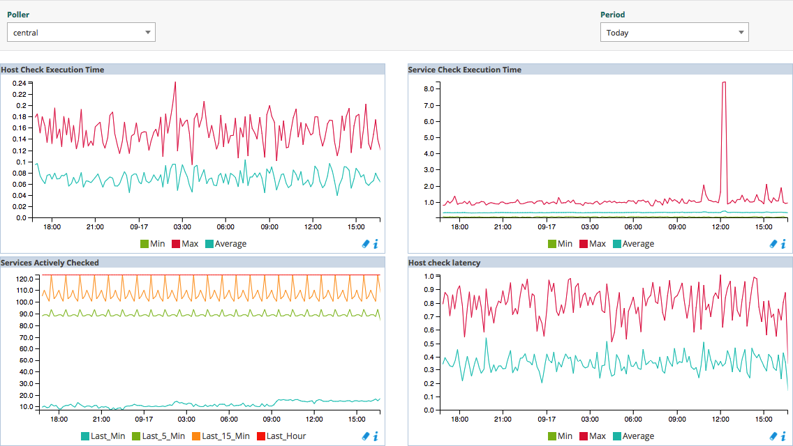

The status of the Centreon platform is available through the `Administration >
Platform Status` menu.

## Broker Statistics

To display the statistics of the Centreon Broker components, go to
`Administration > Platform Status > Broker Statistics` and select the
desired poller:

## Engine Statistics

It is also possible to display the performance of the engines through
performance graphs. Go to the `Administration > Platform Status > Engine
Statistics` menu and select the poller:

