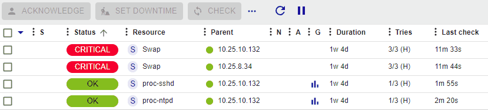
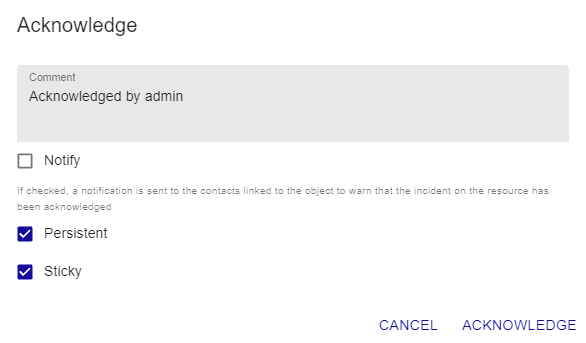

import Tabs from '@theme/Tabs';
import TabItem from '@theme/TabItem';

### Principle

When a host or a service has an incident and this incident is
confirmed, the notification process is triggered. This can generate a
notification sent to a contact. If the problem persists, and depending on
the configuration produced (resend a notification at regular time
intervals, escalation of notification, etc.), it is possible that other
notifications will be sent.

The acknowledgment of an alert can be used to stop the notification
process (sending of notifications) until the host or the service
resumes its nominal status.

Example of use:

A service is in charge of checking the health of the hard disks in a
disk array. A hard disk on a disk array goes down, and a notification is
sent. The monitoring operator acknowledges the service, specifying that a
team is in the process of dealing with the problem. Notifications are no
longer sent. The service will return to its nominal state after a change
of disk.

> The acknowledgment of an alert means that a monitoring user
> has taken the problem into account - not that the incident has been
> corrected; this can only take effect when the check returns to its
> nominal state.

### Practice

To acknowledge an alert, there are several solutions:

<Tabs groupId="sync">
<TabItem value="From the Resources Status page" label="From the Resources Status page">

1. Go to **Monitoring > Resources Status**.
2. Use one of the following methods:
    - Select the object(s) that you want to acknowledge, then click the **Acknowledge** button above the list of resources.
    - Hover over the resource you want to acknowledge, then click the **Acknowledge** icon that appears on the left.

        

    The following window appears:

    

    -   The **Comment** field is generally used to provide the reason for the
    acknowledgment. It is mandatory.
    
    -   If the **Notify** box is checked, a notification is sent to the
    contacts linked to the object to warn them that the incident on the
    resource has been acknowledged (if the contact
    possesses the activity acknowledgment notification filter).

    -   If the **Persistent** box is checked, the acknowledgment will be
    maintained even if the monitoring engine is restarted. Otherwise, the
    acknowledgment disappears and the notification process is
    reactivated.

    -   If the **Sticky** box is checked, the acknowledgment will be
    maintained in case of a change of Not-OK status (e.g.: DOWN to
    UNREACHABLE or WARNING to CRITICAL). Otherwise, the acknowledgment
    disappears and the notification process is reactivated.

</TabItem>
<TabItem value="From real time monitoring" label="From real time monitoring">

1.  Go to **Monitoring > Status Details > Hosts** (or **Services**).
2.  Select the object(s) that you want to acknowledge.
3.  In the menu: **More actions** click **Hosts: Acknowledge** or 
    **Services: Acknowledge**.

    The following window appears:

-   If the **Sticky** box is checked, the acknowledgment will be
    maintained in case of a change of Not-OK status (e.g.: DOWN to
    UNREACHABLE or WARNING to CRITICAL). Otherwise, the acknowledgment
    disappears and the notification process is reactivated.
-   If the **Notify** box is checked, a notification is sent to the
    contacts linked to the object to warn them that the incident on the
    resource has been acknowledged (if the contact
    possesses the activity acknowledgment notification filter).
-   If the **Persistent** box is checked, the acknowledgment will be
    maintained in the case of a restart of the scheduler. Otherwise, the
    acknowledgment disappears and the notification process is
    reactivated.
-   The **Comment** field is generally used to provide the reason for the
    acknowledgment. It is mandatory.
-   If the **Acknowledge services attached to hosts** box is checked,
    all the services linked to the host will be acknowledged (option
    visible only if we acknowledge a host).
-   If the **Force active checks** box is checked, a command will be
    sent to the scheduler to recheck the resource as soon as possible.

</TabItem>
<TabItem value="From the detailed sheet of an object" label="From the detailed sheet of an object">

From of the detail page of an object, click the icon |enabled| associated
with the **Acknowledged** field in the **Options** frame.

The following window appears:

-   If the **Sticky** box is checked, the acknowledgment will be
    maintained in case of a change of Not-OK status (e.g.: DOWN to
    UNREACHABLE or WARNING to CRITICAL). Otherwise, the acknowledgment
    disappears and the notification process is reactivated.
-   If the **Notify** box is checked, a notification is sent to the
    contacts linked to the object to warn them that the incident on the
    resource has been acknowledged (if the contact
    possesses the activity acknowledgment notification filter).
-   If the **Persistent** box is checked, the acknowledgment will be
    maintained in the case of a restart of the scheduler. Otherwise, the
    acknowledgment disappears and the notification process is
    reactivated.
-   The **Comment** field is generally used to provide the reason for the
    acknowledgment. It is mandatory.
-   If the **Acknowledge services attached to hosts** box is checked,
    all the services linked to the host will be acknowledged (option
    visible only if we acknowledge a host).
-   If the **Force active checks** box is checked, a command will be
    sent to the scheduler to recheck the resource as soon as possible.

</TabItem>
</Tabs>

### Disacknowledging resources

To delete the acknowledgment of an incident on an object:

<Tabs groupId="sync">
<TabItem value="From the Resources Status page" label="From the Resources Status page">

1. Go to **Monitoring > Resources Status**.
2. Select the objects you want to disacknowledge.
3. In the **More actions** menu, click **Disacknowledge**.

</TabItem>
<TabItem value="From real time monitoring" label="From real time monitoring">

1.  Go to **Monitoring > Status Details > Hosts** (or **Services**).
2.  Select the objects you want to disacknowledge.
3.  In the **More actions** menu, click **Hosts: Disacknowledge** or
    **Services: Disacknowledge**.

</TabItem>
</Tabs>