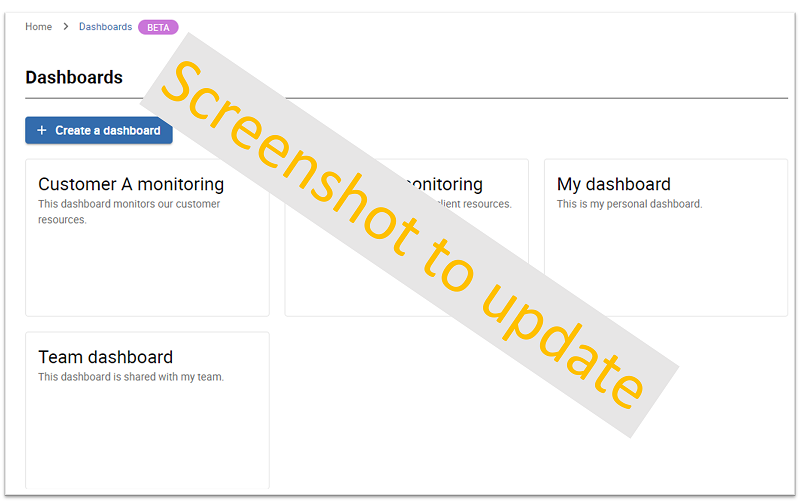

> Centreon Dashboards is available as a beta feature from **Centreon version 23.10**.

Get started with creating dashboards and adding widgets specially designed to optimize your user experience. Then benefit from data visualization options to display and monitor your resources in real time.

## Activating the Dashboards Beta feature

Access to the Dashboards feature is not managed at the user level, but through access groups or ACLs (Access Control Lists). You allow users to access the feature by granting rights to the ACL to which they belong (read more [about ACLs](../administration/access-control-lists.md)).

### Configure the ACL

> - You must be logged into Centreon as an Administrator.
- In this example, we will create a new ACL called **Dashboards users**. This ACL will contain users belonging to the **Guests** user group.

1. Go to **Administration > ACL > Menus Access**.
2. Click the **Add** button. This opens the **Add an ACL** form.
3. Name the **ACL Definition**. In this example: **Dashboards users**.
4. Select **Enabled** in the **Status** parameters.
5. Select the **Linked Groups** to include in this ACL. In this example: **Guests**.
6. In the **Accessible Pages** section, expand the **Home** menu, then the **Dashboards** one. This displays the list of profiles to select.

  > - **Viewer:** can only view dashboards to which they have access.
  > - **Creator:** can create and edit dashboards to which they have access.
  > - **Administrator:** can access and edit all dashboards.

7. Select the profile to be set for this ACL. In this example: **Viewer**.
8. Click **Save** to confirm your changes.

### Check the feature is activated

> You must have a user account with ACL rights to the Dashboards feature.

1. Log into Centreon.
2. You should see in the **Home** menu, the **Dashboards Beta** entry.

## Managing dashboards

### Create a dashboard

### Share a dashboard

### Delete a dashboard

## Adding widgets

List of widgets

