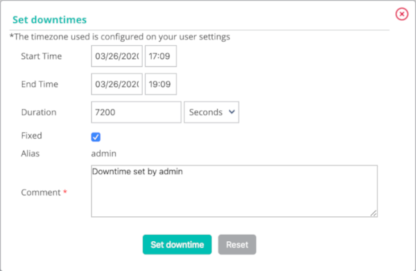

import Tabs from '@theme/Tabs';
import TabItem from '@theme/TabItem';

This chapter presents the different methods to manage alerts.

## Acknowledging a problem

### Principle

When a host or a service has an incident and this incident is
confirmed, the notification process is triggered. This can generate a
notification sent to a contact. If the problem persists, and depending on
the configuration produced (resend a notification at regular time
intervals, escalation of notification, etc.), it is possible that other
notifications will be sent.

The acknowledgment of an alert can be used to stop the notification
process (sending of notifications) until the host or the service
resumes its nominal status.

Example of use:

A service is in charge of checking the health of the hard disks in a
disk array. A hard disk on a disk array goes down, and a notification is
sent. The monitoring operator acknowledges the service, specifying that a
team is in the process of dealing with the problem. Notifications are no
longer sent. The service will return to its nominal state after a change
of disk.

> The acknowledgment of an alert means that a monitoring user
> has taken the problem into account - not that the incident has been
> corrected; this can only take effect when the check returns to its
> nominal state.

### Practice

To acknowledge an incident, there are two solutions:

<Tabs groupId="sync">
<TabItem value="From real time monitoring" label="From real time monitoring">

1.  Go into the **Monitoring > Status Details > Hosts** (or **Services**)
    menu
2.  Select the object(s) that you want acknowledge
3.  In the menu: **More actions** click **Hosts: Acknowledge** or
    **Services: Acknowledge**

</TabItem>
<TabItem value="From the detailed sheet of an object" label="From the detailed sheet of an object">

From of the detail page of an object, click the icon |enabled| associated
with the **Acknowledged** field in the **Options** frame

</TabItem>
</Tabs>

The following window appears:

-   If the **Sticky** box is checked, the acknowledgment will be
    maintained in case of a change of Not-OK status (e.g.: DOWN to
    UNREACHABLE or WARNING to CRITICAL). Otherwise, the acknowledgment
    disappears and the notification process is reactivated.
-   If the **Notify** box is checked, a notification is sent to the
    contacts linked to the object to warn them that the incident on the
    resource has been acknowledged (if the contact
    possesses the activity acknowledgment notification filter).
-   If the **Persistent** box is checked, the acknowledgment will be
    maintained in the case of a restart of the scheduler. Otherwise, the
    acknowledgment disappears and the notification process is
    reactivated.
-   The **Comment** field is generally used to provide the reason for the
    acknowledgment. It is mandatory
-   If the **Acknowledge services attached to hosts** box is checked,
    all the services linked to the host will be acknowledged (option
    visible only if we acknowledge a host).
-   If the **Force active checks** box is checked, a command will be
    sent to the scheduler to recheck the resource as soon as possible.

To delete the acknowledgment of an incident on an object:

1.  Go into the **Monitoring > Status Details > Hosts** (or **Services**)
    menu
2.  Select the objects whose acknowledgment you want to delete.
3.  In the **More actions** menu, click **Hosts: Disacknowledge** or
    **Services: Disacknowledge**

## Add downtime

### Principle

Downtime is a period during which the notifications to a
resource are disabled. Downtimes are used during a programmed
maintenance operation. They save us from receiving false positive alerts.

> It is important to select all the resources necessary to prevent
> false positives and false negatives. In addition, the time spent in
> this state is taken into account during the generation of the
> availability data.

There are two types of downtime:

-   **Fixed** downtime: starts and stops at the planned time.
-   **Flexible** downtime: starts during the planned time window
    as soon as an incident is detected and finishes when the planned time in
    seconds expires.

### Practice

There are three different possibilities to define downtime:

-   From the detail sheets of a host or of the service
-   From the real-time monitoring interface
-   From the **Downtime** menu

<Tabs groupId="sync">
<TabItem value="From the detailed sheet of an object" label="From the detailed sheet of an object">

1.  Access the detail page of an object
2.  In the category: **Commands**, click **Schedule downtime for this
    host/service**

</TabItem>
<TabItem value="From real time monitoring" label="From real time monitoring">

1.  Go into the **Monitoring > Status Details > Hosts** (or **Services**)
    menu
2.  Select the(s) object(s) on which you want to program the downtime
    period
3.  In the **More actions…** menu, click **Hosts: Set Downtime** or
    **Services: Set Downtime**

</TabItem>
<TabItem value="From the Downtime menu" label="From the Downtime menu">

1.  Go into the **Monitoring > Downtimes > Downtimes** menu
2.  Click **Add a service downtime** or **Add a host downtime**

</TabItem>
</Tabs>

The following window appears:

-   The **Host Name** field defines the host concerned by the downtime
-   The **Service** field defines the service concerned by the downtime
-   If the **Fixed** box is checked, the downtime is fixed. Otherwise, it
    is flexible
-   If the downtime is flexible, the **Duration** field defines the
    length of the downtime
-   The **Start Time** and **End Time** fields define the beginning and
    end date of the downtime. Downtime cannot start or end after December 31, 2099, 11:59 pm.
-   The **Comments** field can be used to indicate why the downtime is
    defined

## Recurrent downtimes

### Principle

Downtime is a period during which the notifications to a
host or a service are disabled. Downtime periods are convenient during
maintenance operations on a host or a service: they allow us to avoid
receiving false positives.

Recurrent Downtime periods are Downtime periods that recur
repetitively.

e.g.: A back-up of the virtual machines is performed every day from
8 PM to midnight. This type of back-up has a tendency to saturate the
CPU use of all the virtual machines. It is necessary to program
recurrent Downtime periods on the services concerned to avoid receiving
notifications from 8 PM to midnight.

> Downtime periods are taken into account in the calculation of the
> availability ratio of the resource in the
> **[Dashboard](../reporting/introduction.md#simple-reporting)**.

### Practice

There are two types of Downtime:

-   The **fixed** downtime period: This means that the downtime period
    takes place during exactly the time period defined.
-   The **flexible** downtime period: This means that if, during the time
    period defined, the service or the host returns a Not-OK status, the
    downtime period lasts a certain number of seconds (to be defined in
    the form) from the moment when the host or the status returns a
    Not-OK status.

To add a recurrent downtime period, go into the
`Monitoring > Downtimes > Recurrent Downtimes` menu and click
**Add**.

#### Configuration of Downtime periods

-   The **Name** and **Description** fields are used to give a name and
    describe the recurrent downtime period.
-   The **Enable** field is used to enable or disable the downtime
    period.
-   The **Periods** field is used to define one or more periods of
    recurrent downtime periods. To add a period, click the symbol
    .

It is possible to choose three types of period:

-   Weekly: to choose the days of the week
-   Monthly: to choose the days of the month
-   Specific date: to choose specific dates

-   The **Days** field defines the day(s) concerned.
-   The **Time period** field contains the time period concerned
    (expressed in HH:MM - HH:MM).
-   The **Downtime type** field defines the type of downtime period
    desired.

> It is possible to combine several types of period within the same
> downtime.

#### Relations

-   The **Linked with Hosts** list can be used to choose the host(s)
    concerned by the recurrent downtime period.
-   If **Linked with Host Groups** is chosen with the list Linked with
    the host group, all the hosts belonging to this group are concerned
    by the recurrent downtime period.
-   The **Linked with Services** list can be used to choose the
    service(s) concerned by the recurrent downtime period.
-   If a service group is chosen with the list **Linked with Service
    Groups**, all the services belonging to this group are concerned by
    the recurrent downtime period.

## Add comment

### Principle

Centreon allows us to add comments on an object. This Comment is visible by
anyone having access to the resource (host or service). A comment has the
following properties:

-   Hostname
-   Servicename if the comment is associated with a service
-   Date of entry of the comment
-   Author of the comment
-   The contents of the comment
-   The validity of the comment against a restart of the scheduler

### Practice

There are two solutions to add a comment:

<Tabs groupId="sync">
<TabItem value="From the detailed sheet of an object" label="From the detailed sheet of an object">

1.  Access to the details page of the object
2.  In the category **Host/Service Commands**, click **Add a comment
    for this host/this service**

</TabItem>
<TabItem value="From the Comment menu" label="From the Comment menu">

1.  Go into the **Monitoring > Downtimes > Comments** menu
2.  Click **Add a Service Comment** or **Add a Host Comment**

</TabItem>
</Tabs>

The following window appears:

-   The **Host Name** field defines the host concerned by the comment.
-   If you have chosen to add a comment to a service, the **Service**
    field can be used to select the service concerned by the comment.
-   If the **Persistent** box is checked, the comment will be maintained
    in the event of a restart of the scheduler.
-   The **Comments** field contains the comment itself.

## Management of checks

### Principle

It is possible to temporarily enable or disable a check on a host or a service.

> Changes to settings checks do not affect the configuration of the
> object in the database. These changes are made on the supervision in
> real time, and they are canceled if the scheduler is restarted.

### Practice

<Tabs groupId="sync">
<TabItem value="From the detailed sheet of an object" label="From the detailed sheet of an object">

1.  Access the details page of the object
2.  In the category: **Options** go to the line: **Active checks** to
    check the state of the checks.

To:

-   Enable the check, click 
-   Disable the check, click 

</TabItem>
<TabItem value="From real time monitoring" label="From real time monitoring">

1.  Go into the **Monitoring > Status Details > Hosts** (or **Services**)
    menu
2.  Select the object(s) on which you want to enable or disable the
    check.
3.  In the  **More actions** menu, click:

-   **Hosts : Disable Check** or **Services: Disable Check** to stop the
    * In the definition of a host or a service
-   **Hosts: Enable Check** or **Services: Enable Check** to enable the
    check of a host or of a service

</TabItem>
</Tabs>

## Submitting a result

### Principle

For passively checked services, it is possible send a result manually to the
scheduler so that it is taken into account.

### Practice

To submit a result, access the details page of the object. In the category
**Service Commands**, click **Submit result for this service**

The following window appears:

-   The **Host Name** and **Service** fields define the host and the
    Service for which the result will be submitted
-   The **Check result** field defines the status of the service
-   The **Check output** field defines the message to be displayed for
    the service
-   The **Performance data** field can be used to define performance
    data to generate graphs

## Management of notifications

### Principle

It is possible to temporarily enable or disable the notification of a
host or a service.

> Changes to the notification settings do not affect the configuration of
> the object in the database. These changes are made on the real time
> monitoring, and they are canceled if the scheduler is restarted.

### Practice

There are two ways of managing notifications:

<Tabs groupId="sync">
<TabItem value="From the detailed sheet of an object" label="From the detailed sheet of an object">

1.  Access the details page of the object
2.  In the category: **Options** go to the line: **Service
    Notifications**

To:

-   Enable the notification, click 
-   Disable the notification, click 

</TabItem>
<TabItem value="From real time monitoring" label="From real time monitoring">

1.  Go into the **Monitoring > Status Details > Hosts** (or **Services**)
    menu
2.  Select the host(s) / service(s) whose notification you want 
    to enable or disable
3.  In the menu: **More actions** menu, click:

-   **Hosts: Disable Notification** or **Services: Disable
    Notification** to stop the notification of a host or of a service
-   **Hosts: Enable Notification** or **Services: Enable Notification**
    to enable the notification of a host or a service

</TabItem>
</Tabs>

## Reprogramming checks

### Principle

By default, the checks (checks on a service) are executed at regular
intervals following the configuration defined by the user. It is
possible to act on the check scheduling pile to change the
programming of the checks.

There are two types of programming:

-   Normal programming: the service check is given priority in the
    scheduler queue (asap).
-   Forced programming: the service check is given priority in the
    scheduler queue (asap) even if the time of the execution request is
    outside the check period or if the service is not of the active
    type.

### Practice

There are two ways of forcing the check of a service:

<Tabs groupId="sync">
<TabItem value="From the detailed sheet of an object" label="From the detailed sheet of an object">

1.  Access the detail page of the object
2.  In the category **Host Commands** (or **Service Commands**), click
    **Re-schedule the next check for this host / service** or
    **Re-schedule the next check for this host / service (forced)**

</TabItem>
<TabItem value="From real time monitoring" label="From real time monitoring">

1.  Go into the following menu: **Monitoring > Status Details > Hosts** (or
    **Services**)
2.  Select the objects for which you want to force the check
3.  In the menu: **More actions…** click **Schedule immediate check**
    or **Schedule immediate check (Forced)**

</TabItem>
</Tabs>