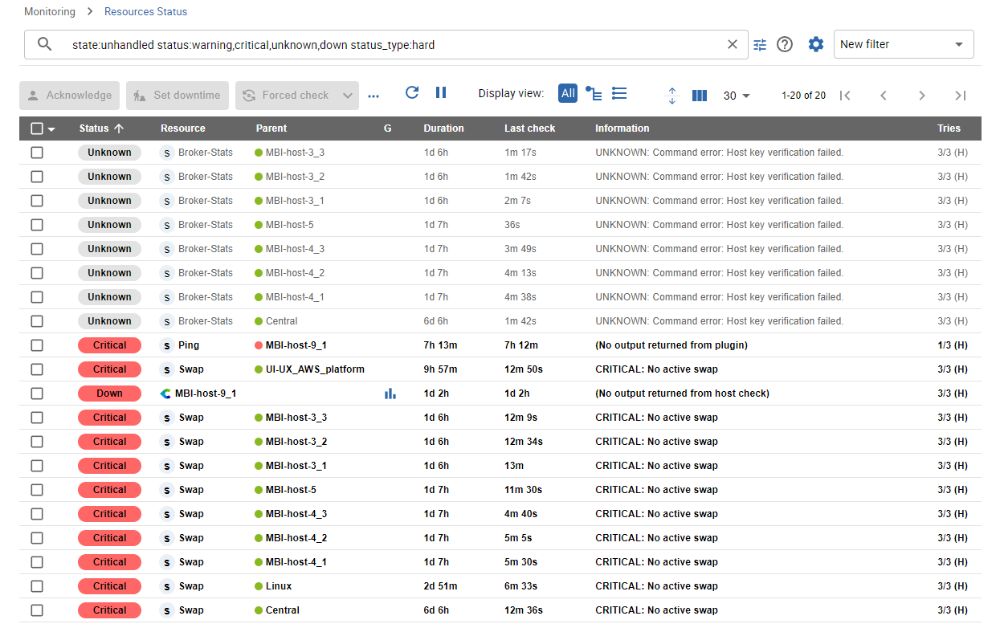
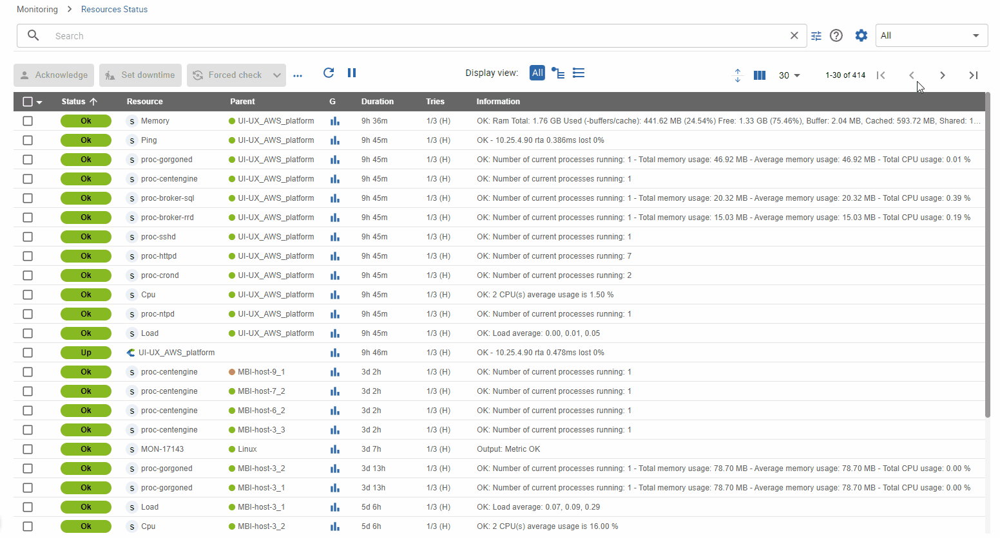
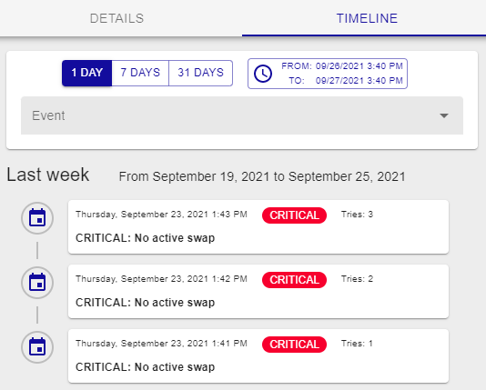
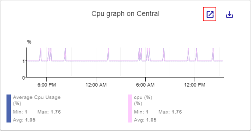

The **Monitoring > Resources Status** page is your main view to track
resource events & statuses, analyze them, and quickly handle them.

This view mixes hosts and services to provide a unified interface and a unified way to manage
events.

## Events list

The event list is a condensed and efficient view of all alerts and the status of all resources
monitored by Centreon.

You can add or remove columns and sort by the column of your choice.

### View by host or by service

Use the **Display view** buttons above the list of resources to define how the list will be displayed. 

- **All**: This view gathers all types of resources in the same list (hosts, services, metaservices, Anomaly Detection services).
- **View by host**: Displays all hosts. By default, for each host, a summary of the status of all services is displayed in the **Services** column. Click the arrow to the left of the summary to expand the zone and display all the services attached to this host. Meta services are not included in this view.
- **View by service**: Lists all the services, and shows the host they are attached to in the **Host** column. The list includes metaservices and Anomaly Detection services.

### Compact or extended view

You can display the view in the mode that suits you best by changing the visual presentation of lines in tables.

Click the dedicated button to improve the readability of the information in the tables:
- Compact view mode 
- Extended view mode 

## Take actions on events

### Acknowledge an event

When one or more alerts are visible, you may need to [acknowledge](acknowledge.md) them to tell
your team that the problem is being handled. You can do that in two ways:

- By directly acknowledging the line: an **Acknowledge** button
    appears on mouseover
- By selecting multiple lines and clicking the **Acknowledge**
    button above the table. You can use the **Shift** key to select several adjacent lines.

 Only "non-ok" resources can be acknowledged and you cannot acknowledge a resource that has already been acknowledged.

When a resource is acknowledged:

- The alert is no longer visible in the **Unhandled alerts** filter
- [Notifications](notif-configuration.md) for this resource are stopped
- The color of the line for acknowledged resources changes
to yellow.

The acknowledgment can also be canceled, in which case the event will be included again in the list 
of **Unhandled alerts** and its notifications will resume: in the **More actions** menu, select **Disacknowledge**.

### Set a planned downtime

When maintenance is planned on one or multiple resources, you can set 
[planned downtime](downtimes.md) for them in Centreon in two ways:

- By directly setting planned downtime on the line:
    a **Set Downtime** button appears on mouseover
- By selecting multiple lines and clicking the **Set Downtime** button
    above the table.

When a resource is in planned downtime, the alert is no longer visible in the
**Unhandled alerts** filter and notifications for this resource are stopped. The
color of lines for resources with planned downtime is changed to light purple.

### Refresh a status

In many situations, you need to quickly re-check one or multiple resources
to refresh their status.

Two types of check action are available:
- The **Check** action: a regular check that you perform only during the configured check period.
- The **Forced check** action: a check that you can perform at any time (in or out of the configured check period).

Check your resources and refresh their status in two ways:

- By directly clicking the button on the line when the mouse is over it (**Forced check** only).
- By selecting one or multiple lines and clicking the **Check** or **Forced check** button above the table.

### Submit a status

In some cases, especially with so-called "passive" services, it can be useful
to submit a result, i.e. a status, an output and metrics, in order to
reset the event.
This can be achieved using the **Submit Status** action, available when a single passive service is selected.

## Filtering events

The various filters are added using an AND criterion: results will match all criteria.

### Pre-defined filters

When you open the **Resource status** page, the default filter is **Unhandled alerts**. This filter quickly shows all alerts that are not 
yet handled so you can focus on choosing the most relevant ones to take
care of. You can choose two other filters, which are **All alerts**
and **All**.

The following rules apply:

- **Unhandled alerts**: resource status is **Warning** or **Critical** or
    **Unknown** or **Down** AND the resource is not acknowledged or in planned
    downtime
- **All alerts**: resource status is **Warning** or **Critical** or **Unknown**
    or **Down** (whether or not the resource has been acknowledged/downtime has been set)
- **All**: All resources.

### Search criteria

You can filter the list of resources according to a number of predefined criteria.

1. Click the **Filter options** icon :

    A pop-in window appears, listing the following criteria:

    - **Host:** select a host in the dropdown list and check the status to display (**Up**, **Down**, **Unreachable**, **Pending**).
    - **Host group**
    - **Service:** select a service in the dropdown list and check the status to display (**OK**, **Warning**, **Critical**, **Unknown**, **Pending**).
    - **Service group**
    - **Pollers**
    - **State**: whether the problem is simply unhandled, already acknowledged, or in a planned downtime.

2. Click **Open more filters** to display more options:

    - [**Host category**](../monitoring/categories.md)
    - [**Host severity**](../monitoring/categories.md)
    - [**Service category**](../monitoring/categories.md)
    - [**Service severity**](../monitoring/categories.md)
    - You can add a comment in the **Information** field.
    - [**Status type**](concepts.md#status-types): **Hard** or **Soft**.

3. You can directly click the **Search** button or save your filter:
   - Click **Save as new** to name and save your filter. You will then be able to access it in the **My filters** list.
   - Click **Save as** if you are already editing an existing filter.
   
   The list of resources is now filtered.

### Search bar

If you type text into the search bar, by default the search is performed on the following fields:

- Name of the host
- Alias of the host
- Address or FQDN of the host
- Name of the service

For instance, if you type "rta", all resources containing "rta" in one of the above fields will be displayed (e.g., a metaservice called **Ping-RTA-Average**).

However, you can do a much more specific search using the [Centreon Query Language](#cql-criteria). This language allows you to search only 
in one or several fields.

#### CQL criteria

- **alias**: search for hosts according to their alias
- **fqdn**: search for hosts according to their IP address or FQDN
- **host_group**: search for hosts that belong to a host group
- **host_category**: search for hosts that belong to a category
- **host_severity**: search for hosts according to the name of their severity
- **host_severity_level**: search for hosts according to the level of their severity
- **h.name**: search for resources according to the name of the host displayed in the **Resource** column for the hosts, and **Parent** for the services
- **h.alias**: search for resources according to the alias of a host or the alias of a service's parent
- **h.address**: search for resources according to the FQDN/IP address of the host or of a service's parent
- **information**: search only in the **Information** column
- **monitoring_server**: search for all the resources that the selected poller is monitoring
- **name**: search for hosts only on the name of the host, as displayed in the **Resource** column
- **parent_name**: search for services according to their parent's name
- **parent_alias**: search for services according to their parent's alias
- **state**: search for resources in a non-OK or non-UP state, according to whether they are unhandled, acknowledged or in downtime
- **status**: search for resources according to their [status](concepts.md)
- **status_type**: search for resources according to their [status type](concepts.md#status-types)
- **service_category**: search for services according to the category they belong to
- **service_group**: search for services that belong to a service group
- **service_severity**: search for services according to the name of their severity
- **service_severity_level**: search for services according to the level of their severity
- **s.description**: search only in the name of the service (shown in the **Resource** column)
- **type**: display only hosts, services or metaservices

#### Using the search bar

The search bar shows all applied criteria as text. Autocomplete helps you enter search terms easily: 

1. Start typing the criterion you want. For instance, type "h": the search bar suggests all criteria starting with "h" (**host_group**, **h.name**, **h.alias**, **h.address**). Select the criterion you want using the **Up** and **Down** arrows, then press **Tab** or **Enter** to confirm the selection. A colon is used between a criterion and its possible values (e.g. **host:Linux**).

2. According to the type of criterion, autocomplete can suggest possible values for this criterion (e.g. for the **Type** criterion, the possible values are **Host**, **Service** and **Metaservice**). Select the value you want using the **Up** and **Down** arrows, then press **Tab** or **Enter** to confirm the selection. It is possible to set several values for a criterion. The values should be separated by commas. The search will retrieve all values using an OR criterion, e.g. **type:service,metaservice** will retrieve all services and metaservices.

3. Use spaces between search criteria. Criteria are added using an AND criterion: results will match all criteria.

   * You can use regular expressions. Wildcards are not supported: a search pattern starting with a * is not valid.
   * You cannot perform a pattern-based search inside a field that has a finite number of values (hostgroups, status, etc). For these fields, use the [**Search options**](#search-criteria) button.

4. Once you have entered all your search criteria, type a space character or press **Esc** to exit autocomplete, then press **Enter**.

Example:
    **s.description:ping h.name:linux**: the list displays all services whose name contains "ping", for all hosts whose name contains "linux".

### Save your filter

You may create some "complex" filters that set you in a specific
context, using multiple criteria and even complex regular expressions.
In that case, you may want to save this filter and re-use it later.

Use the **Filter options** next to **Search** to:

- Save your current search as a new filter
- Save the current filter so that it is updated using the criteria currently
    applied

As soon as a filter is saved, it can be reused in the Filter dropdown list,
categorized under **My Filter**.

By clicking the **Edit filters** menu, you can manage your existing filters (rename, re-order and delete):

## Detail panel

When you click a line, a detail panel opens on the right side to display the main information
concerning the resource. This panel can be resized.

Depending on the type of resource, the detail panel displays different information.

### Host panel

The host panel contains the following elements:

- **Details** tab: Detailed information about the host's current status. You can drag and drop tiles to rearrange them.
- **Services** tab: A listing of its attached services and their current status (as well as their graphs if the corresponding mode is selected)
- **Timeline** tab: The timeline of events that occurred for this host
- **Graph** tab: Graphs for the services for this host
- **Notification** tab: Shows whether notifications are enabled for this host, and lists the contacts and contact groups that will be notified.
- Shortcuts to the configuration, logs and report for this host.

If an acknowledgment or downtime is set on the host, it will be displayed in
the panel and the header will be colored accordingly.

### Service panel

The service panel contains the following elements:

- **Details** tab: Detailed information about its current status. You can drag and drop tiles to rearrange them.
- **Timeline** tab: The timeline of events that occurred for this service
- **Graph** tab: A graph with one curve per metric collected by this service
- **Notification** tab: Shows whether notifications are enabled for this service, and lists the contacts and contact groups that will be notified.
- Shortcuts to the configurations, logs and reports for this service and its
    related host.
- Below the name of the service, the name of its parent host. Click it to open the host panel for the parent host.  

If an acknowledgment or downtime is set on the service, it will be displayed in
the panel and the header will be colored accordingly.

### Timeline tab

The **Timeline** tab shows an antichronological list of events that occurred for this service or host (status alerts, notifications sent, scheduled downtime, comments). Use the **Event** list to display only the types of event you want.

You can export the full list of events in CSV format.

### Graph tab

The graph tab enables you to visually display how the metrics evolve for the selected resource. 

Hovering over the metric curves will display the precise time under the graph's title and also display, within the legend, the different values for that same point in time.

When the pointer is not hovering over curves, the legend displays Min, Max and Average values for each metric.

Use the legend to display or hide metrics:

- Click a legend item to display only the corresponding metric.
- To display all metrics again, click the legend of the displayed metric again.

You can also toggle the selection of individual metrics by Ctrl+Clicking (or Cmd+Clicking for Mac users) on the corresponding tile within the legend:

Graphs display metric evolution over a given period. This can be defined in the following ways:

- A selection of preconfigured periods is available in the graph header: Last Day, Last 7 Days, Last 31 Days
- Datetime pickers are available for Start and End points in time. Whenever the displayed period changes, this element is updated accordingly
- Using the side [<] and [>] buttons that appear upon hovering the graph's border, you can translate in time by half your current timespan (backward and forward in time, respectively)
- Selecting a period of time within the graph will zoom in on this period

The **Display events** toggle (available under the **gear** button) allows you to display some timeline events (downtime, acknowledgment, comment) directly on the graph, via annotations:

It is possible to add a comment directly on the graph by left-clicking anywhere at the time you want to add it, and then selecting **Add a comment** on the tooltip that appears:

To delete a comment, go to **Monitoring > Downtimes > Comments**.

By clicking the **Export** button, you can export a snapshot of the graph, which also includes the timeline events, if the switch is toggled. Note that only the selected metrics will be exported:

To see a bigger version of the graph, click **Go to performance page** in the top right corner of the graph.

The graph opens on the **Monitoring > Performances > Graphs** page, allowing you to filter the graph more precisely.

You can also export the data for the graph as a CSV file. This will include all metrics.

### Notification tab

The Notification tab shows whether notifications are enabled for the selected resource. You can see the recipients of these notifications in the **Contacts** and **Contact groups** sections.

To configure the recipients, click the **gear icon** in the **Contacts** or **Contact groups** section.

