## Configuration

### Select a provider

The module offers many ready-to-use providers listed in the dedicated [integration
section](../integrations/itsm/itsm-overview.md).

Each provider has its own configuration, but a provider
can be added in Centreon in the following way:

Go to the **Configuration > Notifications > Open Tickets > Rules** menu.
Click on **Add** button:

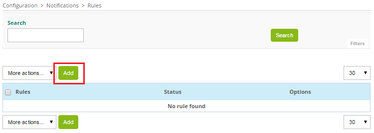

Define **Rule name** and select **Provider**:

A new form appears: configure the provider.

### Hosts & services

In order for resources (hosts and services) to receive a ticket number,
it is necessary to add a personalized macro to them.

The best way is to create these macros in a host template and a service
template inherited by all objects using models from which all resources
will inherit.

Go to the **Configuration > Hosts > Templates** menu and look for the
**generic-active-host-custom** template, and edit it. Add the macro
**TICKET\_ID** and click on **Save**:

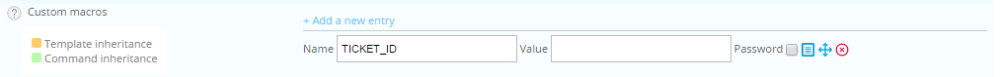

Go to the **Configuration > Services > Templates** menu and look for the
**generic-active-service-custom** template and edit this one. Add the
macro **TICKET\_ID** and click **Save**:

### Widget configuration

To use the widget, you must add it into a custom view. Go to the
**Home > Custom Views** menu, select your view and click the **Add widget**
button.

Define a title for your widget (for example: Open-Tickets) and select
the **Open Tickets** widget. Apply the same procedure to add this
widget again.

On the first widget, to open a ticket, click the **Configuration**
button:

-   Select the **Rule** previously defined
-   **Don’t check** the **Opened Tickets** box
-   Select other filters
-   **Don’t check** the boxes **Display Ticket ID** and **Display Ticket
    Time**

On the second widget, to display opened tickets, click the
**Configuration** button:

-   Select the **Rule** previously defined
-   Check the **Opened Tickets** box
-   Select other filters
-   Check the boxes **Display Ticket ID** and **Display Ticket Time**

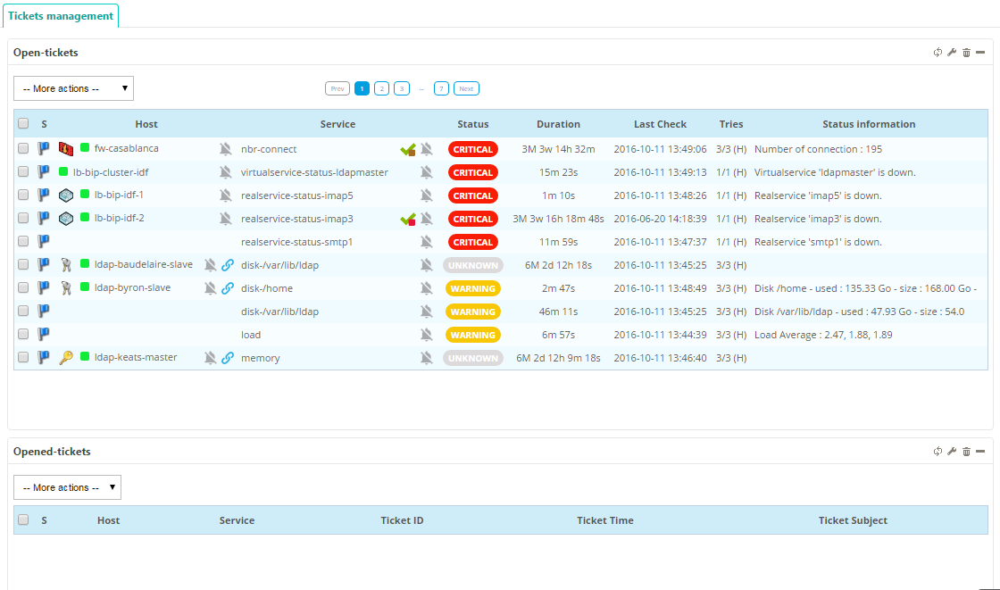

## User guide

### Open a ticket

To open a ticket, select an object using its checkbox, and in the **-- More
actions --** menu, select the required action:

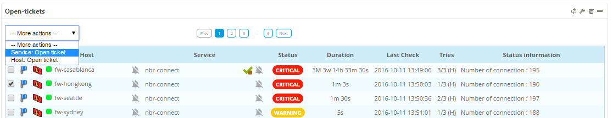

A popup appears to define a comment. Click the **Open** button to open a ticket:

Once the ticket is created, the popup displays the ticket ID:

The selected objects disappear from the widget to open tickets:

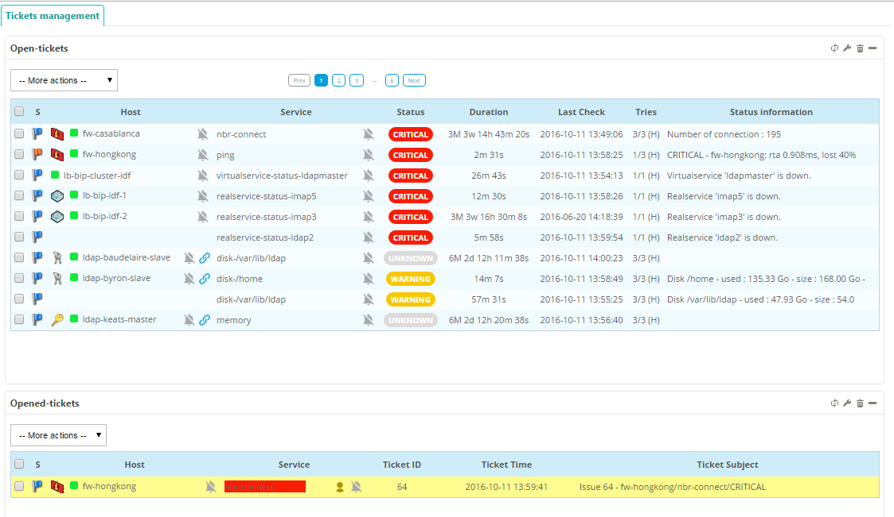

### Close a ticket

To close a ticket, select the object using its checkbox and in the **-- More
actions --** menu, select the required action:

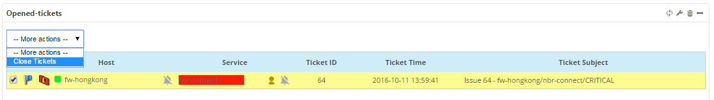

The ticket is closed (only for Centreon):

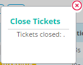

The selected objects disappear from the opened tickets widget:

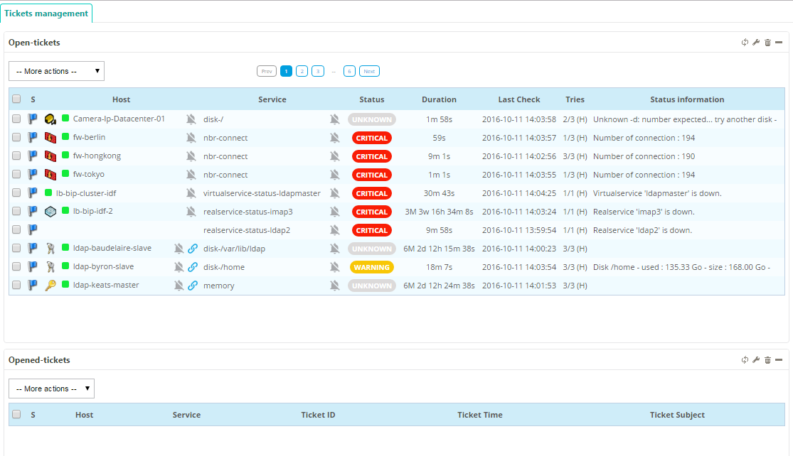

## Advanced configuration

This module offers ready-to-use providers. However, depending on the
configuration of your ITSM, it may be necessary to modify these to adapt
them to your environment.

### List definition

Before opening a ticket, users can choose some options in a popup. An
option is to create a selection list. In the configuration provider, you can
configure it in **Lists** and **Custom list definition**. For each entry in
**Lists**, you can define:

-   **Id**: alphanumeric value (must be unique)
-   **Label**: displayed in the popup
-   **Type**: which kind of list. There are three kinds of list
    -   Provider lists (data directly from the ticketing software)
    -   Centreon lists (like **Host group**)
    -   Custom lists (data from **Custom list definition** configuration.
        **Id** fields must be identical)
-   **Mandatory**: checked if the user needs to set the option

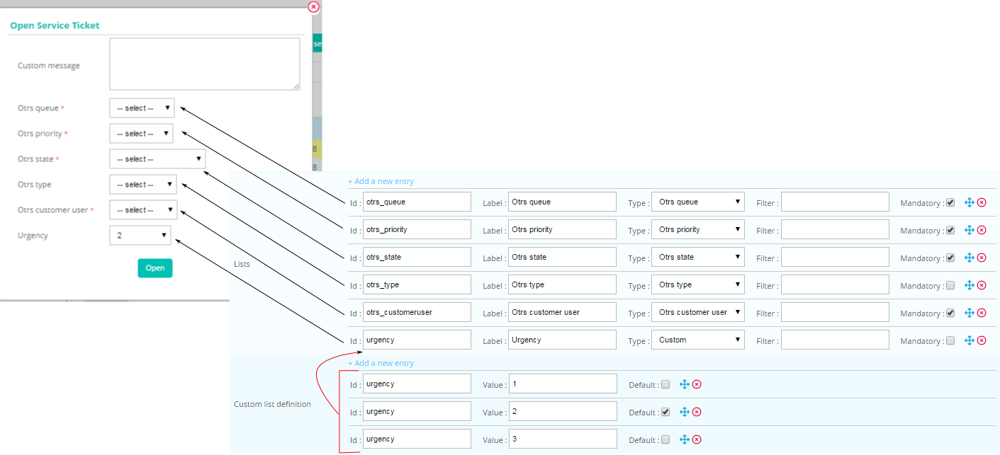

The module stores the user list selection in an array (can be used in
a smart section like **body** or **mapping ticket arguments**). There are 3
fields (**LIST\_ID** must be replaced):

-   \{$select.LIST\_ID.id\}
-   \{$select.LIST\_ID.value\}
-   \{$select.LIST\_ID.label\}

### Chaining rules

After opening a ticket, you may need to send an email. The chaining
rules system is designed to do it:

-   Create a new rule with the name **emailme** and the provider **Mail**
-   Configure **emailme** in the rule of your opening system

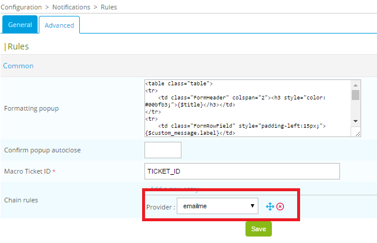

### Commands

After opening a ticket, you can also configure some commands to be executed.

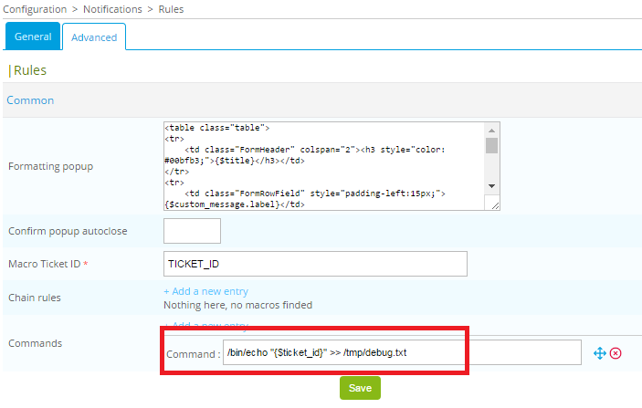
