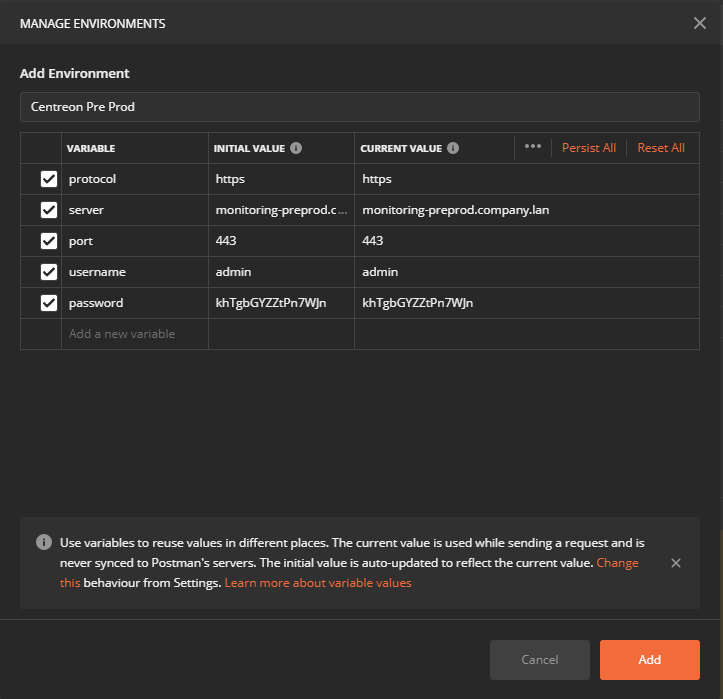

This page describes how to use [the v2 API](https://docs-api.centreon.com/api/centreon-web/23.10/) for Centreon Web with Postman.

## Create a Postman collection from the OpenAPI definition

In order to manipulate the API more efficiently, or just understand how it works,
there is nothing handier than a [Postman](https://learning.postman.com/docs/getting-started/introduction/)
collection.

### Import the OpenAPI definition

From your workspace, click the **Import** button.


Go to the **Link** tab and enter the URL to the OpenAPI definition from GitHub:

```text
https://raw.githubusercontent.com/centreon/centreon/23.10.x/centreon/doc/API/centreon-api-v23.10.yaml
```


Click **Continue** and adjust some of the default parameters:

- Select only *Collection* as an import method,
- Select *Example* for *Request parameter generation*, as it will bring more
  context on path variables or query parameters,
- Select *Tags* for *Folder organization*, as it will arrange the collection
  as in the documentation.

Then click **Import** and wait a few seconds for the process to be done.


### Add an environment

To be able to communicate with your platform, the collection will use
environment variables to define access information and credentials.

From your workspace, click the **Manage Environments** icon.


Click **Add** and set the variables as below with your platform information:



Then click **Add**, and select it in the environments list.

> The API version is not set in the environment variables. It's more of a
> collection variable. It can be changed directly in the collection by editing
> it.
>
> 
>
> In the **Variables** tab, change the *version* value to either
> "latest" or your `v<major>.<minor>` version number, e.g. "v23.10".
>
> You can obtain your "major.minor" version number using the following command:
> `curl -s http://127.0.0.1:80/centreon/api/latest/platform/versions | jq '.web '`
>
> Here is an example of output for this command:
>
> {
>   "version": "23.10.6",
>   "major": "23",
>   "minor": "10",
>   "fix": "6"
> }
>
> 
>
> Other variables will be overloaded by environment variables.

### Edit the Login request

To make the *Login* request, use the previously defined credentials, and retrieve
the API token from the response. It needs to be edited.

From the collection, select the *Login* request from the *Authentication*
folder.

In the **Body** tab, replace the *login* and *password* values with the environment
variables `{{username}}` and `{{password}}` as below:


In the **Tests** tab, add the following code:

```javascript
pm.test("Status code is 200", function () { pm.response.to.have.status(200); });

const responseJson = pm.response.json();

pm.test("The response has all properties", () => {
  pm.expect(responseJson).to.be.an("object");
  pm.expect(responseJson.contact.alias).to.eql(pm.environment.get("username"));
  pm.expect(responseJson.security.token).to.be.a('string');
});

pm.environment.set("token", responseJson.security.token);
```


Then click **Save** or use the shortcut *Ctrl+S*.

### Use the API token

Once saved, **Send** the *Login* request.


If successful, it will add a new *token* environment variable filled with the
token retrieved from login.


To use it in all the requests, edit the collection.


In the **Authorization** tab, choose *API Key* type and fill the *Key* field
with `X-AUTH-TOKEN` and the *Value* field with `{{token}}`.


Make sure it will be added to *Header*.

Then click **Update**.

### Make requests

Now that a valid token is stored, you can execute requests on other endpoints.

Uncheck unused query parameters or fill them with values, and click **Send**.


You will notice the token added in the defined header.

If the token expires, just re-execute the *Login* request to get a new one.
