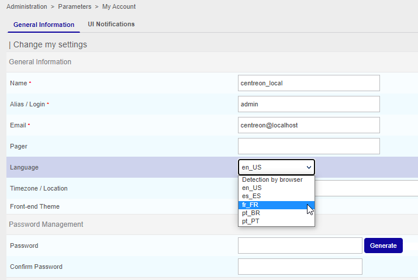

import Tabs from '@theme/Tabs';
import TabItem from '@theme/TabItem';


If you want to contribute to translating Centreon, this new tutorial is for you! Discover how to translate the Centreon web
interface and how to help us to add new languages to Centreon.

## Install translation environment

Contact us to obtain an archive of the contents to translate, and then copy this archive to a Linux server.

Execute the following commands:
```shell
unzip centreon-translation.zip
cd centreon-translation
```

Your environment to translate Centreon is now ready.

## First generation

During the first generation, the script will clone Centreon sources from GitHub on your server.

Execute the following command:

```shell
sh make-translation.sh
```

At the end of execution, two files are available:

* messages.pot to translate Centreon web interface menu and forms
* help.pot to translate help tooltips in configuration forms

Rename messages.pot to messages.po and help.po to help.po

You can now start translating Centreon by editing files with a PO file editor like poedit.

> Always keep your \*.po files for the next translation.

## Use your translation

On your Centreon server, install gettext.

Create the locale directory for your Centreon:

```shell
sudo mkdir -p /usr/share/centreon/www/locale/`locale | grep LC_MESSAGES | cut -d \" -f 2`/LC_MESSAGES
```

> **/usr/share/centreon** is the Centreon installed directory.

If you want to translate Centreon into a language other than that used by your Centreon server, you must define the
locale manually.

For example, for Brazilian users, execute the following command:

```shell
sudo mkdir -p /usr/share/centreon/www/locale/pt_BR.UTF-8/LC_MESSAGES
```

Compile the translated files:

```shell
msgfmt messages.po -o messages.mo
msgfmt help.pot -o help.mo
php ./centreon-github/bin/centreon-translations.php pt centreon-github/lang/pt_BR.UTF-8/LC_MESSAGES/messages.po centreon-github/lang/pt_BR.UTF-8/LC_MESSAGES/messages.ser
```

Copy the compiled translated files:

```shell
sudo cp *.mo /usr/share/centreon/www/locale/`locale | grep LC_MESSAGES | cut -d \" -f 2`/LC_MESSAGES
sudo cp messages.ser /usr/share/centreon/www/locale/`locale | grep LC_MESSAGES | cut -d \" -f 2`/LC_MESSAGES
```

Change the rights on the directory:

```shell
sudo chown -R apache.apache /usr/share/centreon/www/locale/`locale | grep LC_MESSAGES | cut -d \" -f 2`
```

<Tabs groupId="sync">
<TabItem value="Alma/ RHEL / Oracle Linux 8" label="Alma/ RHEL / Oracle Linux 8">

Restart Apache:

```shell
systemctl restart httpd
```

</TabItem>
<TabItem value="Alma / RHEL / Oracle Linux 9" label="Alma / RHEL / Oracle Linux 9">

Restart Apache:

```shell
systemctl restart httpd
```

</TabItem>
</Tabs>

Connect to your Centreon web interface, edit your profile and select new language:



Save the form and access another menu. Your interface will be translated.

## Upgrade translation

Centreon developers release a new version of Centreon Web every month. So the translation could be modified with every new
release.

To keep the translation up to date, follow these steps:

```shell
sh make-translation.sh
```

At the end of execution, two up-to-date files are available:

* messages.pot to translate Centreon Web interface menu and forms
* help.pot to translate help tooltips in configuration forms

Merge these files with the previous translation (messages.po and help.po):

```shell
msgmerge help.po help.pot -o new_help.po
msgmerge messages.po messages.pot -o new_messages.po
```

Follow the chapter “Use your translation” to upgrade your translation for Centreon.

## Participate in the Centreon project

Once your translation is up to date, you can ask to the Centreon team to add your translation to Centreon project. This
will allow all users of Centreon to have access to your translation on their Centreon platform.

* Create an account on GitHub
* Fork centreon/centreon project on GitHub
* Add your translated \*.mo and \*.po files to lang\<your_lang\>/LC_MESSAGES directory
* Commit your change on your project
* Create a pull request on centreon/centreon project
* We will add your translation to Centreon.

Thank you for your help!
