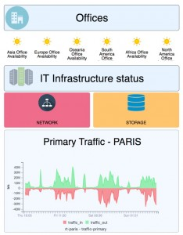

The objective of this tutorial is to help you understand how you can provide
real time IT infrastructure status overviews with the data presentation
extension called Centreon MAP to your ITOM teams and operational users.

With Centreon MAP, you can simply create and share synthetic real time
monitoring views to monitor the performance of your IT infrastructure, network,
applications and services.

For instance, this real-time view allows ITOM teams and managers to see the availability of critical business applications
and services instantaneously. This guarantees a better reaction time in case of outage and
optimizes MTRS (Mean Time to Restore Service).

This tutorial shows you how to create views using Centreon MAP.
After reading this article, you will be familiar with Centreon MAP's main features
and you will be able to create views that meet your technical or business users'
needs.

> Centreon MAP is a Centreon **extension** that requires a valid license key. To
> purchase one and retrieve the necessary repositories, contact
> [Centreon](mailto:sales@centreon.com).

## Create a logical view

### Before creating a view: define the objective

Define what is the main objective of the view. What need does it meet? Who
are the recipients? What are the main topics to consider before creating a view? Here
are some questions you might consider:

  - Who is/are the recipient(s) (users' profiles) of this view?
  - What level of information do users need?
  - Do I monitor all the resources and indicators I need to create that view?
  - What kind of information should the view contain (resources, indicators,
    graphs, network links, etc)? It can be interesting to start drawing that view
    on a paper note.

Now that you have defined the objectives, let's start showing you how to make the view.

### The view designer's workspace

Connect to your Centreon MAP server using the desktop client. The following
workspace environment should appear empty. To illustrate the explanation, we've
opened a view. By default, no view is opened.

The information and area are organized as follows:

1.  **Views**: existing views that are accessible to you.
2.  **Element**: objects available in opened views.
3.  **Media**: available media (images).
4.  **Resources**: Centreon's object that you can use in the view (drag & drop).
5.  Content of the view.
6.  **Palette**: graphical elements that you can use in a view.
7.  **Properties**: the selected element's properties.

### Create a new view

Right click in the **View** panel and click **Add**.

Put resources, widgets and other elements in position using drag and drop and shortcuts.

Below is an example of an IT infrastructure real-time status view created in
4 minutes or less:

  <iframe width="560" height="315" src="https://www.youtube.com/embed/tsgYRpYqaAU" frameborder="0" allow="accelerometer; autoplay; encrypted-media; gyroscope; picture-in-picture" allowfullscreen></iframe>

## Create a geographical view

If your IT is geographically spread over a city, country or even the world, you
may want to view it in the most appropriate way to obtain insights into the status of your IT
infrastructure.

This is easy to do using the **GeoView**. The only prerequisite is to
have defined Geo-coordinate parameters on your hosts (which can be consulted
and modified in the **Configuration > Hosts > Hosts** and **Host Extended Infos** tab).

To create a **GeoView**, go to **Monitoring > Map** and click the "+" that appears
on the **Geographic view** line. If you do not see the "+", it means you do not have
enough privileges on Centreon.

## Display and share the view

Using an access control mechanism based on Centreon ACL objects, it is easy to
share the right views to the right teams. As soon as a view has been shared to a
user, it is accessible through its browser in **Centreon > Monitoring > Map** or
even directly on a dashboard using the **Centreon Map** widget (see example below).

You now have enough information to start working on Centreon Map.
