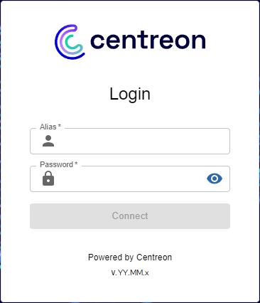

import Tabs from '@theme/Tabs';
import TabItem from '@theme/TabItem';

## First login

To connect to your Centreon web interface, go to URL: `http://IP_ADDRESS/centreon`. (Replace **IP_ADDRESS** with the IP address or FQDN of your Centreon web server.)

Enter your user name and password, and click the **Connect** button:

>If you have installed Centreon from a [VM](../installation/installation-of-a-central-server/using-virtual-machines.md), the default credentials are **admin/Centreon123!**.
Otherwise, the default login is **admin** and the password is the one you defined in [step 5 of the web installation wizard](../installation/web-and-post-installation.md#step-5-admin-information).

You are now connected to the Centreon web interface.

## Menus

The Centreon web interface contains several menus, each with a specific function (click the Centreon logo at the top left of the screen to expand the menus):

* **Home** shows [custom views](create-custom-view.md).
  Your workspace may be blank for now. Once you configure customizable widgets, you will see data and charts according
  to your customization.
* **Monitoring** provides a combined view of the statuses of all monitored items in real and delayed time using logs and
  performance graphics.
* **Reporting** provides an intuitive view (using diagrams) of the evolution of monitoring over a given period.
* **Configuration** allows you to configure all monitored items and the monitoring infrastructure.
* **Administration** lets you access your user account.

## Top banner

### Pollers section

The left part of the top banner shows the health of your platform in real time:

* whether all pollers are running or not: the icon becomes red when a poller has not sent data to the central server for at least 15 minutes
* whether checks are running late or not. If the icon is orange or red, this may mean that your pollers are monitoring too many resources.

Click the **pollers** icon to expand the menu. On the menu, click **Configure pollers** to access page **Configuration > Pollers > Pollers**.

### Hosts and services section (top counters)

Beside the pollers section, statistics show the number of resources being monitored that have a specific status:

* For services: number of services with a **Critical**, **Warning**, **Unknown** and **OK** status.
* For hosts: number of hosts with a **Down**, **Unreachable** and **Up** status.

These numbers include unconfirmed (SOFT) alerts, but do not include resources that are acknowledged or in downtime. Pending resources are shown by a blue dot on the **hosts** or **services** icons.

Click a circle representing a status:

* The **Monitoring > Resources status** page opens.
* The page is filtered according to the type of resource and the corresponding status.

Click the **hosts** or **services** icon to expand the menu and display the details of the hosts and services.

## Customization features

You can benefit from [customization features](../monitoring/basic-objects/customization.md) for a better use of Centreon:

- [Switch to dark mode](../monitoring/basic-objects/customization.md#switch-to-dark-mode)
- [Change the user interface language](../monitoring/basic-objects/customization.md#change-the-user-interface-language)
- [Reset your password](../monitoring/basic-objects/customization.md#reset-your-password)
- [Define a default page after login](../monitoring/basic-objects/customization.md#define-a-default-page-after-login)
