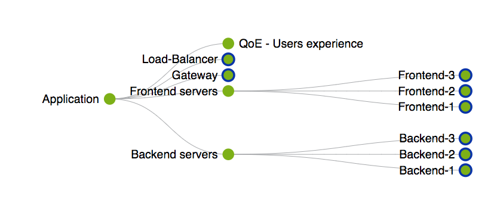
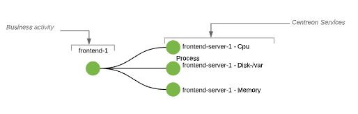
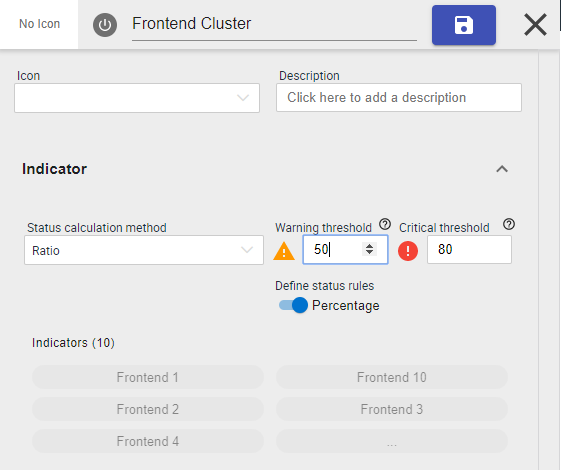
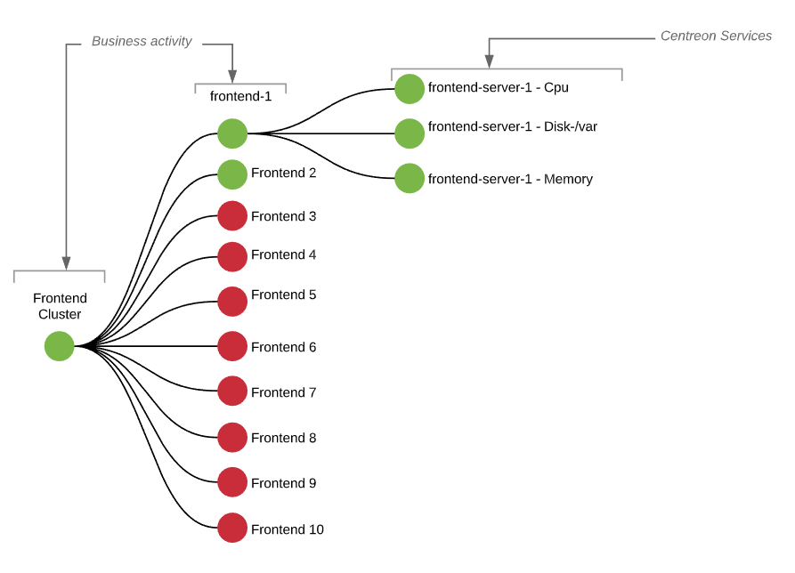

import Tabs from '@theme/Tabs';
import TabItem from '@theme/TabItem';

Centreon Business Activity Monitoring (Centreon-BAM) is an extension for modeling
IT services and applications, ideally, from an end user’s point of view. It reports on the
status of aggregated indicators in real time, tracking any changes, thereby allowing you to
measure results against business-oriented service level agreements (SLAs) with
internal or external users.

> Centreon BAM is a Centreon **extension** that requires a valid license key. To
> purchase one and retrieve the necessary repositories, contact
> [Centreon](mailto:sales@centreon.com).

## Concept

Centreon BAM aggregates raw sets of resource statuses, called indicators, against which to
measure business performance. *These indicators* collected by the Centreon
monitoring system can be either a Centreon service, a logical rule between
multiple services or any another business-centric monitoring indicator, called a
Business Activity (BA).

You can use a BA as an indicator for another BA to create an impact tree and
model the IT services or applications for analysis.

The evolution of a BA status will determine the quality of service (QoS) that
reflects how well the application performs for its users. Based on this QoS
rating, you can define the BA's operating levels and the SLA.

If a BA fails, the malfunction(s) that led to the drop in QoS can be analyzed
and the SLA failure diagnosed.

Below is an example of a business activity that correspond to a generic Application:

## Introduction

Modeling a service or an application (that becomes a BA in Centreon's world) and
its related indicators should be simple and methodical. Ideally, you should
first include indicators that are directly related to the overall function of
the service/applications and then gradually add other indicators that would have
a potential impact on BA status.

All indicators added to a BA must initially be monitored one at a time by the
system to determine the operational status of the BA. 

The important thing to understand here is the way the business activity status will be computed. There are
four calculation methods that can be used:

- **Best status**: When you only need to be warned that ALL indicators are critical at the same time 
- **Worst status**: When you immediately want to know that at least 1 indicator is not-ok
- **Ratio**: When you want to model **Cluster** concepts by specifying a number of percentage of critical resources that you don't want to exceed
- **Impact**: When you want to precisely define the weight of each indicator and reflect that on your BA status 

For more information, look at the [calculation method explanations](../service-mapping/ba-management.md#calculation-methods)

## Implementation method 

The first step when you want to create a business activity is to have a clear view of the IT service, application, component
you want to model. Don't hesitate to first model the Tree on a paper so that you'll just have to replicate the configuration 
in Centreon. 

**The way you think** about an application or service IT may be **Top-Down**: you want to view the state of the Application > "A"
.that relies on Network, Backend, Frontend clusters. These in turn rely on servers and network devices whose status relies
on services monitored by Centreon

**The way you create** a business activity in Centreon is **Bottom-up**: you start by creating the down-level indicators that > represent server or network equipment status, then you aggregate them into Network, Frontend, Backend components and you
finish by creating a Top level component to show the global Application "A" status.

Now that you know what application you want to model and what indicators this application relies on, 
you can sort them into two categories:

  - Indicators known to have a blocking impact
  - Indicators whose impact cannot be measured.

> It's simpler to start by using only the blocking indicators. You'll be able to add more indicators later if you 
> need to have BA status impacted more precisely.

## Example

If we take a simple example: You have multiple frontend servers (10) and you want at least 20% of your servers to be available.

This will be done in two steps (bottom-up):

- First, define what's a frontend server that is OK: create business activities that correspond to frontend servers
- Then, define our cluster: create the business activity that will aggregate my frontend-x servers 

First, we create "Frontend-X" (business activity) corresponding to the frontend servers.
Let's say that a frontend server that performs properly may be defined by:

 - a Load below a critical state
 - and a Disk usage below a critical state
 - and a Swap usage below a critical state

So the state of a frontend-X is the Worst status of these 3 indicators. The first step is over; let's create a 
Frontend-1 business activity:

<Tabs groupId="sync">
<TabItem value="Concept" label="Concept">

</TabItem>
<TabItem value="Configuration" label="Configuration">

</TabItem>
</Tabs>

Now that we've defined our 10 frontend servers, we'll attach them to a parent business activity called "Frontends Cluster"
so that it tells us whether or not we have 20% of Frontend servers available

<Tabs groupId="sync">
<TabItem value="Concept" label="Concept">

</TabItem>
<TabItem value="Configuration" label="Configuration">

</TabItem>
</Tabs>

If we want to be proactive and NEVER go to 20%, we may add a Warning threshold to our Cluster business activity 
to be warned when 50% of the frontend servers are not available: just add "50%" to the Warning threshold:

So, finally, we have combined multiple calculation methods, multiple types of resource, and our business activity
 will look like this:

 

Using the product on a daily basis helps to track the daily evolution of the BA to adjust indicators or rules that
apply.

## Reporting consideration

Now that you can proactively manage your IT services and application thanks to real-time BA tracking,
it's time to look at availability and SLA.This is possible with the reporting capabilities 
and the **Centreon MBI extension** and the settings applied in the "Reporting" section of the BA.

**How do we compare availability and SLA?**

The final value of the SLA is linked to the time spent in *OK*, *Warning* /
*Critical* conditions (downtime/uptime), which are visible in the Reporting
screens.

Examples:

  - 24/7 monitoring
  - Over a 1-day period, the time spent in the status is as follows
      - BA in OK status = 23 hours and 30 minutes
      - BA in WARNING status = 10 minutes
      - BA in CRITICAL status = 20 minutes

In this example, the following availability will be calculated:

  - % Up and optimum performance \~ 98.61% (OK+Warning)
  - % Up but degraded \~ 97.91% (OK)
  - % Not available \~ 1.38% (Critical).

You can use the **Centreon MBI extension** to access advanced reporting capabilities on business activities data.
