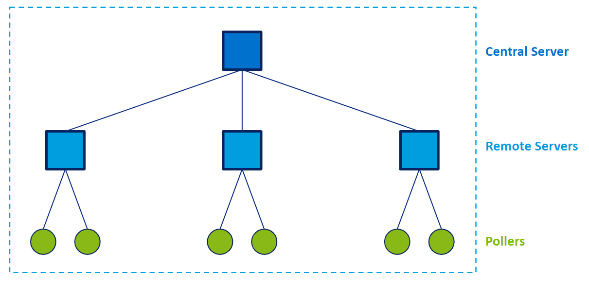

According to your needs, your platform can consist of several elements: a [central server](#central-server), one or several [remote servers](#remote-server), and one or several [pollers](#poller).

- If you are only monitoring a few resources, you will only need a central server.
- If you are monitoring a large number of resources, spread the load across a [distributed architecture](#distributed-architecture).

## Central server

In Centreon, the central server is the main console where you monitor resources. The central server allows you to:

- configure the monitoring of your whole infrastructure,
- monitor resources
- see what all your Centreon servers monitor (central server, [remote servers](#remote-server) and [pollers](#poller)), using its web interface.

## Remote server

A remote server is attached to a central server. Pollers can be attached to a remote server.

- A remote server monitors resources. It has a monitoring engine.
- It has a graphical interface, but no configuration menus.
- The resources it monitors are displayed in its interface, and in the interface of the central server it is attached to.

## Poller

A poller can be attached to a [remote server](#remote-server), or directly to a [central server](#central-server).

- A Centreon poller monitors resources. It has a monitoring engine.
- A poller has no graphical interface: the resources it monitors are displayed in the interface of the central server and of the remote server it is attached to.

## Distributed architecture

See also [**Architectures**](../installation/architectures.md).
