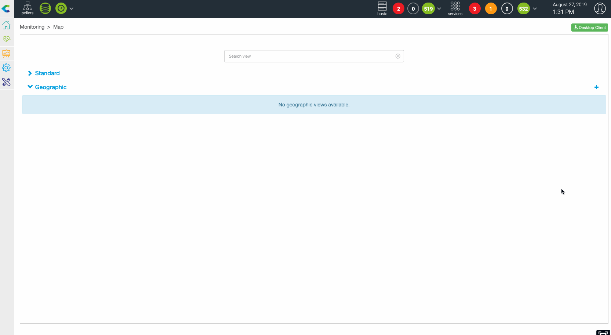

## Create a GeoView

A user that is a Centreon admin, or a Centreon Map admin, or has the right to
create views, can create geographic views using the web interface. To do
so:

1. Go to **Monitoring > Map** and click the "+" on the Geographic section.
2. You are asked to name the view and then to define resources to
   display on the view.
3. After configuring these parameters, resources will appear on this
   geographic view

The following resources can be displayed on a GeoView:

- Hosts belonging to hostgroup(s)
- Business Activity belonging to Business View(s)
- One or multiple Hostgroup(s)

Prerequisites: Define lat/long coordinate in the resources configuration form
for host, hostgroups or business activity.

Example with a host:

## How access control limitations (ACL) are handled

As soon as you give access to **Monitoring > Map** or to a custom view
containing a Map widget, GeoViews are accessible to every Centreon
user. A user will only see resources they are authorized to see, based on
their ACL profile.

## How resources are displayed

When a resource (host, hostgroup or a business activity) is positioned
on a geoview, it is displayed as a circle whose color is defined using
the following rules:

- Host: worst state between the host and its services
- Hostgroups: worst state of hosts belonging to the hostgroups
- Business activity: current status

*Worst state order: Critical (red) \> Down (red) \> Warning(orange) \>
Unknown(gray) \> Unreachable(gray) \> Ok(green) \> Up(green) \> Pending(blue)*

### Clustering

When multiple resources are geographically close and you are at
"certain" zoom level, then they are grouped into one single circle
displaying two things:

- Status of the worst object (displayed as a color between green, orange, red
  and gray)
- Number of resources in this state

*This behavior can be disabled in the global Centreon Map parameters*

### Blinking resources

If a resource is in a "not-ok" state, it blinks.

*This behavior can be disabled in the global Centreon Map parameters*

## Datalayers on Geoview

Centreon MAP gives you the possibility to display additional "data layers" on
maps to add context to your real-time IT infrastructure status.

First you need to add data layers in the Centreon Map option, and then, if the
data layer is enabled, you can make it visible or not by checking the
layer concerned using the top left icon.

**Examples**

