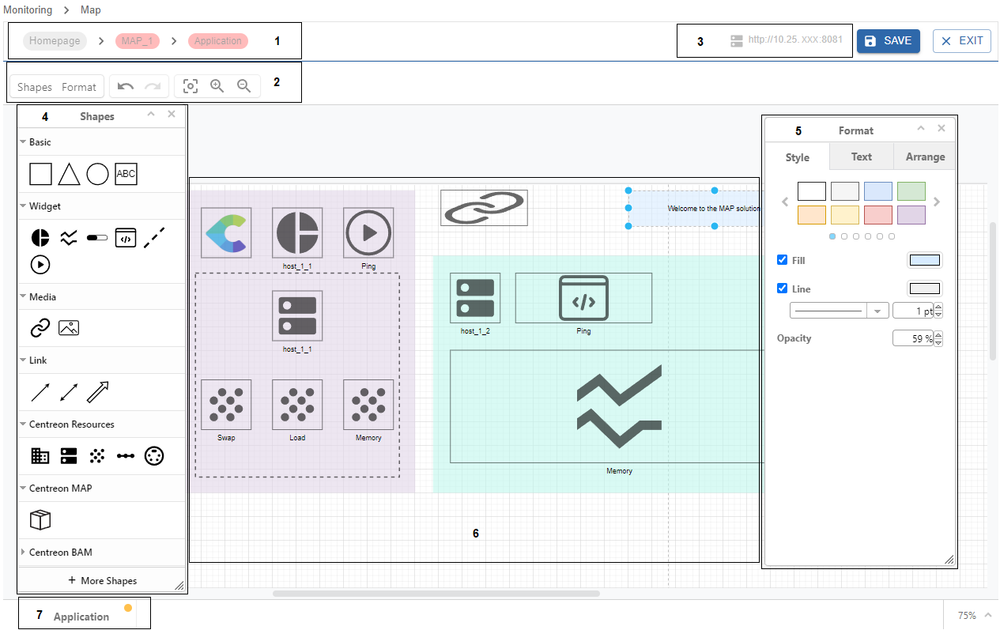

This topic describes how to create standard maps and how to customize them using the MAP editing mode.

The display of the **Add a Map** button in the **Map** page means that you are allowed to create a map and that you belong to an access group that is granted the creator role.

## Create a standard map

1. In the **Monitoring > Map** page, click the **Add a Map** button located in the **Standard maps** section.

2. Fill in the properties of the new map:
   - Name: provide a name to the map.
   - Image: select an image if you want to customize the map's display in the list of maps.

3. Click **Add** to confirm the map's creation.

The new map opens directly in the editor interface.
Now you can customize your map using the MAP editor features.

## Use the MAP editor

Follow this procedure to open your map in editing mode:

1. Go to **Monitoring > Map** to display the list of existing maps.
2. Select the map you want to edit.
3. Click the **EDIT** button to open it in editing mode.

> After editing the map, switch to viewing mode by saving your changes with the **SAVE** button. Then click **EXIT**.

### MAP editor overview

This is the MAP editor view:

**1. Breadcrumb:** allows you to know which elements of the map you have been through to reach the current view. 
**2. Toolbar:** allows you to hide / display panels,  to undo / redo actions, and to fit / zoom in / zoom out on the drawing canvas space.
**3. IP address:** this is the MAP server address specified in the Centreon Map settings.
**4. Shapes panel:** this panel offers all elements you need to build a map, from the basics to the Centreon resources.
**5. Format panel:** this panel allows you to apply a format to a selected element.
**6. Drawing canvas:** this is the space in the middle of the editor, where you draw your diagram.
**7. Tab:** you can navigate between multiple tabs when your map requires multiple pages. For instance, when your map has several containers, you can navigate between tabs where each tab corresponds to a container.

### Use graphical elements to build your map

The **Shapes** panel contains different types of elements to build your map. Options will be displayed depending on the type of element you have selected.

#### Basic elements

Use **Basic** shapes to organize your map elements with geometric shapes and text areas. Then use the **Format** panel to customize your shape by applying a style format such as color, opacity, etc.

#### Widget elements

Use **Widget** elements to display graphical data about the resources you monitor. Widgets provide information such as health status information or performance metrics. The available widgets are:
- **Pie chart:** displays the status of a resource to monitor in proportional data format. It displays:
  - For a host: the number of OK, Warning, Critical, and NA states.
  - For a host group: the number of hosts in OK, Warning, Critical, and NA states.
- **Line chart:** displays performance data related to a service, over a period of time.
- **Gauge:** describes the output of a service. You can place a gauge in any direction (left to right, bottom to top, etc.).
- **Output:** describes the output of a service. The background is in the same color as the status.
- **Process:** allows you to trigger an action on any resources based on a command. Here is an example:
  - You have an internal website that uses Apache, and sometimes Apache crashes. Your need to investigate the core problem of why this crash occurs, however your priority is to make sure the end users can access the website.
  - You can use the process widget by assigning a command such as "services httpd restart" so that when the Apache process crashes, users can immediately restart the Apache service from the view by double-clicking on the widget.
  - To create a service dedicated to an "action": create a command (in **Configuration > Command > Checks > Add**) that contains "service httpd restart" (remember to enable shell). Link the command to a passive service. Link the passive service to a host (e.g. the host that hosts the website). Then you can assign that service to the widget.

#### Media elements

Use **Media** elements to add:
- **Url:** allows you to add an access to a specified link.
- **Image:** allows you to customize your diagram by adding images.  

1. Drag and drop the element into the drawing canvas.
2. Right-click it and select **Edit data**.
3. Fill in the required setting and click **Submit**.

#### Link elements

Use **Link** elements to make connections between items (with anchor points):
- **Link:** is a simple arrow link element to connect two items.
- **Status link:** use this link between two items and configure a resource to monitor from it. Then this link will display the color status of the resource you specified.
- **Metric link:** use this link between two items and configure a service and its metrics from it. Then this link will display the metrics of the service you specified. 

#### Centreon elements

- **Resources** elements:
  - Host group
  - Host
  - Service
  - Service group
  - Meta service

- **MAP** elements:
  - Container

- **BAM** elements:
  - Business activity

Settings will be displayed depending on the type of element you have selected.

1. Drag and drop the element into the drawing canvas.
2. Right-click it and select **Edit data**.
3. Fill in the required settings and click **Submit**.

#### Customize your elements

The **Format** panel allows you to apply formatting options depending on the type of element you have selected.
- **Style tab:** to customize shapes, links and text.
- **Text tab:** to format all text elements.
- **Arrange tab:** to organize elements on the drawing canvas (size, position, alignment) and place them according to different layers.

## Save the perspective of your map

For an optimal user experience, you can save the perspective (zoom and position) of your map. So each time you open your map, you will find it in the position that suits you best.

- **In edition mode:** the perspective is saved as soon as you click on the **Save** button.

- **In view mode:** click the **Save perspective** button and a message will confirm the perspective is saved.
