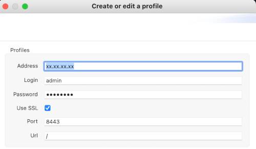
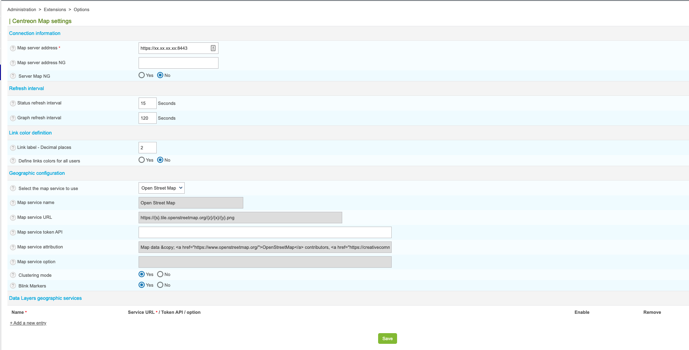
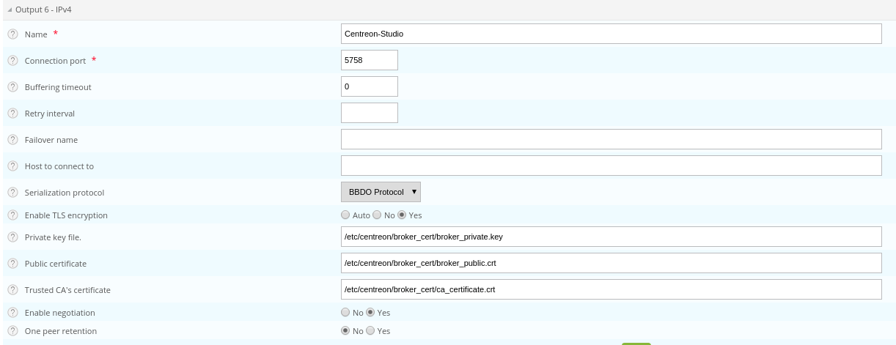

import Tabs from '@theme/Tabs';
import TabItem from '@theme/TabItem';

This chapter describes advanced procedures to secure your Centreon MAP and MAP (Legacy)
platform.

> If you want to use MAP and MAP (Legacy) in HTTPS, you must both secure your Centreon platform and MAP (or MAP Legacy). Follow this [procedure](../administration/secure-platform.md#secure-the-web-server-with-https) if you need to secure your Centreon platform.

> Mistakes when editing configuration files can lead to malfunctions of the software. We recommend that you make a backup of the file before editing it and that you only change the settings advised by Centreon.

## Configure HTTPS/TLS on the MAP (or MAP Legacy) server

### HTTPS/TLS configuration with a recognized key

> This section describes how to add a **recognized key** to the Centreon
> MAP (or MAP Legacy) server.
>
> If you want to create an auto-signed key and add it to your server, please
> refer to the [following
> section](#httpstls-configuration-with-an-auto-signed-key)

You will require:

- A key file, referred to as *key.key*.
- A certificate file, referred to as *certificate.crt*.

1. Access the Centreon MAP server through SSH and create a PKCS12 file with the following command line:

    ```shell
    openssl pkcs12 -inkey key.key -in certificate.crt -export -out keys.pkcs12
    ```

2. Import this file into a new keystore (a Java repository of security certificates):

<Tabs groupId="sync">
<TabItem value="MAP" label="MAP">

```shell
keytool -importkeystore -srckeystore keys.pkcs12 -srcstoretype pkcs12 -destkeystore /etc/centreon-map/map.jks
```

3. Set below parameters inside **/etc/centreon-map/map-config.properties**:

```text
centreon-map.keystore=/etc/centreon-map/map.jks
centreon-map.keystore-pass=xxx
```

</TabItem>
<TabItem value="MAP (Legacy)" label="MAP (Legacy)">

```shell
keytool -importkeystore -srckeystore keys.pkcs12 -srcstoretype pkcs12 -destkeystore /etc/centreon-studio/studio.jks
```

3. Set below parameters inside **/etc/centreon-studio/studio-config.properties**:

```text
centreon-map.keystore=/etc/centreon-studio/studio.jks
centreon-map.keystore-pass=xxx
```

</TabItem>
</Tabs>

> Replace the keystore-pass value "xxx" with the password you used for
> the keystore and adapt the path (if it was changed) to the keystore.

### HTTPS/TLS configuration with an auto-signed key

<Tabs groupId="sync">
<TabItem value="MAP" label="MAP">

> Enabling the TLS mode with an auto-signed key will force every user to add an
> exception for the certificate before using the web interface.
>
> Enable it only if your Centreon also uses this protocol.
>
> Users will have to open the URL:
>
> - MAP:
> ```shell
>https://<MAP_IP>:9443/centreon-map/api/beta/actuator/health
> ```
>
> *The solution we recommend is to use a recognized key method, as explained
> above.*

1. Move to the the Java installation folder:

```shell
cd $JAVA_HOME/bin
```

2. Generate a keystore file with the following command:

```shell
keytool -genkey -alias map -keyalg RSA -keystore /etc/centreon-map/map.jks
```

The alias value "map" and the keystore file path
**/etc/centreon-map/map.jks** may be changed, but unless there is a
specific reason, we advise keeping the default values.

Provide the needed information when creating the keystore.

At the end of the screen form, when the "key password" is requested, use
the same password as the one used for the keystore itself by pressing the
ENTER key.

3. Set below parameters inside **/etc/centreon-map/map-config.properties**:

```text
centreon-map.keystore=/etc/centreon-map/map.jks
centreon-map.keystore-pass=xxx
```

> Replace the keystore-pass value "xxx" with the password you used for
> the keystore and adapt the path (if it was changed to the keystore).

</TabItem>
<TabItem value="MAP (Legacy)" label="MAP (Legacy)">

> Enabling the TLS mode with an auto-signed key will force every user to add an
> exception for the certificate before using the web interface.
>
> Enable it only if your Centreon also uses this protocol.
>
> Users will have to open the URL:
>
> - MAP (Legacy):
> ```shell
> https://<MAP_IP>:8443/centreon-studio/api/beta/actuator/health
> ```
>
> *The solution we recommend is to use a recognized key method, as explained
> above.*

1. Move to the the Java installation folder:

```shell
cd $JAVA_HOME/bin
```

2. Generate a keystore file with the following command:

```shell
keytool -genkey -alias studio -keyalg RSA -keystore /etc/centreon-studio/studio.jks
```

The alias value "studio" and the keystore file path
**/etc/centreon-studio/studio.jks** may be changed, but unless there is a
specific reason, we advise keeping the default values.

Provide the needed information when creating the keystore.

At the end of the screen form, when the "key password" is requested, use
the same password as the one used for the keystore itself by pressing the
ENTER key.

3. Set below parameters inside **/etc/centreon-studio/studio-config.properties**:

```text
centreon-map.keystore=/etc/centreon-studio/studio.jks
centreon-map.keystore-pass=xxx
```

> Replace the keystore-pass value "xxx" with the password you used for
> the keystore and adapt the path (if it was changed to the keystore).

</TabItem>
</Tabs>

### Activate TLS profile of Centreon MAP service

<Tabs groupId="sync">
<TabItem value="MAP" label="MAP">

1. Stop Centreon MAP service:

```shell
systemctl stop centreon-map-engine
```

2. Edit the file `/etc/centreon-map/centreon-map.conf`, adding ",tls after "prod" profile:

```text
RUN_ARGS="--spring.profiles.active=prod,tls"
```

3. Restart Centreon MAP service:

```shell
systemctl start centreon-map-engine
```

Centreon MAP server is now configured to respond to requests from HTTPS at port 9443.

</TabItem>
<TabItem value="MAP (Legacy)" label="MAP (Legacy)">

1. Stop Centreon MAP service:

```shell
systemctl stop centreon-map
```

2. Edit the file **/etc/centreon-studio/centreon-map.conf**, adding `,tls` after `prod` profile:

```text
RUN_ARGS="--spring.profiles.active=prod,tls"
```

3. Restart Centreon MAP service:

```shell
systemctl start centreon-map
```

Centreon MAP server is now configured to respond to requests from HTTPS at port 8443.

> Don't forget to update your connection profile in the desktop client 
> by checking the ssl checkbox.


</TabItem>
</Tabs>

To change the default port, refer to the [dedicated
procedure](advanced-configuration.md#change-centreon-map-server-port).

> Don't forget to modify the URL on Centreon side in the **Map server address**
> field in the **Administration > Extensions > Map > Options** menu.


## Configure TLS on the Broker connection

An additional Broker output for Centreon Central (centreon-broker-master) has
been created during the installation.

You can check it in your Centreon web interface, from the **Configuration > Pollers > Broker Configuration**, 
by editing the **centreon-broker-master** configuration.

The output configuration should look like this:


### Broker configuration

You can enable TLS output and set up Broker's private key and public
certificate as described below:



1. Create a self-signed certificate with the following commands: 

    ```text
    openssl req -new -newkey rsa:2048 -nodes -keyout broker_private.key -out broker.csr
    openssl x509 -req -in broker.csr -CA ca.crt -CAkey ca.key -CAcreateserial -out broker_public.crt -days 365 -sha256
    ```

2. Copy the private key and the certificate into **/etc/centreon/broker_cert/** directory:

    ```text
    mv broker_private.key /etc/centreon/broker_cert/
    mv broker_public.crt /etc/centreon/broker_cert/
    ```

> "Trusted CA's certificate" field is optional. If you activate Broker's client
> authentication by setting this "ca\_certificate.crt", then you must setup a
> [keystore for MAP server](#configure-httpstls-on-the-web-server)
>
> You MUST push the new broker configuration and restart the broker after
> configuration.

### MAP server configuration

> You must [secure your Centreon platform with HTTPS](../administration/secure-platform.md#secure-the-web-server-with-https).

<Tabs groupId="sync">
<TabItem value="MAP" label="MAP">

Set the **centreon.url** inside **/etc/centreon-map/map-config.properties** to use HTTPS instead of HTTP:

</TabItem>
<TabItem value="MAP (Legacy)" label="MAP (Legacy)">

Set the **centreon.url** inside **/etc/centreon-studio/studio-config.properties** to use HTTPS instead of HTTP:

</TabItem>
</Tabs>

```shell
centreon.url=https://<server-address>
```

To enable TLS socket connection with Broker:

```text
broker.tls=true
```

#### Configuration with a self signed certificate

If the Broker public certificate is self signed, you must create a trust store
containing given certificate or its CA certificate with the following command
line:

<Tabs groupId="sync">
<TabItem value="MAP" label="MAP">

```shell
keytool -import -alias centreon-broker -file broker_public.crt -keystore /etc/centreon-map/truststore.jks
```

- "broker\_public.crt" is Broker public certificate or its CA certificate
  in PEM format,
- "truststore.jks" is the generated trust store in JKS format,
- a store password is required during generation.

1. Add truststore parameters in **/etc/centreon-map/map-config.properties**:

```text
centreon-map.truststore=/etc/centreon-studio/truststore.jks
centreon-map.truststore-pass=XXXX
```

> Replace the trustStorePassword value "xxx" with the password you used when
> generate the trust store.

2. Edit the file **/etc/centreon-map/centreon-map.conf**, and replace `,tls` by `,tls_broker` after `prod` profile:

```text
RUN_ARGS="--spring.profiles.active=prod,tls_broker"
```

> "tls_broker" profile implies "tls" profile. So Centreon MAP service
> serves necessarily HTTPS.

Once you add a truststore, Centreon MAP will use it to validate self-signed certificates.
This means that if you use a self-signed certificate for the central server, you must add it to the truststore. If you don't, the
 **Monitoring > Map** page will be blank, and the logs (**/var/log/centreon-map/centreon-map.log**)
 will show the following error :
 `unable to find valid certification path to requested target`.

1. Copy the central server's **.crt** certificate to the MAP server.

2. Add the certificate to the truststore:

```shell
keytool -import -alias centreon-broker -file central_public.crt -keystore /etc/centreon-map/truststore.jks
```

</TabItem>
<TabItem value="MAP (Legacy)" label="MAP (Legacy)">

```shell
keytool -import -alias centreon-broker -file broker_public.crt -keystore /etc/centreon-studio/truststore.jks
```

- "broker\_public.crt" is Broker public certificate or its CA certificate
  in PEM format,
- "truststore.jks" is the generated trust store in JKS format,
- a store password is required during generation.

1. Add truststore parameters in **/etc/centreon-studio/studio-config.properties**:

```text
centreon-map.truststore=/etc/centreon-studio/truststore.jks
centreon-map.truststore-pass=XXXX
```

> Replace the trustStorePassword value "xxx" with the password you used when
> generate the trust store.

2. Edit the file `/etc/centreon-studio/centreon-map.conf`, and replace `,tls` by `,tls_broker` after `prod` profile:

```text
RUN_ARGS="--spring.profiles.active=prod,tls_broker"
```

> "tls_broker" profile implies "tls" profile. So Centreon MAP service
> serves necessarily HTTPS.

Once you add a truststore, Centreon MAP will use it to validate self-signed certificates.
This means that if you use a self-signed certificate for the central server, you must add it to the truststore. If you don't, the
 **Monitoring > Map** page will be blank, and the logs (**/var/log/centreon-map/centreon-map.log**)
 will show the following error :
 `unable to find valid certification path to requested target`.

1. Copy the central server's **.crt** certificate to the MAP server.

2. Add the certificate to the truststore:

```shell
keytool -import -alias centreon-broker -file central_public.crt -keystore /etc/centreon-studio/truststore.jks
```

</TabItem>
</Tabs>

#### Configuration with a recognized CA certificate

If the broker public certificate is signed with a recognized CA, the JVM
default trust store "cacerts (/etc/pki/java/cacerts)" will be used. Nothing
to configure for Centreon MAP service