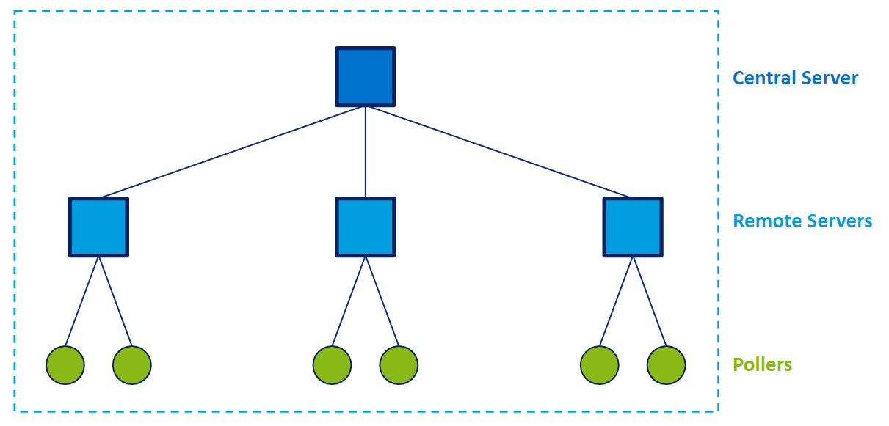

import Tabs from '@theme/Tabs';
import TabItem from '@theme/TabItem';

If you are monitoring a small number of hosts and services, a central server is enough. However, to monitor a large number of hosts and services, you will need to distribute the load over multiple servers.

> If you do not know what remote servers and pollers are, see [Elements of a Centreon platform](../getting-started/platform.md).

## Available architectures

### Standalone central server

If you are not monitoring many hosts, you may only need one central server. The central server will do all of the monitoring itself.

### Distributed architecture

A distributed architecture consists of:

* A Centreon Central server to configure monitoring and to display and operate on collected data
* One or more remote servers to display and operate on a subset of collected data

and/or

* One or more pollers to collect data.

All servers (central, remote and pollers) in your architecture must have the same major version of Centreon. It is also recommended that they have the same minor version.

Example of distributed architecture with 3 remote servers and 6 pollers. Note that you can also attach a poller directly to the central server.

### Architecture with remote DBMS

Your central server can have a remote DBMS. An architecture with a remote DBMS consists of:

* A Centreon Central server to configure monitoring and display collected data
* A DBMS server to store collected data
* Optionally, one or more remote servers and/or pollers to collect data

## What kind of architecture do you need?

When designing your Centreon platform, bear the following considerations in mind:

* The number of hosts you will monitor is not enough to determine how big your platform should be. You will also need to take into account the number of services per host and the number of metrics per service.
* Another criterion to consider is whether you need to use pollers or remote servers to separate your resources according to geographical or logical criteria. Example: If your monitoring architecture has to monitor a DMZ area, it is easier (and safer) to place a remote server in the DMZ network.
* A central server should only monitor a small number of hosts and services because its CPU should primarily handle the data sent by remote servers and pollers (the same applies to remote servers). The more hosts and services you monitor on your central server, the higher the risk of the interface being slowed down, because the monitoring engine will use more resources.
* The central server should monitor all remote servers and pollers.
* The central server should be monitored by a poller or a remote server.
* Use a remote server instead of a poller if you need to view data on a site other than where the central server is located.
