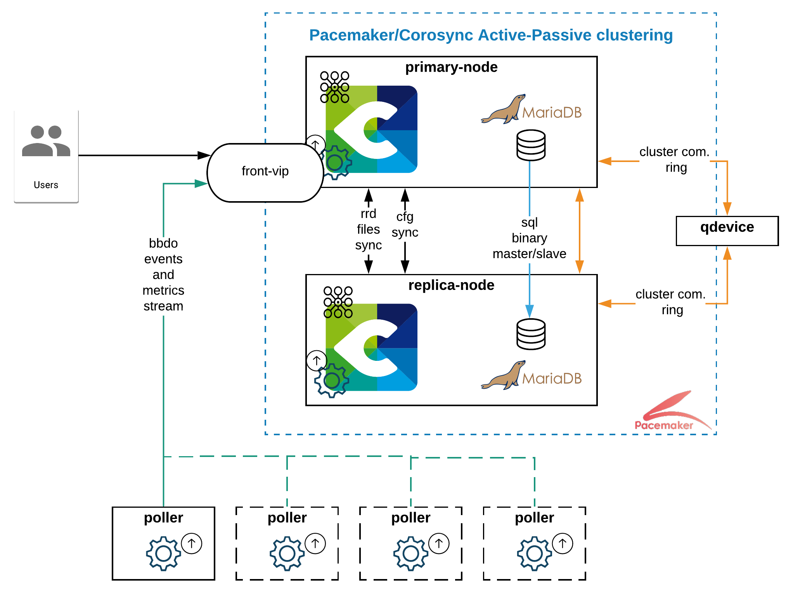
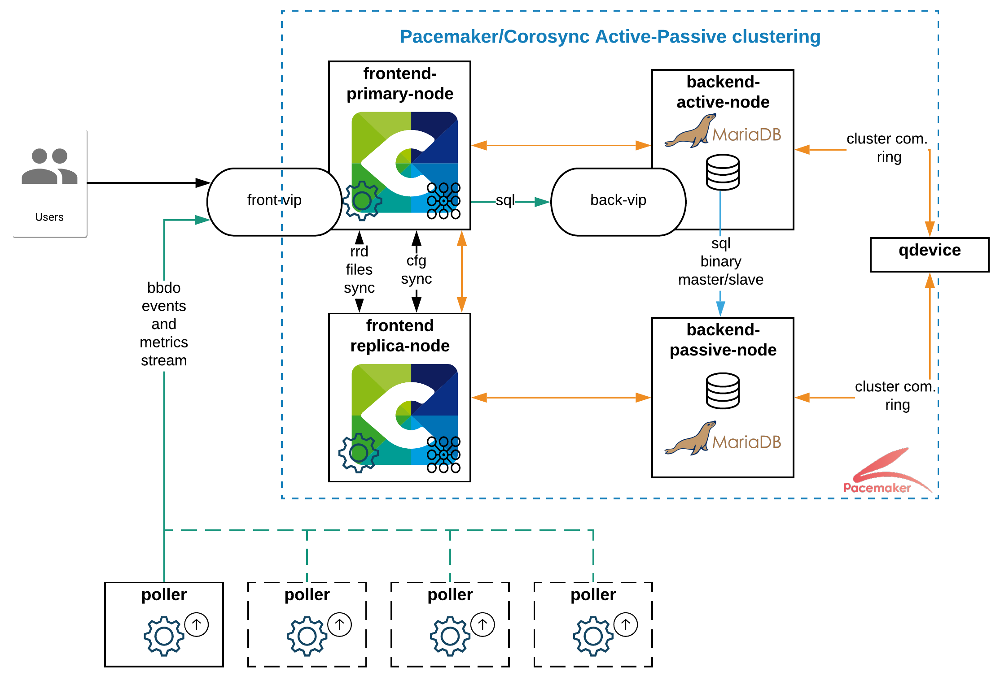

import Tabs from '@theme/Tabs';
import TabItem from '@theme/TabItem';

## Introduction 

Centreon-HA is the only official and supported solution to set up a highly available monitoring cluster. It 
includes the following: 
* Documentation, mainly to describe how to set up your Cluster on top of your Centreon solution.
* Script collection enabling safe and efficient management of Centreon-related resources.
* Additional files that extend the default Centreon capabilities. 

Its architecture relies on the [ClusterLabs](https://clusterlabs.org/) components pacemaker and corosync, 
allowing fault tolerance on the following components: 

* Central Server applicative daemons
  * centreon-engine (scheduler)
  * centreon-broker (multiplexer)
  * centreon-gorgone (task manager)
  * centreon-central-sync (config file replication)
  * snmptrapd and centreontrapd (system and applicative trap management processes)
* Central Server third-party daemons
  * php-fpm (FastCGI PHP cache)
  * apache server (webserver)
* Databases
  * Active/Passive binlog replication (storage)
* Host failures
  * Virtual machines or Physical servers

> **Warning:** If you have an IT or Business subscription, please get in touch with your Centreon Sales 
representative or Technical Account Manager before implementing this. Extensions need specific license 
files to work on both nodes smoothly.  

## Concepts

The solution implements three different kinds of resources: 

* _Multi-state_ resource running on both nodes with different roles. 
* _Clone_ resources, running on both primary and secondary nodes.
* _Unique_ resources, part of a _group_, and running on only one node.

The cluster services are divided into two functional groups.

### MariaDB functional group

The `ms_mysql` functional group is a _multi-state_ resource. This resource can be in active/primary mode 
on one node and in secondary/passive mode on another node. 

The `ms_mysql-master` meta-resource is assigned to the primary database. 

### Centreon functional group

The `centreon` functional group gathers all Centreon resources to manage them. 

### Resources type description

All these resources are described in the table below.

| Name                    | Type                 | Description                                          |
| ----------------------- | -------------------- | ---------------------------------------------------- |
| `ms_mysql`              | multi-state resource | Handles the `mysql` process and data replication     |
| `ms_mysql-master`       | location             | Set MariaDB Master server rule preference            |
| `php8`                  | clone service        | FastCGI Process Manager service (`php-fpm`)          |
| `cbd_rrd`               | clone service        | Broker RRD service (`cbd`)                           |
| `centreon`              | group                | Centreon "primitive services" group                  |
| `vip`                   | primitive service    | VIP address for centreon                             |
| `http`                  | primitive service    | Apache service (`httpd24-httpd`)                     |
| `gorgone`               | primitive service    | Gorgone service (`gorgoned`)                         |
| `centreon_central_sync` | primitive service    | File synchronization service                        |
| `cbd_central_broker`    | primitive service    | Central Broker service (`cbd-sql`)                   |
| `centengine`            | primitive service    | Centreon-Engine service (`centengine`)               |
| `centreontrapd`         | primitive service    | SNMP Traps management service (`centreontrapd`)      |
| `snmptrapd`             | primitive service    | SNMP Traps listening service (`snmptrapd`)           |

**Note:** The resources of the `centreon` group are started one after the other in the list order.

### Resource constraints

Pacemaker offers various types of constraints:
* Location: where the resource should or shouldn't run.
* Colocation: how resources behave to each other.

For example, Centreon-HA uses location constraints to specify to Pacemaker that the database process 
needs to be up on backend nodes but not on frontend nodes. 

Regarding colocation constraints, they can ensure a Virtual IP sticks to the master nodes and/or role. 
Therefore Users, Pollers, and Daemons constantly interact with the primary node. 

### QDevice and votes

The configuration of a qdevice is **mandatory** to avoid split-brain and other situations nobody wants 
to face in a Cluster. The server with the `quorum-device` role aims to obtain an absolute majority in a vote 
to elect a master node or resource role.

## Support

### Software & operating systems 

Centreon officially supports clustering on the following products: 

* Any Centreon Licensed Editions 
* Centreon Map Server 

And on the following Operating Systems: 

* Alma / RHEL / Oracle Linux 8
* Debian 11 

*Important:* To install pacemaker and corosync packages on RedHat systems, servers must have access to
the _Red Hat Enterprise Linux High Availability_ licensed repository.  

The only official database server Centreon supports is MariaDB. 

Nevertheless, note that we validated that the whole solution can run on MySQL 8 *with some 
modifications*; only the [community](https://github.com/centreon-ha/issues) (or your DBAs) 
can help and support you in running a cluster on top of an Oracle MySQL server.

For both MariaDB and Oracle MySQL, the replication configuration might be intrusive. We *strongly discourage you* from setting 
up a cluster on a server holding other application databases, and we won't support it. 

### Architectures

Centreon supports both two- and four-node architectures. We recommend using a two-node architecture, unless
your organization requires a systematic split of front and back servers or your monitoring 
scope is above 5k Hosts. 

The schemas below show both the architecture flavor and network flows between servers. To get the complete network 
flow matrix, refer to the architecture dedicated installation page.

<Tabs groupId="sync">
<TabItem value="Two-nodes-cluster" label="Two-nodes-cluster">

Go to [this page](../../installation/installation-of-centreon-ha/installation-2-nodes.md) to start your two-node setup! 

</TabItem>
<TabItem value="Four-nodes-cluster" label="Four-nodes-cluster">

Go to [this page](../../installation/installation-of-centreon-ha/installation-4-nodes.md) to start your four-node setup!

</TabItem>
</Tabs>

## Additional information

### Server organization

Setting up a Centreon-HA cluster might be overkill, or at least not optimal, when all your servers are running in 
the same datacenter or (even more so) within the same rack. 

In a perfect world, the primary and secondary nodes would be running on different (geographical) sites, and the qdevice 
would communicate with both sites independently. Obviously, all nodes need to communicate with each other.

### Role of the Centreon central server

In the case of a highly available architecture the **Centreon central cluster must not be used as a poller**. 
In other words, it should not monitor resources. Its monitoring ability should only be used to monitor its pollers. 
If this recommendation is not followed, the `centengine` service will take too long to restart 
and **it may cause the functional `centreon` group to failover**.

### VIP and load balancing

Centreon recommends using VIP addresses.

Using a load balancer is an option, but it should support custom rules to route application flows.

For example, in a four-node setup, a load balancer can rely on:
* frontend-vip: the listening port or the apache process state to route Users and Pollers' communication toward frontend servers.
* backend-vip: the value of the "read_only" flag on both database servers to determine which is the primary one.