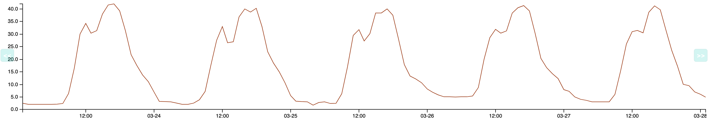
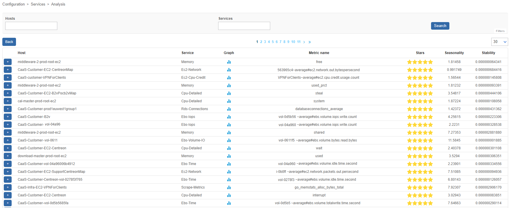
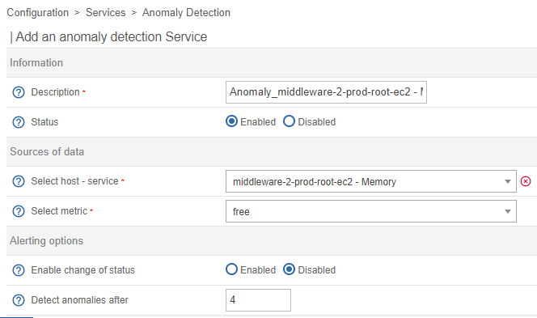

import Tabs from '@theme/Tabs';
import TabItem from '@theme/TabItem';

> Centreon Anomaly Detection is a Centreon extension that requires a valid [license](../administration/licenses.md). To purchase one and obtain the necessary repositories and access token, contact [Centreon](mailto:sales@centreon.com).

## Description

The **Centreon Anomaly Detection** module detects deviations from the regular behavior of a
service. It uses dynamic thresholds to trigger alerts.

With "classic" monitoring, alerts are triggered from static thresholds. For instance, users are alerted when the ping
on a server exceeds 700 ms. However, for some services, "normal" values change over time, which means that static thresholds are
not that relevant. You can use Anomaly Detection when the behavior of a service is repetitive and predictable:



Anomaly Detection determines how the normal values evolve over time; predictions calculate a lower threshold and an upper threshold.
When the behavior of the service deviates from the expected model, these thresholds are passed (i.e. the metric goes below the lower threshold or goes over the upper threshold). The service goes into a CRITICAL state and a notification is sent. Example: a server usually has little traffic at night. One night, Centreon detects network flows that are higher than normal and triggers an alert. This makes the company aware that the server has been hacked.

## How it works

1. Collected data is sent to the Centreon SaaS platform.

2. Centreon computes a regular behavior model using the history of this data.

3. Once the model has been calculated, predictions are then generated and retrieved
by your Centreon platform.

4. The predictions act as floating thresholds, which will then be used by
the monitoring engine to compare the collected value with the predicted
thresholds to highlight deviations and generate alerts. Data received during downtimes is not taken into account when computing predictions, to avoid distorting the analysis.

5. Models are recomputed regularly and improve over time.

## Prerequisites

To use Anomaly Detection, you will need:

- A token provided by Centreon to access the Centreon SaaS platform,
- An internet connection from the Centreon central server. The central server must be able to reach `api.a.prod.mycentreon.com` on port 443.
- The SHELL environment variable [LC_ALL](https://www.gnu.org/software/gettext/manual/html_node/Locale-Environment-Variables) must not be set, or be set to `C`. To check the value of this variable, enter:

   ```
   echo $LC_ALL
   ```

## Installation

### Step 1: Installing packages

Run the following command:

<Tabs groupId="sync">
<TabItem value="Alma / RHEL / Oracle Linux 8" label="Alma / RHEL / Oracle Linux 8">

```shell
dnf install centreon-anomaly-detection
```

</TabItem>
<TabItem value="Alma / RHEL / Oracle Linux 9" label="Alma / RHEL / Oracle Linux 9">

```shell
dnf install centreon-anomaly-detection
```

</TabItem>
<TabItem value="Debian 11" label="Debian 11">

``` shell
apt update && apt install centreon-anomaly-detection
```

</TabItem>
</Tabs>

### Step 2: UI installation

1. Go to **Administration > Extensions > Manager**. An **Anomaly Detection** tile appears in the **Modules** section.

2. Click the installation button in the **Anomaly Detection** tile. The module is now installed (the version number appears on a green background with a white check mark next to it).

3. Run the following command as a privileged user:

   ```shell
   systemctl restart gorgoned
   ```

### Step 3: Add your token

1. Go to **Configuration > Services > Anomaly Detection** and click 
**Add Centreon Cloud Token**.

2. Enter your token and click **Save**.

> If your Centreon central server needs a proxy configuration to access the
> Internet, check the **Use proxy** box.

Your Centreon platform is now ready to use Centreon Anomaly Detection.

## Configuration

To have a fully functional Anomaly Detection service, you need to complete four steps:

1. [Create an Anomaly Detection service](#step-1-create-an-anomaly-detection-service). This will activate the sending of the collected data to the Centreon SaaS platform, in order to start modeling regular behavior.
2. Assess the relevance of the computed predictions.
3. Once the model seems right, [activate status changes for the service](#activate-the-generation-of-alerts).
4. When all changes in status seem relevant, [activate the notification process](#activate-the-notification-process).

### Step 1: Create an Anomaly Detection service

You can create an Anomaly Detection service manually, or [use the creation wizard](#use-the-creation-wizard). To create an Anomaly Detection service manually:

1. Go to **Configuration > Services > Anomaly Detection** and click
**Create manually**:

2. Fill in the following fields:

  - **Description**: the name of the service.
  - **Status**: enable or disable the service. If you disable the service, after you deploy the configuration, the service will no longer be monitored (for instance, it will no longer appear on the **Resources Status** page ).
  - **Select host - service**: choose the host/service pair on which the Anomaly Detection service will be based.
  - **Select metric**: select the metric on which to apply anomaly detection.
  - For the time being, leave the **Enable change of status** and **Enable notifications** fields set to **Disabled** (they will be enabled in Steps 3 and 4).
  - In the **Categories and groups** section, you can set a [severity level](../monitoring/categories.md#severities).

3. Click **Save**.

4. [Deploy the configuration](monitoring-servers/deploying-a-configuration.md).

   - The service appears on the **Monitoring > Resources Status** page. To display only Anomaly Detection services, use the **Type** filter in the **Filter options** window.

   - The behavior model calculation starts. However, until calculations have been made and predictions sent to your platform, the status of the service is UNKNOWN. For predictions to be computed, you need to have at least 4 hours' worth of data.

   - The first predictions will appear in up to 36 hours. The service will then be in OK status, until status changes are enabled (Step 3).

   > If the data to which you apply the anomaly detection has been supervised for a
   > certain time, you can [transfer the data
   > history](#forward-history-of-data) to obtain a reliable model more quickly.

## Step 2: Assess the relevance of the predictions

At first, the predictions you receive will not be very relevant: Anomaly Detection needs to identify several repetitions of data patterns before it can compute a correct model. This means that the length of time needed to compute the model varies according to how often your data repeats (daily, weekly, etc.). In general, you will need to wait for about 6 weeks to obtain a stable model.

To assess the relevance of the predictions, look at the service's graph on the  **Monitoring > Performances > Graphs** page, or on the **Graphs** tab of the details panel, find the service on the **Monitoring > Resources Status** page.

You can manually adjust the distance between the curve and the thresholds, if you think this is necessary (e.g if you see too many false positives, or on the contrary if the predictions do not detect enough incidents).

1. On the **Monitoring > Resources Status** page, click the Anomaly Detection service you want, and then click the **Graph** tab in the details panel.
2. Click the **Edit anomaly detection data** icon (wrench) at the top right of the tab. The graph opens in a pop-up window.
3. Use the slider in the **Manage envelope size** section to change the range of the predictions. In the preview, checks outside the envelope are shown by red dots.
4. Click **Save**. The new envelope size is applied from that moment on. The envelope that was already calculated stays the same (this means that the changes are not visible immediately on the graph).

### Step 3: Activate status changes

If, by regularly checking the generated model and the data from the
**Monitoring > Performances > Graphs** menu, you think that your model is
stable, you can activate status changes. Once you enable this option, the status of the service will switch to CRITICAL [SOFT](../alerts-notifications/concepts.md#status-types) as soon as the metric goes below the lower threshold or above the upper threshold.

1. Go to the **Configuration > Services > Anomaly Detection** menu and click the Anomaly Detection service you want.

2. In the **Alerting options** section, enable the **Enable change of status** option.

3. In the **Detect anomalies after** field, enter the number of deviations before the service switches to a CRITICAL [HARD](../alerts-notifications/concepts.md#status-types) state. (When enabled, notifications are only sent when the service switches from SOFT to HARD.)

4. Click **Save**.

5. [Deploy the configuration](monitoring-servers/deploying-a-configuration.md).

### Activate the notification process

When you are satisfied that the status changes you see are relevant (they do happen when an incident starts or finishes), then your Anomaly Detection service is fully operational. You can then activate the notifications.

1. Go to **Configuration > Services > Anomaly Detection** and click the Anomaly Detection service you want.

2. Complete the following fields:

  - **Enable notification**: select **Enabled**.
  - **Implied Contacts**: select who will receive notifications for this service.
  - **Implied Contact Groups**: select the contact groups that will receive notifications for this service.
  - **Notification Interval**: define how frequently notifications should be sent once the service has entered a CRITICAL HARD state and has not been acknowledged yet. The default value is **0**, which means only one notification will be sent per status change.
  - **Notification Period**: select the [time period](../monitoring/basic-objects/timeperiods.md) during which these users may receive notifications.
  - **Notification Type**: select the types of notifications you want to receive (when the service enters a CRITICAL state and/or when it goes back to normal).

3. Click **Save**.

4. [Deploy the configuration](./monitoring-servers/deploying-a-configuration.md).

### Use the creation wizard

The creation wizard lets you highlight the services that follow patterns or have a regular stability (for which values are consistently included between two thresholds).

Go to **Configuration > Services > Anomaly Detection** and click
**Create from analysis**.

The list of existing services on your Centreon platform is displayed, as well as a
score in number of stars: from 5 stars to 0, 5 stars representing high potential
services:



After selecting a service of interest, click the **ADD** button to the left
of the row. You arrive on the pre-filled creation form:



Modify the name of the service and then click the **Save** button.

> If the list is empty, it means that the calculation to determine which services
> are of interest has not yet started.
>
> This is done every six hours via a cron launched by the **gorgoned** process
> (defined in the **/etc/centreon-gorgone/config.d/cron.d/42-anomalydetection.yaml** file).
>
>You can launch the first calculation manually via the following
> command from the central Centreon server:
>
> ```shell
> su - centreon
> perl /usr/share/centreon/bin/anomaly_detection --seasonality
> ```

## View the anomalies detected

Once you have created an Anomaly Detection service, you can see it in the following places:

- The **Monitoring > Resources Status** menu.
- The **Monitoring > Status Details > Services** menu.
- The **Monitoring > Performances > Graphs** menu.
- The **Monitoring > Event Logs > Event Logs** menu.
- The **service-monitoring** widget in the **Home > Custom Views** menu.
- You can use an Anomaly Detection service as an indicator in [Centreon BAM](../service-mapping/ba-management.md).
- And all menus where you can operate on services.

## Forward history of data

> Sending data history is a very CPU-intensive process. Depending on the number
> of services monitored, the extraction of data from the **centreon\_storage**
> database can take several tens of minutes. This will strongly impact the
> performance of the database and may slow down the monitoring platform as a whole.

To be able to send data from an Anomaly Detection service, a first check must have been made. You can [run a check on the service from the Resources Status page](../alerts-notifications/resources-status.md#refresh-a-status).

To send the data history of an anomaly service to our SaaS platform, connect to your Centreon
Central server and access the **centreon** user:

```shell
su - centreon
```

Select the anomaly service using the following command:

```shell
/usr/share/centreon/bin/anomaly_detection --list-services
```

You will see the list of services with their ID:

```shell
List of available anomaly detection services:

- id: 14, hostname: fw-beijing, servicename: anomaly-nbr-connect, metric name: connection
- id: 15, hostname: fw-brasilia, servicename: anomaly-nbr-connect, metric name: connection
- id: 17, hostname: fw-mexico, servicename: anomaly-nbr-connect, metric name: connection
- id: 18, hostname: fw-berlin, servicename: anomaly-nbr-connect, metric name: connection
- id: 22, hostname: fw-brasilia, servicename: anomaly-traffic-in, metric name: traffic_in
```

To send the data history of the anomaly service with ID 14 for the last 4 weeks,
execute the following command:

```shell
/usr/share/centreon/bin/anomaly_detection --send-history 14 --history-period 4w
```

Wait until the end of the process:

```shell
Sending data from 2020-03-09T09:32:31 to 2020-03-10T00:00:00
Sending data from 2020-03-10T00:00:00 to 2020-03-11T00:00:00
Sending data from 2020-03-11T00:00:00 to 2020-03-12T00:00:00
Sending data from 2020-03-12T00:00:00 to 2020-03-13T00:00:00
Sending data from 2020-03-13T00:00:00 to 2020-03-14T00:00:00
Sending data from 2020-03-14T00:00:00 to 2020-03-15T00:00:00
Sending data from 2020-03-15T00:00:00 to 2020-03-16T00:00:00
Sending data from 2020-03-16T00:00:00 to 2020-03-17T00:00:00
Sending data from 2020-03-17T00:00:00 to 2020-03-18T00:00:00
Sending data from 2020-03-18T00:00:00 to 2020-03-19T00:00:00
Sending data from 2020-03-19T00:00:00 to 2020-03-20T00:00:00
Sending data from 2020-03-20T00:00:00 to 2020-03-21T00:00:00
Sending data from 2020-03-21T00:00:00 to 2020-03-22T00:00:00
Sending data from 2020-03-22T00:00:00 to 2020-03-23T00:00:00
Sending data from 2020-03-23T00:00:00 to 2020-03-24T00:00:00
Sending data from 2020-03-24T00:00:00 to 2020-03-25T00:00:00
Sending data from 2020-03-25T00:00:00 to 2020-03-26T00:00:00
Sending data from 2020-03-26T00:00:00 to 2020-03-27T00:00:00
Sending data from 2020-03-27T00:00:00 to 2020-03-28T00:00:00
Sending data from 2020-03-28T00:00:00 to 2020-03-29T00:00:00
Sending data from 2020-03-29T00:00:00 to 2020-03-30T00:00:00
Sending data from 2020-03-30T00:00:00 to 2020-03-31T00:00:00
Sending data from 2020-03-31T00:00:00 to 2020-04-01T00:00:00
Sending data from 2020-04-01T00:00:00 to 2020-04-02T00:00:00
Sending data from 2020-04-02T00:00:00 to 2020-04-03T00:00:00
Sending data from 2020-04-03T00:00:00 to 2020-04-04T00:00:00
Sending data from 2020-04-04T00:00:00 to 2020-04-05T00:00:00
Sending data from 2020-04-05T00:00:00 to 2020-04-06T00:00:00
```

## FAQ

### How long is the data stored?

The data is kept for the entire validity of the license. This will allow the recalculation of models if necessary. An
additional period of 3 months will be added at the end of the validity of the license before deletion.

### What data is hosted by the service?

The data hosted by the anomaly detection service only concerns data linked to the services created by the user. It
includes the date and time of the check, the identifier of the monitored resource, the identifier of the associated
indicator, the name of the performance data on which the computations will be performed, and the value of the
performance data.

### How is the sending and storage of my data protected?

Sending data to our Cloud infrastructure is risk-free. Data is sent using end-to-end encryption.
Collected data consists only in metrics and some Centreon identifiers (host name, service name). Our environment is protected by AWS Web
Application Firewall and AWS Shields to prevent DDoS attacks. Our architecture has been reviewed by AWS architects
(AWS Foundational Technical Review) and we are an AWS Qualified Partner.

### What is the data used for?

The data is used to compute behavior models. These models will generate predictions used as floating
thresholds by the Centreon platform.

### Who has access to the data hosted by the service?

The data is associated with the access token of the anomaly detection offer. It is hosted on the Centreon SaaS
Platform and partitioned by platform. Users with a token can only access their own data.

### How can I request the deletion of data?

The deletion of data may be requested at any time. However, the history of the data is used to create a model to
calculate the floating thresholds. Therefore, participation in the program or subscription to the subsequent offer
will be impossible.
A request must be made via the Centreon professional support interface.
