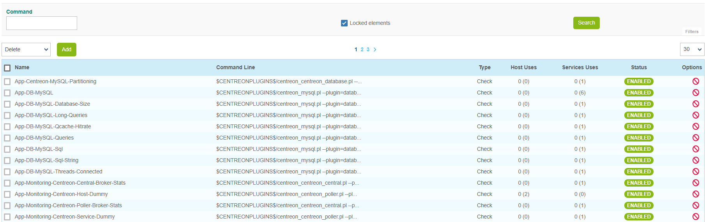

import Tabs from '@theme/Tabs';
import TabItem from '@theme/TabItem';


## Definition

A command is the definition of a line of command which uses a script or an application to perform an action. It is
possible execute this command by specifying arguments.

There are four types of command:

* **Verification** commands are used by the schedulers to verify the status of a host or of a service.
* **Notification** commands are used by the schedulers to alert the contacts (via mail, SMS, etc.).
* **Discovery** commands are used by the schedulers to discover.
* **Miscellaneous** commands are used by the additional modules (to perform certain actions), by the scheduler for
  data processing, etc.

All the commands can be configured in the menu: **Configuration > Commands**.



> By default, locked commands are hidden. Check the "Locked elements" box to list all commands.

## Adding a command

1. Go to the **Configuration > Commands** menu
2. Click on **Add**


> The configuration fields of a command are the same regardless of the type of command chosen.

## Configuration fields

* The **command Name** field defined the name of the command.
* The **Command Type** field allows us to choose the type of command.
* The **Command Line** field indicates the application or the script use with the command.
* The **Enable shell** box allows us to enable functions that are specific to a shell such as the pipe, etc.
* The **Argument Example** field define examples of arguments (each argument starts with a ”!”)
* The **Describe arguments** button serves to add  a description to arguments of the “$ARGn$” type. This description
  will be visible when using the command in a host or service form.
* The **Clear arguments** button deletes the description of arguments defined
* The **Describe macros** button serves to add  a description to all macros. This description will be visible when
  using the command in a host or service form.
* The **Connectors** selectlist serves to link a Connector to the command. For more information on Connectors refer to the
  chapter entitled *[Perl Connector](#perl-connector)* and *[SSH Connector](#ssh-connector)*.
* The **Graph template** field serves to link the command to a graphic model.
* The **Comment** field can be used to make a comment on the command.

## Arguments and macros

In the **Command Line** field it is possible to use *[macros](macros.md)* and arguments.

The macros are used to be able to pass various settings to the scripts called up by the commands. During execution
of the command by the scheduler, each of the arguments and macros are replaced by their respective values.
Each macro appears in the form **$value$**:

```shell
$CENTREONPLUGINS$/centreon_linux_snmp.pl --plugin=os::linux::snmp::plugin --mode=cpu \
--hostname=$HOSTADDRESS$ --snmp-version='$_HOSTSNMPVERSION$' \
--snmp-community='$_HOSTSNMPCOMMUNITY$' $_HOSTSNMPEXTRAOPTIONS$ \
--warning-average='$_SERVICEWARNING$' \
--critical-average='$_SERVICECRITICAL$' $_SERVICEEXTRAOPTIONS$
```

> Good practice requires replacing the arguments by *[custom macros](macros.md#custom-macros)*.

## Connectors

### SSH connector

Centreon SSH Connector is a free software from Centreon available under the Apache Software License version 2 (ASL 2.0).
It speeds up execution checks over SSH when used along Centreon Engine.

#### Installation

Centreon recommends using its official packages. Most of Centreon’ endorsed software are available as RPM packages.

Run the following commands as a privileged user:

<Tabs groupId="sync">
<TabItem value="Alma / RHEL / Oracle Linux 8" label="Alma / RHEL / Oracle Linux 8">

``` shell
dnf install centreon-connector-ssh
```

</TabItem>
<TabItem value="Alma / RHEL / Oracle Linux 9" label="Alma / RHEL / Oracle Linux 9">

``` shell
dnf install centreon-connector-ssh
```

</TabItem>
<TabItem value="Debian 11" label="Debian 11">

``` shell
apt install centreon-connector-ssh
```

</TabItem>
</Tabs>

### Perl connector

Centreon Perl Connector is a free software from Centreon available under the Apache Software License version 2 (ASL 2.0).
It speeds up execution of Perl scripts when used along Centreon Engine.

#### Installation

Centreon recommends using its official packages. Most of Centreon’ endorsed software are available as RPM packages.

Run the following commands as a privileged user:

<Tabs groupId="sync">
<TabItem value="Alma / RHEL / Oracle Linux 8" label="Alma / RHEL / Oracle Linux 8">

``` shell
dnf install centreon-connector-perl
```

</TabItem>
<TabItem value="Alma / RHEL / Oracle Linux 9" label="Alma / RHEL / Oracle Linux 9">

``` shell
dnf install centreon-connector-perl
```

</TabItem>
<TabItem value="Debian 11" label="Debian 11">

``` shell
apt install centreon-connector-perl
```

</TabItem>
</Tabs>
