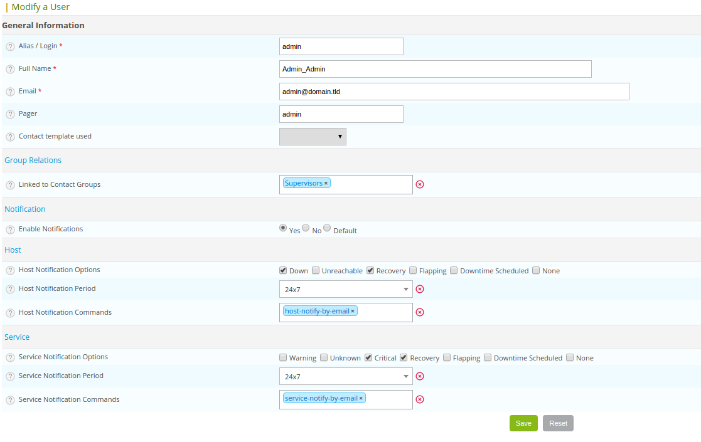

To create a user, go to **Configuration > Users > Contacts/Users**, then click **Add**.



To display the matrix of notifications for a user, click **View contact notifications** next to the **Add** menu).

## General information

* The **Alias/Login** field defines the login to access the web interface.
* The **Full Name** field contains the last name and first name of the user.
* The **Email** and **Pager** fields contain the e-mail address and the telephone number of the user, respectively (in
  case of a notification by SMS or call, for instance).
* The **Contact template used** field allows us to link the contact to a contact template.
* The **Linked to Contact Groups** list associates the contact with one or more groups of contacts.
* The **Enable Notifications** field allows us to enable the sending of notifications to the user.
* The **Host / Service Notification Options** field is used to define the statuses to which notifications are sent.
* The **Host / Service Notification Period** field is used to choose the time period in which notifications are sent.
* The **Host / Service Notification Command** field is used to choose the notification command to a host or a service.

## Centreon authentication

* The **Reach Centreon Front-end** field is used to authorize the user to access the Centreon web interface.
* The **Password** and **Confirm Password** fields contain the user password.
* The **Default Language** field is used to define the language of the Centreon interface for this user.
* The **Admin** field defines whether or not this user is the administrator of the monitoring platform.
* The **Autologin key** is used to define a connection key for the user. The user will no longer need to enter his / her
  login and password, but will use this key to log in directly. Connection syntax:

```url
http://[IP_DU_SERVER_CENTRAL]/centreon/main.php?autologin=1&useralias=[login_user]&token=[value_autologin]
```

> The Possibility of automatic connection (auto login) should be enabled in the menu: **Administration \> Options**.

* The **Authentication Source** field specifies if the connection information comes from an LDAP directory or information
  stored locally on the server.
* The **Access list groups** field is used to define an access group for a user (group use for access control (ACL)).

> An Administrative user is never concerned by access control, even if linked to an access group.

## Additional information

* The **Address** fields allow us to specify the data of additional contacts (other e-mails, other telephone numbers, etc.).
* The **Status** and **Comment** fields are used to enable or disable the contact and to make comments on it.
