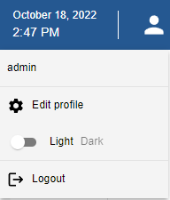

You can optimize the use of Centreon by using the following customization features:

## Switch to dark mode

When you first connect to the interface, Centreon is displayed in light mode by default.

On the banner, click the profile icon and use the switch button to turn on dark mode.
Next time you connect to the interface, the mode you previously selected remains on.

- Light mode:



- Dark mode:


## Change the user interface language

On the banner, click the profile icon, then click **Edit profile**:


In the language selection box, choose your language:


Then click **Save**. Your interface is now translated.

> If your language doesn't appear in the available language list, you can help the Centreon community to translate
> the web interface. For more details go to  [How to translate Centreon](../../developer/developer-translate-centreon.md).

## Reset your password

### Reset your password before expiration

When your password is going to expire in the next 7 days, an orange dot appears in the banner on the right
next to the profile icon:


Click **Edit profile**, then change your password:


### Reset your password when expired

If you have not changed your password before it expires, you will be redirected after login
to a dedicated page where you can update it:


Input your current password, define a new one, and then click **Reset Password**.

## Define a default page after login

You can configure the page that will be displayed by default when you connect to the interface, at the user level or at the contact template level. You can perform this procedure either from the interface or with CLAPI commands.

### Using the interface

Follow this procedure to set a default page:

<Tabs groupId="sync">
<TabItem value="For a user" label="For a user">

  1. Go to the **Configuration > Users > Contacts/Users** page.

  2. Select the user you want and click the **Centreon Authentication** tab.
    
  3. In the **Default page** field, select the page name in the dropdown list. Then save your changes.

</TabItem>
<TabItem value="For a contact template" label="For a contact template">

  1. Go to the **Configuration > Users > Contact Templates** page.

  2. Select an existing template or click the **Add** button to fill in the **Add a User Template** form.
      
  3. In the **Default page** field, select the page name in the dropdown list. Then save your changes.
  
  Users created from this template will see this default page when they log in.
  
</TabItem>
</Tabs>

### Using CLAPI commands

> First, you need the "topology page" number associated with the default page in the interface. In this example, we need the number associated with the Resource Status page.

1. From your terminal, connect to **MariaDB** and run the following command:
  
  ```shell
  use centreon;
  ```
  
2. Obtain the "topology page" number for the Resource Status page:
  
  ```shell
  SELECT topology_page FROM topology WHERE topology_name = "Resources Status";
  ```
  
  You should receive the following output:
  
  ```shell
  +---------------+
  | topology_page |
  +---------------+
  |           200 |
  ```
  
3. Then follow this procedure to set a default page. Execute these commands with your customized credentials:

<Tabs groupId="sync">
<TabItem value="For a user" label="For a user">

- By editing an existing user (where `200` is the number associated with the Resource Status page):
  
```shell
centreon -u admin -p 'centreon' -o contact -a setparam -v "contact alias;default_page;200"
```

- By adding a new user (where `200` is the number associated with the Resource Status page):

```shell
centreon -u admin -p 'centreon' -o CONTACT -a ADD -v "user;user;user@mail.com;mypassword;1;1;en_US;local;200"
```

</TabItem>
<TabItem value="For a contact template" label="For a contact template">

Where `200` is the number associated with the Resource Status page:

```shell
centreon -u Admin -p 'centreon' -o CONTACTTPL -a ADD -v "new_template;new_template;user@mail.com;mypassword;1;1;en_US;local;200"
```

</TabItem>
</Tabs>
