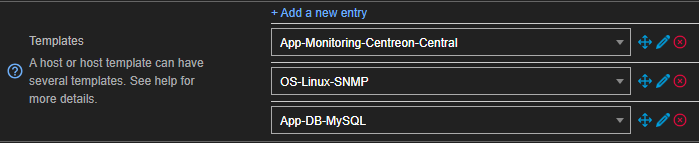

To create a host manually:

1. Go to **Configuration \> Hosts \> Hosts** and then click **Add**.
2. Fill in the fields (see [below](#host-configuration-tab)), and then click **Save**.
3. [Deploy the configuration](../monitoring-servers/deploying-a-configuration.md).

## Host configuration tab

### Host basic information

* **Name**: host name used by the Monitoring Engine. Cannot contain `~!$%^&|'"<>?,()=*{}` and spaces.
* **Alias**: another name for the host, spaces and characters unauthorized in the name are allowed here. You may also use the alias to look up the host using the **Search bar** with the syntax `alias:`.
* **Address**: IP address or DNS name of the host. The **Resolve** button tests the domain name by questioning the DNS server configured on the central server. If given a DNS name, the Resolve button will also replace the text with the matching IP address.
* **SNMP Community & Version**: name of the community that was defined for the equipment and its version. If the version is 1 or 2, use the community field, if the version is 3, leave the community field empty and add the following custom macro in the **Host check options** section: [`snmpextraoptions`](../../../../pp/integrations/plugin-packs/getting-started/how-to-guides/troubleshooting-plugins.md).
* **Monitoring server**: which server (central, poller or remote) will be charged with monitoring this host.
* **Timezone**: location of the host. Note that the timezone defined here is what determines the time of the checks of this host, not the timezone of server monitoring the host.
* **Templates**: associate one or more [host templates](../templates.md#definition) with this object.

If multiple templates would modify the same field, the properties of the template placed above the others will be applied. 

   Here is an example of a host with 3 templates applied to it.

   * App-Monitoring-Centreon-Poller applies its configuration.

   * OS-Linux-SNMP then overwrites it where its own configuration is in conflict with App-Monitoring-Centreon-Poller but will not change fields occupied for which it has no new information.

   * App-DB-MySQL then does the same with the configuration from OS-Linux-SNMP.

   Modifying the order of the templates automatically updates the applied configurations if necessary.

This button  enables us to change the order of host templates.
This button  is used to delete the host template.

* If the **Create Services linked to the Template too** field is defined as **Yes**, Centreon automatically generates
  the services according to the service template of the host template placed above the others.

### Access groups (option invisible to administrators)

* **[ACL Resource Groups](../../administration/access-control-lists.md)**: link this host to a hostgroup.
> Not linking the host to a hostgroup will cause it to be invisible!

### Host check options

* **Check Command**: command used to check the availability of the host. Only useful if you are not applying any [templates](../templates.md) to the host.
* **Args**: arguments given to the check command (each argument starts with ”!”).

* **Custom macros**: is automatically populated as you add [templates](../templates.md#definition) but you can also add your own [custom macros](../macros/#custom-macros).

   * **Name** and **Value** define the name and value of the macro.
   * Checking the **Password** box hides the value of the macro.

  To revert to the value defined by the template, click 
  
  To view the description of the macro, click 

  To delete the macro, click 

  To change the order of the macros, click 

### Scheduling options

* **Check Period**: time period during which active checks can performed.
* **Max Check Attempts**: the number of checks to be performed before confirming the status of the
  host as not OK. When the status is confirmed, the notification process is triggered.
* **Normal Check Interval**: interval in minutes between checks when the host status is OK.
* **Retry Check Interval**: interval expressed in minutes referring to the wait between the checks done to confirm the status of the host. Once the max check attempts have been made, the interval returns to its normal check interval.
* **Active Checks Enabled** and **Passive Checks Enabled**: enable / disable the active and passive checks. [Passive checks](../../monitoring/passive-monitoring/enable-snmp-traps.md) are information the monitored resource sends to Central without it having been actively requested.

## Notification tab
Learn more about [notifications](../../alerts-notifications/notif-concept.md) and [contacts](contacts.md) with our dedicated articles.

* **Notification Enabled**: used to enable or disable notifications concerning the object.
* **Linked contacts**: contacts that will receive the notifications. These contacts must be previously configured in the **Users** section.
* **Linked contacts Groups**: groups of contacts that will receive the notifications. Groups must be previously configured in the **Users** section.
  
  **Vertical inheritance only**: determines contacts and/or groups of contacts that should be notified. When enabled on the  **Administration > Parameters > Centreon UI** page, two extra checkboxes appear:

    * **Contact additive inheritance**: overwrites the configuration of the parent host template, but adds the contacts in addition to the contacts defined in the parent template.
    * **Contact group additive inheritance**: will not overwrite the configuration of the parent host template, but adds the contact groups in addition to the contact groups defined in the parent template.

* **Notification Options**: define the statuses for which a notification will be sent. If no boxes are checked, you will receive notifications for all the statuses listed.
* **Notification Interval**: expressed in minutes. It indicates the time between sending notifications when the status is Not-OK. If the value is defined as 0, the scheduler sends a single notification per status change.
  If the value is defined as 0, the scheduler sends a single notification per status change.
* **Notification Period**: indicates the time period during which the notifications will be enabled.
* **First notification delay**: expressed in minutes. It refers to the time delay to be respected before sending
  the first notification when a Not-OK status is validated. Setting the value to 0 will cause notifications to be sent immediately.
* **Recovery notification delay**: time that must pass before a recovery notification is sent (when the host goes back to an UP state). Setting the value to 0 will cause notifications to be sent immediately.

## Relations tab
Also called [dependencies](../../alerts-notifications/notif-dependencies.md)

* **Host Groups**: host groups to which the host belongs. Groups allow you to make changes to many hosts at the same time.
* **Host Categories**: categories to which the host belongs.
* **Parent Hosts**: define an object as a parent for this host. The parent of a host is the object between it and its monitoring host that is also the closest to the monitored object. A host is considered to have no parent host if it is on the same network segment as the host doing the monitoring without any intermediates. Leave this field blank if that is the case.
* **Child Hosts**: designate the current host as the parent for other hosts.

## Data processing tab

* **Check Freshness**: active check performed by the engine when a determined threshold of time has elapsed since the last [passive check](../../passive-monitoring/enable-snmp-traps.md) of the object.
* **Freshness Threshold**: expressed in seconds. If, during this period, no host status change request (passive command) is received, the active check command is executed. A threshold will be determined automatically if the field is left blank and the check is enabled.
* **Flap Detection Enabled**: enable or disable the detection [flapping](../../alerts-notifications/notif-flapping.md) in the statuses (status
  value changing too often in a given period).
* **Low Flap Threshold** and **High Flap Threshold** define the high and low thresholds for the detection of
  flapping as a percentage of status change.
* **Retain Status Information** and **Retain Non Status Information**: indicate if the information concerning
  the status is saved after each time the check command is repeated.
* **Stalking Options**: options to be recorded if **Retain Information** is enabled.
* **Event Handler Enabled**: enables or disables the [event handler](../event-handler.md).
* **Event Handler**: command to be executed if the event handler is enabled.
* **Args**: arguments of the events handler command.

## Host Extended Infos tab

### Monitoring engine

* **Note URL**: clickable URL that will appear in the **Notes** column on the **Resource Status** page (the **Notes** column must be displayed for this).
* **Note**: optional information concerning the host visible in the Resource Status page (the **Notes** column must be displayed for this).
* **Action URL**: URL normally used for giving information on actions on the host (maintenance, etc.).
* **Icon**: icon used for the host, it can be seen in a variety of places. A 40x40 pixels format is recommended.
* **Alt Icon**: optional string shown when the **Icon** cannot be displayed.
* **Host severity**: severity level of the host. This is a special type of category that also allows you to sort the Resource Status by severity level.
* **Status MAP Image**: logo for the [Centreon MAP module](../../graph-views/introduction-map.md).
* **Geographic coordinates**: geographical coordinates used by the Centreon MAP module to position the resource on a map.
  Define "Latitude,Longitude"; for example, the set of coordinates for Paris is "48.51,2.20"

The **2d Coords** and **3d Coords** fields are obsolete and have no impact on the host.

### Additional Information

* **Enable/disable resource**: determine whether or not the host and its services must be monitored. If the host is disabled, it does not appear on the **Resources Status** page.
* The **Comments**: add a comment concerning the host.

> Remember to [deploy the configuration](../monitoring-servers/deploying-a-configuration.md) for your changes to be taken into account.
