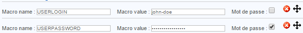
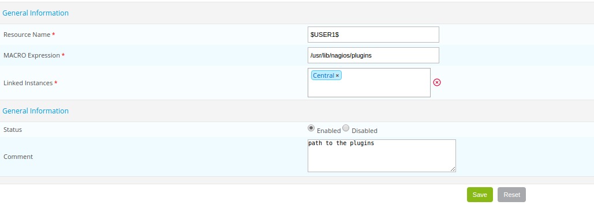

A macro is a variable used to retrieve certain values.
A macro always starts and finishes with the “$” sign.

## Standard macros

Standard macros are macros predefined in the source code of the monitoring engines. These macros allow us to
retrieve the value of various objects from commands.

e.g.:

* The macro called **$HOSTADDRESS$** enables us to retrieve the IP address of a host
* The macro called **$CONTACTEMAIL$** enables us to retrieve the e-mail address of the contact

> A complete list of macros is available at the following *[address](https://assets.nagios.com/downloads/nagioscore/docs/nagioscore/3/en/macrolist.html)*.

## Custom macros

### Definition

Customized macros are macros defined by the user at the creation of a host or a service. They are used in check
commands. Customized macros start with $_HOST for customized macros of hosts and $_SERVICE for customized macros of
services.

There are several advantages to using customized macros instead of arguments:

* The function of the macro is defined in its name. The macro $_HOSTMOTDEPASSEINTRANET$ is easier to read than $ARG1$
* Macros inherit models of hosts and services; hence it is possible to modify a single macro for a host or a
  service. On the other hand, the arguments all need to be redefined if a single argument is changed
* The number of arguments is limited to 32, unlike customized macros, which are unlimited

A macro of a host is used to define a variable that is specific to the host and that will not change regardless of the
service questioned: host connection identifiers, a port of connection to a particular service, an SNMP community, etc.
A macro of a service is used more to define settings specific to a service: a WARNING / CRITICAL threshold, a partition
to be questioned, etc.

### Example

When a host is defined, the following macros are created:

To retrieve these macros in a check command, you need to call it using the following variables: $_HOSTUSERLOGIN$,
$_HOSTUSERPASSWORD$.

When a service is defined, the following macros are created:

To retrieve these macros in a check command, you need to invoke them using the following variables: $_SERVICEPARTITION$,
$_SERVICEWARNING$, $_SERVICECRITICAL$.

### A special case

The **Community SNMP & Version** fields in a host form automatically generate the following customized macros:
$_HOSTSNMPCOMMUNITY$ and $_HOSTSNMPVERSION$.

## Resource macros

Macros of resources are global macros that are used by the monitoring engine. These macros can be invoked by any type
of command. They come in the form: $USERn$ where ‘n’ lies between 1 and 256.

In general, these macros are used to refer to paths containing supervision probes. By default the $USER1$
macro is created, and its value is the following: /usr/lib/nagios/plugins.

To add a resource macro:

* Go into the **Configuration \> Pollers \> Resources** menu
* Click **Add**

* The **Resource Name** field defines the name of the resource macro. e.g.: $USER3$
* The **MACRO Expression** field defines the value of the macro.
* The **Linked Instances** list allows us to define which monitoring poller will be able to access this macro.
* The **Status** and **Comment** fields are used to enable / disable the macro and to comment on it.

## Environment macros

Environment macros (also called “on demand”) are used to retrieve information from all
the objects obtained from the supervision. They are used to retrieve the value of an object at any given moment.

They are complementary to standard macros. e.g.:

* The standard macro $CONTACTEMAIL$ refers to the e-mail address of the contact who uses the 
  notification command
* The environment macro $CONTACTEMAIL:centreon$ returns the e-mail address of the user: “centreon”

The complete documentation on “on demand” macros is available at this *[address](https://assets.nagios.com/downloads/nagioscore/docs/nagioscore/3/en/macros.html)*.

> The use of these macros is not recommended, because the search for a value of a setting of an object from another
object consumes resources.

> The enabling of the setting **Use large installation tweaks** makes it impossible to use environment macros.
