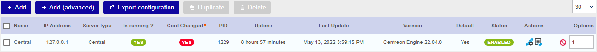
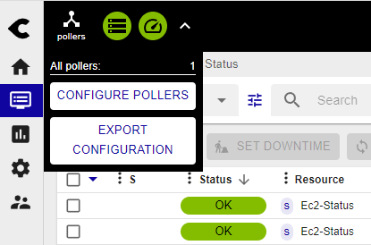

When you create, delete or edit objects in the **Configuration** menu, changes are not applied automatically (either on the central server on which you have made the change or on any remote server or poller linked to it). For the changes to be taken into account, you must export the configuration.

Any change in configuration must be done and exported from the central server's interface or API, regardless of which poller is affected by the change (central server, remote server, poller).

## Exporting the configuration

1. Go to the **Configuration > Pollers > Pollers** page. The page shows the state of your central
server and of all pollers and remote servers linked to it: changes are shown in the **Conf changed** column.

2. Select the central server, the remote server or the poller whose configuration has changed. 

   

3. Click on **Export configuration**.

4. Check the following boxes (see section [**Export options**](#export-options)):

   - **Generate Configuration Files**
   - **Run monitoring engine debug (-v)**
   - **Move Export Files**
   - **Restart Monitoring Engine**. Use the most appropriate method:
     - **Reload**: when you have created, deleted or edited monitored objects
     - **Restart**: when you have made changes to the way a poller and the central server communicate together, or
     to the configuration of the engine. Restarting takes more time than reloading.

5. Click **Export**. A log of the export is displayed.

    

6. Read the log to check that the export has worked normally and that no errors were returned.

## Export options

The options work in the following ways:

- **Generate Configuration Files**: Generates the monitoring engine's configuration
  files in a temporary directory. This configuration is generated from objects
  configured via the web interface
- **Run monitoring engine debug (-v)**: Performs a sanity check of the monitoring engine's configuration files
- **Move Export Files**: Moves the configuration files from the temporary
  directory to the monitoring engine's configuration directory.
- **Restart Monitoring Engine**: Restarts the monitoring engine to apply the new
  configuration.
- **Post generation command**: Executes the post-generation command set in the
  poller's configuration.

## Quick export

Administrators and users with the [appropriate rights](#activating-the-feature) can activate a quick export button that allows them to export the configurations of ALL pollers at once (i.e. the configuration of the central server, remote servers and pollers).

### When to use this feature

> Do NOT use this feature if you have a large number of pollers. This feature is not appropriate either if you are an MSP and each poller belongs to a different customer.

### Activating the feature

* For administrator users, the feature is automatically enabled.
* To make the feature available to a non-administrator user, make sure they have the [**Deploy configuration**](../../administration/access-control-lists.md#poller-configuration-actions--poller-management) right, and the [**Display Top Counter pollers statistics**](../../administration/access-control-lists.md#global-functionalities-access) right.

### Exporting all configurations

To quickly export the configuration for all pollers:

1. Click the **Pollers** menu at the top left of the screen, then click **Export configuration**.

   

2. Confirm the export in the pop-up that appears.
