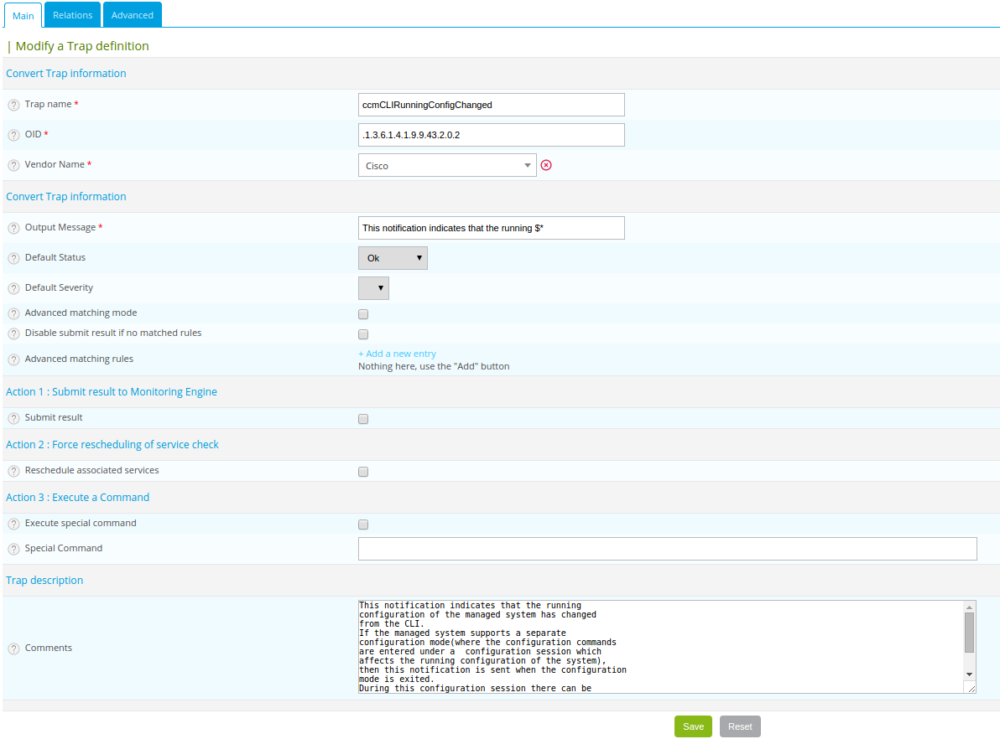
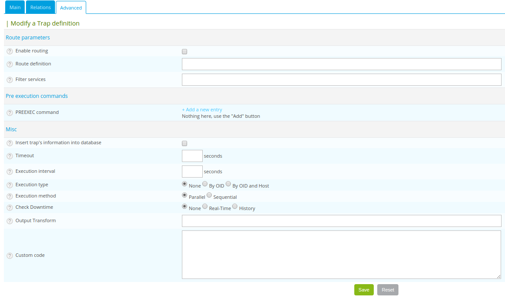

## Add a manufacturer

Within centreon, the root OIDs of the SNMP traps is filed by manufacturer. To add a manufacturer:

Go to **Configuration > SNMP traps > Manufacturer** and click **Add**


* The **Name** and **Alias** fields define the name and the alias of the manufacturer
* The **Description** field provides an indication about the manufacturer

## Import SNMP traps from a MIB file

Go into the **Configuration > SNMP traps > MIBs** menu


* The **Manufacturer** list can be used to choose the manufacturer to which the MIB that you are importing belongs
* The **File (.mib)** field can be used to load the MIB

Prior to importing a certain MIB file, it may happen that a number of dependencies need to be met.
In order to find the dependencies of your MIB, open your MIB file using a standard text editor, and then:

1. Locate the line that starts with **IMPORTS**
2. Verify all the required dependencies to import your MIB file after the keyword **FROM**


In the MIB file shown above, there are four dependencies required to import the MIB: SNMPv2-SMI, SNMPv2-TC, SNMPv2-CONF,
SNMP-FRAMEWORK-MIB.

> The dependencies of the MIBS that you import must be present in the folder **/usr/share/snmp/mibs**. Once the import
> is completed, delete the dependencies previously copied.

## Manual configuration of traps

### Basic configuration

It is also possible to create definitions of SNMP traps manually:

Go to **Configuration > SNMP traps > SNMP traps** and click **Add**



* The field **Trap name** defines the name of the trap.
* The field **Mode** defines how to check the trap **OID** received.
* The field **OID** defines the Root OID to be received for this trap to be considered as received.
* The field **Vendor name** defines the name of the manufacturer to which the trap to be selected in the dropdown
  list belongs.
* The field **Output message** contains the message to be displayed in the event of reception of a trap containing
  the OID configured above.

> By default, the MIB contains the definition of this variable (e.g.: “Link up on interface $2. State: $4.”, here $2
> will be replaced by the 2nd argument received in the event.) In the opposite situation, the variable **$*** can be
> used to display all the arguments contained in the trap.

> It is possible to construct the output message yourself. To do this, use the MIB to find out the arguments that will be
> present in the body of the event and retrieve the arguments with the variables **$n**. As each argument is identified
> by an OID, it is possible to use this OID directly to place it in the output message without knowing its position via
> the variable **@{OID}**.

* The **Default status** field defines the “monitoring” status of the service in case of reception of the trap.
* If the **Submit result** box is checked, the result is submitted to the Network supervisor engine.
* By default, the **Comments** field (last field) contains the comment by the manufacturer of the SNMP trap. Most of the
  time, this comment indicates the list of variables contained in the SNMP trap (see the next chapter on advanced configuration).

### Advanced configuration of the traps

It is possible to determine the status of a service from the value of a setting of the SNMP trap rather than from the
Root OID. Previously, the manufacturer defined an SNMP trap (Root OID) by type of event to be sent (linkUp / linkDown).
Today, the tendency is to define a Root OID by category of events and then to define the event via a set of settings.

To do this, it is possible of define **Advanced Matching mode** by clicking **Add a new entry** and by creating as
many rules as necessary.
For each rule, define the settings:

* **String** defines the element on which the search will be applied (@OUTPUT@ defines all the **Output messages**
  translated).
* **Regexp** defines the REGEXP type search to be applied.
* **Status** defines the status of the service in the event of concordance.

> The order is important in the rules of correspondence because the process will stop at the first rule of which the
correspondence is assured.

* The **Disable submit result if no matched rules** field disables the sending of information to the scheduling engine
  if no correspondence with a rule is confirmed.
* If the **Reschedule associated services** box is checked, the next check on the service, which should be ‘active’,
  should be reprogrammed as soon as possible after reception of the trap.
* If the **Execute special command** box is checked, the command defined in **Special command** is executed.

### Advanced tab

The **Advanced** tab is used to configure the behavior of the handling process of the SNMP traps on receiving the traps.



* **Enable routing** is used to enable the routing of information.
* **Route definition** is used to define the command to be used for routing.

Before performing the processing of the event (translation of the **Output message**), it is possible to execute a
command called PREEXEC. To do this, you can define the **PREEXEC command (SNMPTT type)** by clicking 
**Add a new entry** and then create as many rules as necessary.

* **PREEXEC command** defines the command to be executed.

Here is an example of use with the linkUP trap:

For a Cisco resource, $2 == ifDescr contains the port number of the interface (GigabitEthernet0/1 for instance).
The best description of the interface is in the SNMP if Alias field.

The following command can be used to retrieve this value:

``` shell
snmpget -v 2c -Ovq -c <community> <cisco switch> ifAlias.$1
```

To use the result of the PREEXEC command in the **Output message**, it is necessary to use the variable $p{n} where ‘n’
corresponds to the order of definition of the command.

Example:

``` shell
"Interface $2 ( $p1 ) linkUP. State: $4." "$CA"
```

The result will have the form:  Interface GigabitEthernet0/1 ( NAS Server ) linkUP. State: up

* The **Insert trap's information into database** box, if checked, records the SNMP trap information in the database
  field can be used to define whether or not to classify the traps by day in the database.
* The **Timeout** field expressed in seconds is used to define the maximum processing time of the event including the
  pre-processing commands (PREEXEC) and post-processing commands (special command).
* The **Execution interval** field expressed in seconds is used to define the maximum waiting time between two
  processing operations of an event.
* The **Execution Type** field is used to enable the Execution interval by defining the conditions by Root OID, by the
  Root OID and host combination or, to disable this restriction, None.
* The **Execution Method** field is used to define if, on reception of multiple same events (Root OID), the execution is
  either **Sequential** or **Parallel**.

### Custom code

The field **custom code** allows custom Perl processing. To enable this feature, you must set **secure_mode** to 0 in the
**/etc/centreon/centreontrapd.pm** file as follows:

```perl
our %centreontrapd_config = (
    ...
    secure_mode => 0,
    ....
);

1;
```

For example, to decode the 4 arguments from hexadecimal, the custom code will be:

```perl
if ($self->{trap_data}->{entvar}->[3] =~ /[[:xdigit:]]+/) {
    my $hexa_value = $self->{trap_data}->{entvar}->[3];
    $hexa_value =~ s/ //g;
    $self->{trap_data}->{entvar}->[3] = pack('H*', $hexa_value);
}
```

> Beware: the argument table starts at 0 for argument 1 of the SNMP trap.

### Variables

When adding a rule of correspondence or executing a special command, it is possible to transmit arguments to the **String**
or **Special command** fields. These arguments are listed in the table below:

| Macro name               | Description                                                                                                               |
|--------------------------|---------------------------------------------------------------------------------------------------------------------------|
| @{NUMERIC_OID}           | Retrieval of the value of an argument via its OID, e.g.: @{.1.3.6.1.4.1.9.9.43.1.1.1}                                     |
| $1, $2...                | Retrieval of the value of an argument via its order of appearance                                                         |
| $p1, $p2,...             | Value of the command: PREEXEC ($p1 = at the first command, $p2 at the second, ...)                                        |
| $*                       | All the arguments separated by a space                                                                                    |
| @HOSTNAME@               | Host name (in centreon) to which the service is attached                                                                  |
| @HOSTADDRESS@            | IP address of the host sending the trap                                                                                   |
| @HOSTADDRESS2@           | DNS name of the host sending the trap (if the server fails to effect a reverse DNS resolution we retrieve the IP address) |
| @SERVICEDESC@            | Service name                                                                                                              |
| @TRAPOUTPUT@ ou @OUTPUT@ | Output of the traps                                                                                                       |
| @STATUS@                 | Service state                                                                                                             |
| @SEVERITYNAME@           | Criticality name                                                                                                          |
| @SEVERITYLEVEL@          | Criticality level                                                                                                         |
| @TIME@                   | Trap reception timestamp                                                                                                  |
| @POLLERID@               | ID of the poller having received the trap                                                                                 |
| @POLLERADDRESS@          | IP address of the poller having received the trap                                                                         |
| @CMDFILE@                | Path to the command file of central or of centreon Engine (collector)                                          |

In addition, there are special variables that can be used in the **Routing settings** section at the level of the
**Routing command** if the option Enable routing is selected:

| Macro name          | Description                                                                                       |
|---------------------|---------------------------------------------------------------------------------------------------|
| @GETHOSTBYADDR($1)@ | Reverse DNS resolution used to find the DNS name DNS from the IP address (127.0.0.1 -> localhost) |
| @GETHOSTBYNAME($1)@ | DNS resolution used to find the IP address from the DNS name (localhost -> 127.0.0.1)             |
