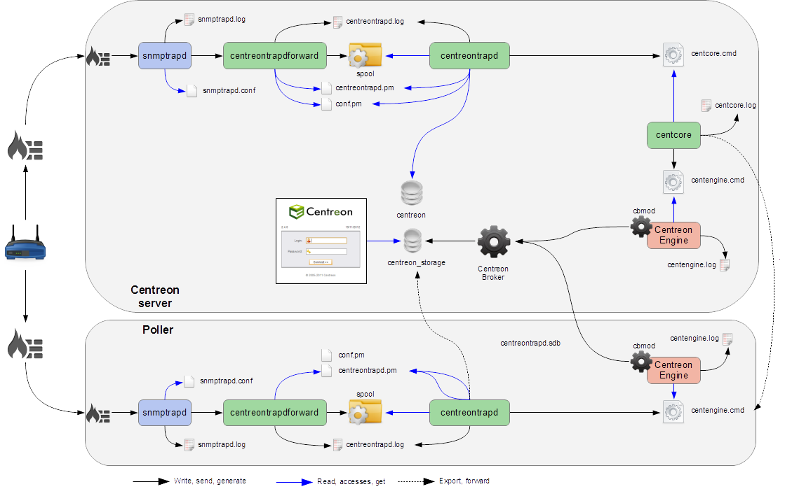

## Debug SNMP Traps

Several elements are involved in the management of SNMP traps. In case of a problem, it is necessary to check the proper
functioning of its architecture. There are several things to check.

### Sender settings

The first point is to check the configuration of the equipment or application that issued the trap that you should
have received. Check the IP address or DNS name, the SNMP community and version.

### Firewall, routing

The second point is to check the network firewalls and software permissions and the implementation of a specific routing.
If one or more network firewalls are present or if a port translation and/or IP address is in place, make sure the
connection between the emitter and the poller is possible. The use of network probes, debug network devices (firewalls
and routers) or software tcpdump/wireshark on the poller may help you to confirm receipt of data on UDP port 162.

### Snmptrapd

After validation of the connection, check the operating status of snmptrapd process (which must be running) and its
configuration options. It is possible to enable logging of the process. To do this, change the
**/etc/sysconfig/snmptrapd** file and replace the "OPTIONS" line:

``` shell
# snmptrapd command line options
# OPTIONS="-On -d -t -n -p /var/run/snmptrapd.pid"
OPTIONS="-On -Lf /var/log/snmptrapd.log -p /var/run/snmptrapd.pid"
```

Restart the process to take the changes into account. Thus, for any receiving SNMP traps, these events will be listed
in the **/var/log/snmptrapd.log** log.

In case you filter by SNMP community, check the allowed communities in the configuration file **/etc/snmp/snmptrapd.conf**.
If after all these checks, SNMP traps are not included in the log, verify that the process is listening on UDP port 162
for remote equipment using the command:

``` shell
netstat -ano | grep 162
```

You must have a result like:

``` shell
udp        0      0 0.0.0.0:162             0.0.0.0:*                           off (0.00/0/0)
```

If not, change the listening port of the process.

> Don't forget to deactivate the logs after your check. Otherwise, the volume of the logs can be very large.

### Centreontrapdforward

Once the snmptrapd process is validated, check the centreontrapdforward process. The first step is to check the access
parameters of this process, snmptrapd, in the file **/etc/snmp/snmptrapd.conf**

* Check that the snmptrapd service executes centreontrapdforward. To do this, edit the file **/etc/snmp/snmptrapd.conf**
   and verify that its contains:

``` shell
traphandle default su -l centreon -c "/usr/share/centreon/bin/centreontrapdforward"
```

If the path to the file is incorrect, change it and restart the snmptrapd process.
You can check the proper functioning of binary centreontrapdforward by checking the configuration part of
*[centreontrapdforward](enable-snmp-traps.md#centreontrapdforward)*.

### Centreontrapd

The next process to check is Centreontrapd. This daemon is used to connect an SNMP trap to a passive service linked to a
host in Centreon using an IP address or DNS from a remote resource.
To check its operation, check the centreontrapd configuration settings.

You can check the proper functioning of binary centreontrapd by checking the configuration part of
*[centreontrapd](enable-snmp-traps.md#centreontrapd)*.

You can set up debug mode for the **centreontrapd** service. Edit the following file:

```shell
vi /etc/sysconfig/centreontrapd
```

Then modify the option **severity** to **debug**:

```shell
OPTIONS="--logfile=/var/log/centreon/centreontrapd.log --severity=debug --config=/etc/centreon/conf.pm  --config-extra=/etc/centreon/centreontrapd.pm"
```

Then restart **centreontrapd**:

```shell
systemctl restart centreontrapd
```

### Centreon Gorgone

Gorgoned daemon must be running to forward information from Centreontrapd to the monitoring engine as an external command.
Enable the debug mode via **Administration > Parameters > Debug** menu and restart the process.

> You can change the logging level via the **Administration > Parameters > Debug** menu.

If any external commands are sent to the monitoring engine, please check the path to "$cmdFile"" in the **/etc/centreon/conf.pm**
configuration file. The path should be **/var/lib/centreon/centcore.cmd** for a central Centreon server.

### Centreon Engine

The monitoring engine must receive external commands from the Centreon Gorgone process in order to change the status and output of the
passive service. Please check the event log. For Centreon Engine, the path is **/var/log/centreon-engine/centengine.log**.
You should find lines such as:

``` shell
[1352838428] EXTERNAL COMMAND: PROCESS_SERVICE_CHECK_RESULT;Centreon-Server;Traps-SNMP;2;Critical problem
[1352838433] PASSIVE SERVICE CHECK: Centreon-Server;Traps-SNMP;2;Critical problem
```

If only the external command appears, but not its acknowledgement by the scheduler ("PASSIVE SERVICE CHECK"), there may be a system clock synchronizing issue.
Either the server is late and the command will be processed later, or it is ahead and the command will not be taken into account.

### Centreon UI

To display the result in Centreon, the monitoring engine must forward information to the broker using the NEB module to
store it in the database. Centreon will display a result from the "centreon_storage" database. If you can reach the Centreon web
interface, you should see the changed output and possibly the status of the passive service. If any change appears, a
connection failure between the monitoring engine and the broker can be the root cause of this issue. Possible problems could be:

* The monitoring engine doesn't load the NEB module to connect to the remote broker.
* The NEB module settings are wrong to connect to the remote broker.
* A firewall stops the connection.

### Detailed diagram

Below is a detailed diagram of all the processes used and/or present at the reception of an SNMP trap:


