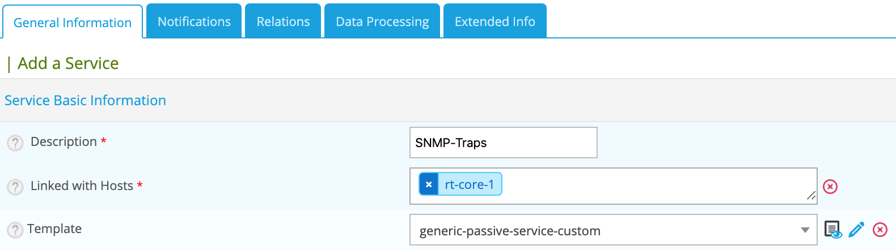
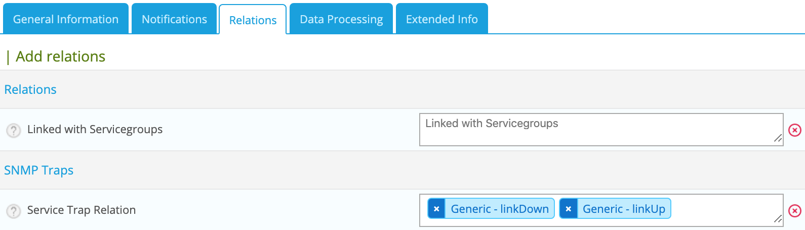
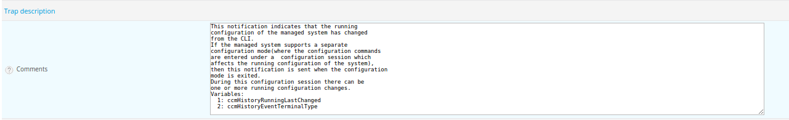
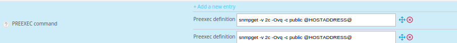

## Monitoring configuration

Go to the **Configuration > Services > Services by host** menu and click **Add**.

* Set a description of the service
* Select the host to which to attach this service
* Select the **generic-passive-service-custom** template



* Go to the **Relation** tab and select the SNMP traps



* Click **Save**.

## Applying the changes

To be able to export the OID present in the database in the configuration file to centreontrapd, apply the following procedure:

1. Go to the **Configuration > SNMP traps > Generate** menu
2. Select the poller to which you want to export the configuration files
3. Check **Generate traps database** and **Apply configurations**
4. In the dropdown list, choose **Send signal** (the **Reload** option is preferable)
5. Click on the **Generate** button
6. *[Export the monitoring configuration](../monitoring-servers/deploying-a-configuration.md)*

## To go further

### Modify the output

#### Use all the arguments

For an SNMP trap, when configuring the output message, the argument **$\*** will display all the information (the value of
arguments) contained within the SNMP trap. However, it is possible to display only certain information contained in the
SNMP trap by calling unitary arguments.

For example:


The output message **Link down on interface $2. State: $4.** will display only the name of the interface and its status
($2 and $4 argument).

Where can I find the arguments?

The arguments are in the documentation of the MIB manufacturer or in the **Comments** field of the SNMP trap.



To show:

* The index link, use the $1 argument
* The interface name , use the $2 argument
* The administrative state of the interface, use the $3 argument
* The state interface, use the $4 argument

For example, the following output message displays all the arguments:

``` shell
Link down on interface: $2 (index: $1). Operational state: $4, Administration state: $3
```

#### Active checks after trap reception

**Reschedule associated services** option to actively check the service after trap reception.

The active service linked in the service configuration is executed.

#### Execute special command

With Centreontrapd, it is possible to execute a special command after the reception of a SNMP trap. Just use the option
**Execute special command** followed by the description of this command.

#### Use all the arguments (via OID)

It is also possible to have an argument value directly without knowing the order of the arguments ($1, $2, $3, etc.). To do this,
use the complete OID number of needed arguments.

For example:

``` shell
Link down on interface: @{.1.3.6.1.2.1.2.2.1.2} (index: @{.1.3.6.1.2.1.2.2.1.1}). Operational state: @{.1.3.6.1.2.1.2.2.1.8}, Administration state: @{.1.3.6.1.2.1.2.2.1.7}
```

#### Use an external variable

It is also possible to modify the output message by retrieving information via scripts or external commands and get the
result to insert it in the output.
To do this, within the definition of your SNMP trap, go to the **Advanced** tab and add one (or more) preexec commands.

For example:


The first command is **snmpget -v 2c -Ovq -c public @HOSTADDRESS@ ifAlias.$1** and allows you to retrieve the alias
interface. The "$1" variable is for the argument 1 associated value of linkUp/linkDown traps.

The second command is **snmpget -v 2c -Ovq -c public @HOSTADDRESS@ ifSpeed.$1** and allows you to retrieve interface speed.
The "$1" variable is for the argument 1 associated value of linkUp/linkDown traps.

In order to exploit the result of the first command in the output, use the argument $p1. To exploit the
result of the second command in the output, use the argument $p2 .

We can then deduce the following output message:

``` shell
Link down on interface: $2 (index: $1). Operational state: $4, Administration state: $3, Alias : $p1, Speed : $p2
```

#### Use a Regular expression

It is also possible to modify the output by using a regular expression with the **Output Transform** option. Simply
define the regexp and it will be executed at trap reception.

For example:

``` shell
s/\|/-/g
```

Will replace **|** in the output to **-**.

### Route/Transfer SNMP traps

It is possible to have an SNMP trap concentrator. Example: Oracle GRID.
Oracle GRID is responsible for federating information for all Oracle servers. If necessary, the Oracle GRID server sends the SNMP trap to the monitoring server.

However, from an SNMP trap sent from Oracle GRID, we want to extract the IP address of the host and display the message in the service trap not belonging to Oracle Grid but to the correct host.

To do this, perform the following steps:

1. Create a generic trap, with the following parameters:

* In the **Main** Tab:

| Attributes     | Description           |
| -------------- | --------------------- |
| Trap Name      | Trap name             |
| Mode           | Unique                |
| OID            | OID of the trap       |
| Default Status | Trap default status   |
| Output Message | Custom output message |

* In the **Advanced** Tab:

| Attributes       | Description                                                    |
| ---------------- | -------------------------------------------------------------- |
| Enable routing   | Checked                                                        |
| Route definition | $2 (In this example $2 argument is for IP address of the host) |

2. Create a second trap definition:

* In the **Main** Tab:

| Attributes     | Description                          |
| -------------- | ------------------------------------ |
| Trap Name      | Trap name (not the same as previous) |
| OID            | OID of the trap (same as previous)   |
| Default Status | Trap default status                  |
| Output Message | Custom output message                |

3. Associate the first definition to a service (e.g. PING) of the Oracle GRID server
4. Associate the second definition to a passive service of the host.
5. Generate SNMP trap definitions and restart centreontrapd

In the **Route definition** field you can use the following arguments:

| Variable name       | Description                                                                           |
| ------------------- | ------------------------------------------------------------------------------------- |
| @GETHOSTBYADDR($2)@ | Reverse DNS resolution to know the DNS name from IP address (127.0.0.1 -\> localhost) |
| @GETHOSTBYNAME($2)@ | DNS resolution to know the Ip address from the DNS (localhost -\> 127.0.0.1)          |

### Ignore SNMP Trap when resource is on downtime

**Check Downtime** allow centreontrapd to check if the service is not in Downtime status at trap reception. The
submission can be canceled.

> This is only possible with Centreon Broker and on central monitoring.

There are three ways to configure this:

* None: nothing to do; the trap is sent as normal;
* Real-Time: with this option, a trap sent with a current downtime, the service state is not updated;
* History: option used to not acknowledge an snmp trap concerning a past event during a downtime.
