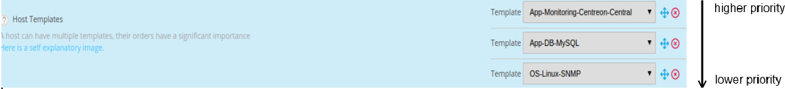
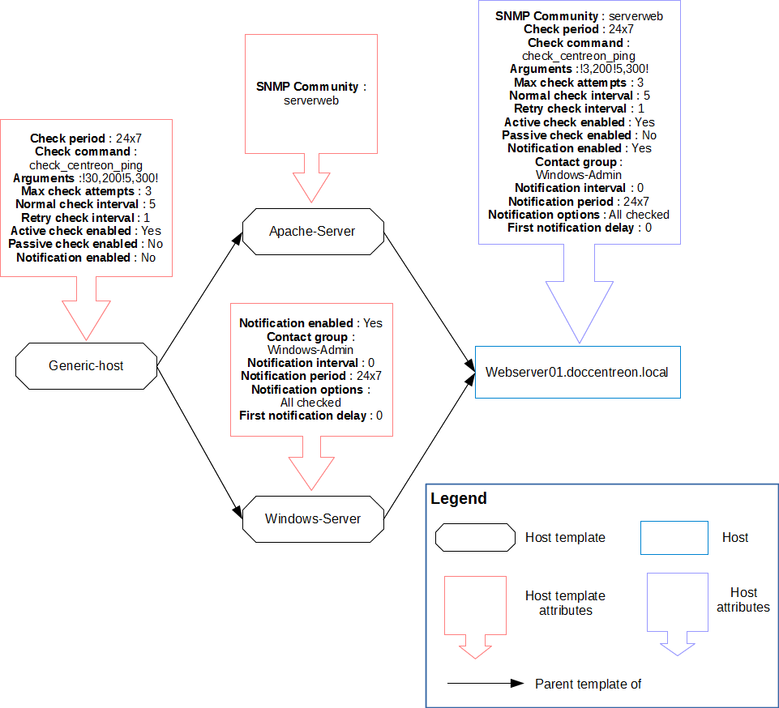

## Definition

A Template is a pre-configuration of settings of an object that could be used to
configure it. The main advantage is to be able to define default values for
certain objects to speed up the creation of similar objects.

On creation of a Template, only the template name is mandatory. The other
attributes are optional.

There are 3 types of template:

  - Host Templates
  - Service Templates
  - Contact Templates

The advantages are:

  - Simplified element definition
  - No duplication of data
  - Easy addition of new resources
  - Predefined configurations equivalent to a “catalog of indicators”
  - Templates can inherit from other templates.

## Host Templates

### Inheritance

A host or a host template can inherit from one or more host templates. This
heritage may be:

  - associative (addition of multiple host templates)
  - parent-child type

#### Parent-child type inheritance

This is a predefinition of settings at “n” levels. The object inherits from its
Template which can itself inherit from its Template. If the child redefines a
setting, this setting overwrites the one defined in the higher-level templates.
Otherwise it is added to the settings.

#### Associative type inheritance

This consists of adding together several templates within the same object in
order to add together all the settings available. If a host inherits from
several host templates and if the same setting is defined on several templates,
the host template situated above the other templates has priority over
its ancestors.

The diagram below shows a host inheriting from multiple host templates.

### Configuration

To add a host template:

Go into the **Configuration > Hosts > Templates** menu and click **Add**

> Refer to the chapter covering configuration of
> *[hosts](basic-objects/hosts.md)* to configure a template, because the form
> is identical.

> By default, locked host templates are hidden. Check the "Locked elements" box
> to list all templates.

## Services Templates

### Inheritance

A service or a service template can only inherit from a single service template
(parent-child type inheritance).

### Configuration

To add a Service Template:

Go to **Configuration > Services > Templates** and click **Add**.

> Refer to the chapter covering configuration of
> *[services](basic-objects/services.md)* to configure a template, because the
> form is identical.

> By default, locked service templates are hidden. Check the "Locked elements"
> box to list all templates.

## Best practice

### Explanations

Good practice requires that service templates be associated with a host's
template: on creation of a host, the services are generated automatically from
the host's templates. There are two advantages of linking service templates to
host templates:

  - The services generated automatically retain their granularity, i.e., it is
    possible to change the attributes of a service without affecting the other
    services obtained from this template
  - The creation of new hosts is speeded up greatly: simply define
    the host and the host's templates associated with it.

Example: We create the srvi-web-01 host according to the template below:

The host srvi-web-01 will automatically possess the following services:

  - Load, CPU, Memory, disk-/ from service templates linked to the host
    template “Linux-Server-RedHat-5”
  - Broken-jobs, hit-ratio, tablespaces, listener from service templates linked
    to the host template “DB-MySQL”
  - Process and connection from service templates linked to the host template
    “Web-Server-Apache”

When the services of a host are generated from host templates, it is possible
that certain services generated are not checked by the supervision tool. In this
case, it is necessary to disable the services that are not used (but not to
delete them). In case of deletion of services, regeneration of services of the
host from host templates will re-create the deleted services.

### Configuration

The linking of service templates with host templates takes place in the
**Relations** tab of the service templates or host templates.

## Contact Templates

A contact or a contact template can only inherit one contact template.

### Configuration

To add a contact template:

Go to **Configuration > Users > Contact Templates**, and click
**Add**

> Refer to the chapter covering configuration of
> [contacts](basic-objects/contacts.md). In addition, the contact
> templates are used for automatic import of profiles via
> [LDAP](../administration/parameters/ldap.md)
