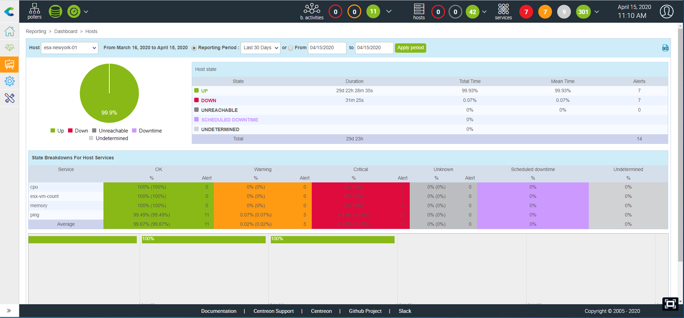
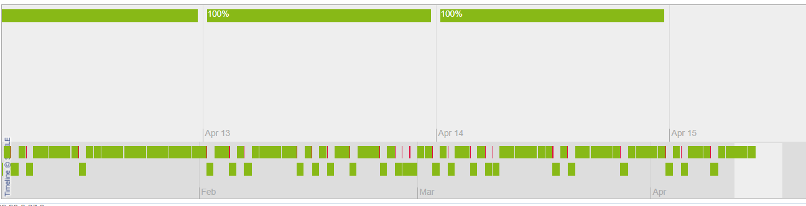
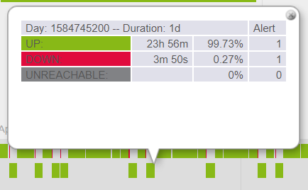

## Complete reporting with Centreon MBI

The reporting capabilities in Centreon rely on the **Centreon Monitoring Business Intelligence (MBI)** extension.
You also have simple reporting capabilities described below.

> Centreon MBI is a Centreon **extension** that requires a valid [license](../administration/licenses.md). To
> purchase one and retrieve the necessary repositories, contact
> [Centreon](mailto:sales@centreon.com).

Centreon Monitoring Business Intelligence (MBI) is a software tool
designed to help business users make critical decisions and to
facilitate management of an IT environment. Centreon MBI analyzes data
from monitored events, performance counters and capacity accessed from
the Centreon Enterprise Monitoring Solution (EMS), providing you with
full visibility of your infrastructures and application activities
through *ITIL compliant* reporting.

Generate insightful statistics using our 30+ reports designs\...

Centreon MBI provides a full package of standard reports that address:

-   Capacity planning and management
-   Availability management
-   SLA (Service Level Agreement) management
-   Performance management.

**Here are some examples of reports available in Centreon MBI**: [Reports examples](../assets/reporting/Centreon-MBI-Sample-Reports.pdf)

or simply create your own reporting dashboard using our widgets.

Main features:

-   Scheduling and generation of standalone reports in PDF, Excel, Word
    and Powerpoint formats
-   Visualization of web & interactive statistics using reporting
    widgets that are Centreon-compatible
-   Publication of reports by e-mail and other standard protocols (FTP,
    CIFS, etc.)
-   Access control to reports
-   Administration and user interface integrated into Centreon
-   Report development libraries

## Simple reporting

The availability reports concerning objects monitored via the Centreon Web interface 
can display the availability rates of hosts, a hostgroup, or a servicegroup over a selected period.

To access the availability reports:

- Go into the following menu: **Reporting > Dashboard**
- In the left menu, click **Host**.
- Select a host from the **Host** list.

- The **Reporting Period** lets you select a predefined period or define it manually using **From** to **to** fields.
- The **Host state** table displays the availability rates of objects.
- The **State Breakdowns For Host Services** table displays the availability of linked objects.
- The timeline provides a quick and intuitive overview of the status of the object.

Click a day in the timeline to obtain the report for that day:

It is also possible to view web reports:

* The groups of hosts: Click **Host Groups** in the left menu
* The groups of services: Click **Service Groups** in the left menu

The CSV icon is used to export data to a CSV file.

> You can also see the availability of a service by clicking the service name in the host or servicegroup report.