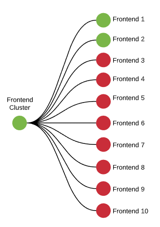
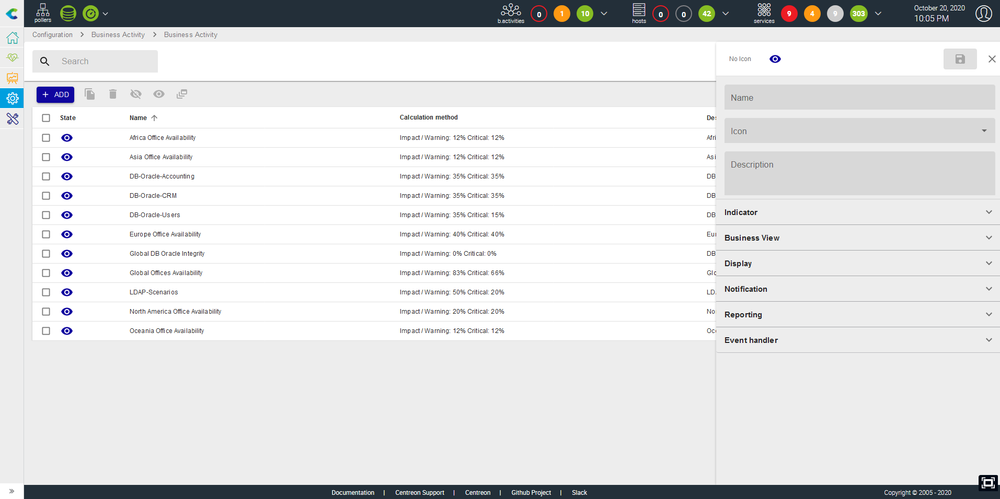
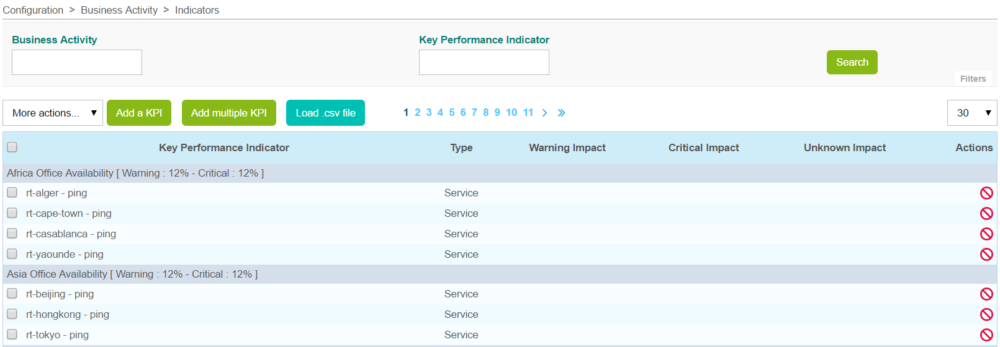
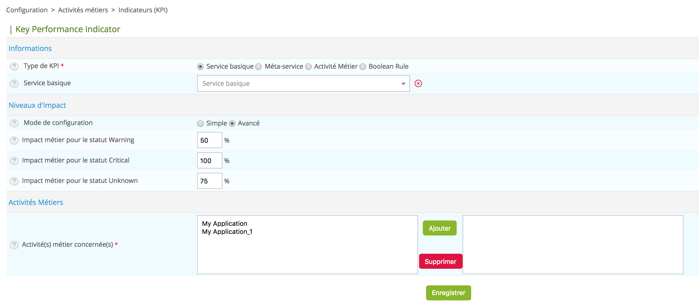
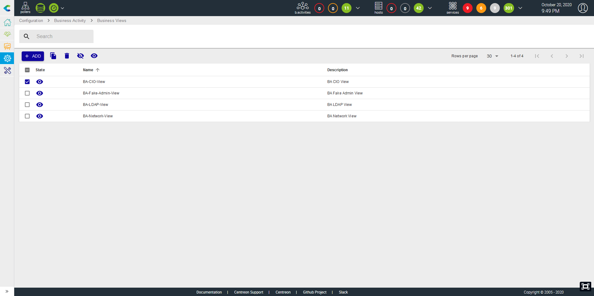

import Tabs from '@theme/Tabs';
import TabItem from '@theme/TabItem';

## Business Activities (BA)

> When you modify a business activity, you need to push and reload the
> configuration using the "Poller" menu so that it is applied

### Definition

Business Activities form the core of the Centreon BAM extension. As
aggregated indicators, they are monitored by the software in real time
using specific calculation methods. Business Activities are able to
notify users depending their status, revealing a problem with the IT
service or application.

### Calculation methods

Business activity statuses rely on the calculation done on indicators
(child resources). The calculation method is configured at business
activity level.

There are four calculation methods that you can use:

-   **Best status**: When you only need to be warned that ALL indicators
    are critical at the same time
-   **Worst status**: When you want to know immediately when at least one
    indicator is not-ok
-   **Ratio**: When you want to model Cluster concepts by specifying a
    number or percentage of critical resources that you do not want to
    exceed
-   **Impact**: When you want to precisely define the weight of each
    indicator and reflect that on your BA status

Below are some examples and a configuration of each calculation method.

<Tabs groupId="sync">
<TabItem value="Best Status" label="Best Status">

The following order will be applied to find the "Best" status:
`OK > Unknown > Warning > Critical > Pending`

The configuration is as follows:

</TabItem>
<TabItem value="Worst Status" label="Worst Status">

The following order will be applied to find the "Worst" status:
`CRITICAL > Warning > Unknown > OK > Pending`

The configuration is as follows:

</TabItem>
<TabItem value="Ratio" label="Ratio">

This method helps you model “Cluster” concepts. The calculation is based
on the **number or percentage of indicators in CRITICAL status**, which you
compare to number/percentage thresholds that you do not want to exceed.

In the following example, we defined that we want the percentage of Critical indicators to
be less than 80%.

The configuration is as follow:

After choosing whether you want to define them in terms of percentage or number,
you must configure the threshold parameters:

-   Critical threshold: if the number/percentage of **Critical**
    indicators exceeds that number/percentage, the Business activity will
    be Critical
-   Warning threshold: if the number/percentage of **Critical**
    indicators exceed that number/percentage, the Business activity will
    be Warning

</TabItem>
<TabItem value="Impact" label="Impact">

> This mode is complex to use, but it could help you model
> severity-related concepts.

When you use impact mode, the business activity has a “Health”
between 100% and 0%. When you attach indicators to it, you must
define the impact (in %) of each status for each indicator. When these
indicators switch to these statuses (unknown, critical etc.), the
calculation is simple: BA Health = 100% - Current impacts.

You then use the Warning and Critical thresholds to determine at what
level you want the BA to become Warning or Critical

-   **Warning threshold**: Between 100 and 0, the threshold below which
    the BA will switch to Warning status
-   **Critical threshold**: Between 100 and 0 (< the Warning
    threshold) below which the BA will switch to Critical status

The health value between 100% and 0% is often related to a service
quality measurement. A variation in this value is used to determine
whether the modeled IT service or application is in an **OK**,
**Warning** or **Critical** state.

</TabItem>
</Tabs>

### Create a Business Activity

To add a Business Activity, click the **Add** button. The following panel
appears:

In this configuration panel, after giving a unique name (mandatory), you
need to configure multiple sections to have an aggregated indicator. The
name is the only mandatory parameter, but to have a BA that works, **you
must at least configure some indicators and define the
calculation methods**. This can be done in the "Indicator" section.

#### Indicators

This section is the most important section for a business activity, because it
is where you define how the status will be calculated by attaching
resources to the business activity and setting the calculation method.

The type of indicators you can use are :

- Services
- Other business activities: it is really important to understand
  that you can create “infinite” multi-level BAs to model simple to
  highly complex IT services or apps.
- Meta services
- Boolean rules: a combination of services with AND/OR/XOR rules
- [Anomaly detection services](../monitoring/anomaly-detection.md).

**Calculation methods**

You can choose between the following four calculation methods. Refer to
the previous section to understand each calculation method.

-   Best status
-   Worst status
-   Ratio
-   Impact

Now that you have chosen how the business activity status will be
calculated, you can manage how **planned downtime** on indicators will
be handled. You have three choices:

-   **Ignore the downtime**: In that case, the planned downtime
    positioned on child indicators will be ignored, the BA will be
    impacted, and that is all.
-   **Inherit the downtime**: the BA is automatically set in “planned
    downtime” whenever an indicator in a non-ok state is in planned
    downtime AND impacts the BA. The BA will still be impacted. The
    planned downtime inheritance follows these rules:
    -   A BA inherits planned downtime from its indicators only when the
        BA status is **not OK**.
    -   When a BA is in planned downtime due to indicator downtime
        inheritance: If the BA status switches to OK, planned downtime
        is stopped.
    -   When a BA is in planned downtime due to indicators downtime
        inheritance: If an impact comes from an indicator that has no
        planned downtime, the BA downtime is stopped.
-   **Ignore the indicator in the calculation**: when the indicator
    impacts the BA and is in planned downtime, its status/impact is
    ignored in the calculation.

After configuring how the business activity status is computed,
you will be able to configure the following properties:

-   Business View: what BV(s) to link the BA to. Mandatory if you want
    to give access to this BA to non-admin users
-   Display: All parameters concerning the way the BA will be accessible
    outside the BA monitoring page
-   Notification: who and when users are notified
-   Reporting: What SLA and time period you want to use to calculate the BA
    availability statistics
-   Event handler: parameters to auto-remediate the BA when state
    becomes non-ok

#### Business View

Link the BA to one or multiple business views so it becomes available for
non-admin users.

#### Display

-   Display on remote server: If you are using a remote server, you can
    send the business activity to it so that it is also available for
    remote teams. This is possible only if ALL the indicators under the
    BA (at any level) are visible by the remote server.
-   Geo-coordinates: Geo-coordinate to position the BA on a geoview
-   Associated infrastructure view name: the BA probably corresponds to
    an aggregated/customer's point of view state of an IT service or
    application that relies on a complex infrastructure. If this
    infrastructure was designed in Centreon Map, you can ease
    access from this BA to the corresponding view to help users to drill
    down when a problem occurs on that BA.

#### Notification

Configure when, for what status and who should be notified when the BA's
status changes. You can also define escalation that applies to that BA.

The escalation is the same as with other **Centreon** objects; when you
select an escalation, the service escalation definition will be applied
to the BA.

#### Reporting

-   Default reporting time period: Availability statistics for widgets and
    reports will be automatically calculated using this time period
-   Service Level Agreement in % (SLA): whenever the availability is
    compared to a SLA in %, this will be the value that it will be
    compared to
-   Service Level Agreement in minutes (SLA): whenever the availability
    is compared to an SLA in minutes, this will be the value that it will
    be compared to
-   Service Level Objective in % (SLO): additional threshold in % to
    compare the availability. It can be seen as an “SLA warning”
    threshold.
-   Service Level Objective in minutes (SLO): additional threshold in
    minutes to compare the availability. It can be seen as an “SLA
    warning” threshold..
-   Extra reporting time periods: Additional time period you may want
    to use in widget and reports

#### Event handler

Activate or not the auto-remediation command that you may execute when the BA
status switches.

> In order for the new BA to be calculated and monitored, you must regenerate
> the configuration on the scheduler and restart the monitoring services through
> the interface in the **Configuration > Poller** menu.

### List Business Activities

The BA is managed through the
`Configuration > Business Activity > Business Activity` menu.

You have inline actions and global actions to delete, duplicate,
enable/disable the BA and massively change thresholds.

> Deleting a business activity is permanent; only passed data will be
> available through reports/widgets

## Indicators (KPI)

> To update the indicator configuration, you need to push and reload the
> configuration using the “Poller” menu

### Definition

An indicator is a resource in the monitoring system that is linked to a
BA. A BA may have multiple indicators and sub-indicators. There are five
types of indicator:

- Service (Service by hostgroups are **NOT** usable as indicators)
- Meta service
- Boolean
- Another business activity
- [Anomaly Detection services](../monitoring/anomaly-detection.md)

An indicator can only impact a BA when the status of its object (e.g., a
service) is *Hard* (validated).

The indicator can impact the health of a BA and change its value
according to the indicator status. We recommend that you use the
standard impact mode (based on keywords *Minor*, *Major*, etc.) instead
of the advanced mode based on numeric impact values, which involve a more
complex calculation.

Any time an indicator status changes, the BA engine evaluates the impact
and subtracts its value from the BA health level. The minimum health of
a BA is 0, even if the sum of the impacts of its indicators is > 100.

### List Indicators

Indicators can be configured in two different ways:

-   From the BA panel (common way)
-   From **Configuration > Business Activity > Indicators**

| Column          | Description                                                                                                          |
| --------------- | -------------------------------------------------------------------------------------------------------------------- |
| Indicator (KPI) | Indicator or Key Performance Indicator: Name of the indicator based on the object used                               |
| Type            | Indicator type (service, meta service, BA, boolean rule)                                                           |
| Warning Impact  | Impact weight in the event of a *Warning* condition, in real-time monitoring. Ignored if indicator is a boolean rule |
| Critical Impact | Impact weight in the event of a *Critical* condition, in real-time monitoring                                        |
| Unknown Impact  | Impact weight in the event of an *Unknown* condition, in real-time monitoring. Ignored if indicator is a boolean rule |
| Actions         | Actions can be performed (modification,activation/deactivation)                                                      |

The **More Actions** menu allows an action to be applied to several
indicators at once:

-   Activate the indicator within their BA.
-   Update impact types collectively.
-   Deactivate indicator within their BA.
-   Delete indicator.

### Create an indicator (KPI)

> In this page, you can only attach an indicator to business activities
> that use the “Impact” calculation method. If you want to manipulate BA
> or indicators using another calculation method, go back to the Business
> Activity page.

There are several ways to create an indicator:

#### Add an indicator

To add an indicator, click the **Add a KPI** link, which takes you to the
following form.

**Regular Mode**:

**Advanced mode**:

To be able to manually define an impact:

| Column          | Description                                                                                                          |
| ------------------------- | ----------------------------------------------------------------------------- |
| Configuration Mode        | Configuration mode: regular or advanced                                       |
| KPI Type                  | KPI type (service, meta service, boolean rule or a BA)                        |
| Key Performance Indicator | Choice of KPI based on the objects in Centreon                                |
| Warning Business Impact   | Impact weight in the event of a *Warning* condition, in real-time monitoring  |
| Critical Business Impact  | Impact weight in the event of a *Critical* condition, in real-time monitoring |
| Unknown Business Impact   | Impact weight in the event of an *Unknown* condition, in real-time monitoring |
| Linked Business Activity  | BA related to KPI                                                             |

*To add a boolean rule: First create the boolean rule (see below), and then add
the KPI.*

#### Adding multiple KPIs

In order to add multiple KPIs, click the **Add multiple KPIs** link, which takes
you to a data entry form.

| Column                            | Description                                                                           |
| --------------------------------- | ------------------------------------------------------------------------------------- |
| Configuration Mode                | Configuration mode: Standard or Advanced                                              |
| Object Type                       | Type of object from which the indicators will be loaded                               |
| Hosts, Host Groups, Service group | Depending on the selected object type, a list of objects will be automatically loaded |
| Linked Business Activity          | BA related to indicators                                                              |

Click the **Retrieve KPI** button; a list of indicators will be displayed.
You can filter and apply thresholds, collectively or one by one:

| Column          | Description                                                                   |
| --------------- | ----------------------------------------------------------------------------- |
| Host            | Host                                                                          |
| Service         | Service                                                                       |
| Warning Impact  | Impact weight in the event of a *Warning* condition, in real-time monitoring  |
| Critical Impact | Impact weight in the event of a *Critical* condition, in real-time monitoring |
| Unknown Impact  | Impact weight in the event of an *Unknown* condition, in real-time monitoring |

### Boolean Rules

To create a boolean rule, go to:
`Configuration > Business Activity > Boolean Rules`

| Column                                    | Description                                          |
|-------------------------------------------|------------------------------------------------------|
| Boolean name                              | Name of the boolean KPI                              |
| Expression                                | Logical expression (see below)                       |
| Impact is applied when expression returns | State of logical expression that triggers the impact |
| Comments                                  | Comments regarding the boolean KPI                   |
| Status                                    | Enabled or Disabled                                  |

Logical expression:

1.  Field for editing the logical expression
2.  Toolbox
3.  Services that compose the logical expression
4.  Button for evaluating the expression with real-time monitored status
5.  Boolean state after evaluation (whether it is real-time or
    simulated)
6.  Enter simulation mode, thus allowing the user to simulate the statuses of
    the defined services

## Business View (BV)

### Definition

BVs are used to gather multiple BAs into a single group. Similar to Centreon
host groups, BV groups can be used in different Centreon BAM screens.

Access restrictions (via ACL) for viewing BAs are managed by linking them to
BVs, which are in turn linked to one or more *Centreon Access Groups*.

> For the purpose of a root cause analysis, as soon as you give a user access to a
> business activity, they will see all the indicators linked to it, no matter what their
> restriction concerning resources used in the BA definition

A BV is not an indicator as such by which data can be calculated. The
information in a BV depends on its content and is displayed in real time.

### List Business Views

Configure a BV in the **Configuration > Business Activity > Business Views**
menu.

| Column      | Description                                                                          |
| ----------- | ------------------------------------------------------------------------------------ |
| Name        | Business view name                                                                   |
| Description | Brief description of BV                                                              |
| Displayed   | The BV is either displayed or not displayed on the Centreon BAM screens (deprecated) |
| Actions     | List of actions to be performed on the BV (modification/display)                     |

> Deleting a BV:
>
>   - Does not delete the BAs that are linked to it.
>   - Is permanent.

### Create a Business View

| Column              | Description                                            |
| ------------------- | ------------------------------------------------------ |
| Name                | BV name                                                |
| Description         | Brief description of the BV                            |
| Business activities | The BA(s) linked to the BV                             |
| ACL Groups          | The access group(s) that can consult the BV and its BA |
