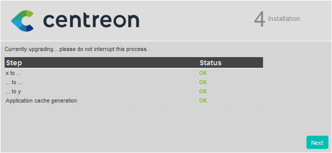

import Tabs from '@theme/Tabs';
import TabItem from '@theme/TabItem';

This chapter describes how to upgrade your Centreon platform from version 23.04
to version 23.10.

> When you upgrade your central server, make sure you also upgrade all your remote servers and your pollers. All servers in your architecture must have the same version of Centreon. In addition, all servers must use the same [version of the BBDO protocol](../developer/developer-broker-bbdo.md#switching-versions-of-bbdo).

> If you want to migrate your Centreon platform to another server/OS, please read our chapter on migration.
> you need to follow the [migration procedure](../migrate/introduction.md).

## Prerequisites

### Perform a backup

Be sure that you have fully backed up your environment for the following
servers:

- Central server
- Database server

## Upgrade the Centreon Central server

> When you run a command, check its output. If you get an error message, stop the procedure and fix the issue.

### Install the new repositories

<Tabs groupId="sync">
<TabItem value="Alma / RHEL / Oracle Linux 8" label="Alma / RHEL / Oracle Linux 8">

1. Update your Centreon 23.04 to the latest minor version.

2. Remove the **centreon.repo** file:

   ```shell
   rm /etc/yum.repos.d/centreon.repo
   ```

3. Install the new repository:

```shell
dnf install -y dnf-plugins-core
dnf config-manager --add-repo https://packages.centreon.com/rpm-standard/23.10/el8/centreon-23.10.repo
```

</TabItem>
<TabItem value="Alma / RHEL / Oracle Linux 9" label="Alma / RHEL / Oracle Linux 9">

1. Update your Centreon 23.04 to the latest minor version.

2. Remove the **centreon.repo** file:

   ```shell
   rm /etc/yum.repos.d/centreon.repo
   ```

3. Install the new repository:

```shell
dnf install -y dnf-plugins-core
dnf config-manager --add-repo https://packages.centreon.com/rpm-standard/23.10/el9/centreon-23.10.repo
```

</TabItem>
<TabItem value="Debian 11" label="Debian 11">

```shell
echo "deb https://packages.centreon.com/apt-standard-23.10-stable/ $(lsb_release -sc) main" | tee /etc/apt/sources.list.d/centreon.list
echo "deb https://packages.centreon.com/apt-plugins-stable/ $(lsb_release -sc) main" | tee /etc/apt/sources.list.d/centreon-plugins.list
```

Then import the repository key:

```shell
wget -O- https://apt-key.centreon.com | gpg --dearmor | tee /etc/apt/trusted.gpg.d/centreon.gpg > /dev/null 2>&1
apt update
```

</TabItem>
</Tabs>

> If you have an [offline license](../administration/licenses.md#types-of-licenses), also remove the old Monitoring Connectors repository, then install the new one.
>
> If you have a Business edition, do the same with the Business repository.
>
> You can find the address of these repositories on the [support portal](https://support.centreon.com/hc/en-us/categories/10341239833105-Repositories).

### Upgrade the Centreon solution

> Make sure all users are logged out from the Centreon web interface
> before starting the upgrade procedure.

If you have installed Business extensions, update the Business repository to version 23.10.
Visit the [support portal](https://support.centreon.com/hc/en-us/categories/10341239833105-Repositories) to get its address.

If your OS is Debian 11 and you have a customized Apache configuration, perform a backup of your configuration file (**/etc/apache2/sites-available/centreon.conf**).

Stop the Centreon Broker process:

```shell
systemctl stop cbd
```

Delete existing retention files:

```shell
rm /var/lib/centreon-broker/* -f
```

Clean the cache:

<Tabs groupId="sync">
<TabItem value="Alma / RHEL / Oracle Linux 8" label="Alma / RHEL / Oracle Linux 8">

```shell
dnf clean all --enablerepo=*
```

</TabItem>
<TabItem value="Alma / RHEL / Oracle Linux 9" label="Alma / RHEL / Oracle Linux 9">

```shell
dnf clean all --enablerepo=*
```

</TabItem>
<TabItem value="Debian 11" label="Debian 11">

```shell
apt clean
apt update
```

</TabItem>
</Tabs>

Then upgrade all the components with the following command:

<Tabs groupId="sync">
<TabItem value="Alma / RHEL / Oracle Linux 8" label="Alma / RHEL / Oracle Linux 8">

```shell
dnf update centreon\* php-pecl-gnupg
```

</TabItem>
<TabItem value="Alma / RHEL / Oracle Linux 9" label="Alma / RHEL / Oracle Linux 9">

```shell
dnf update centreon\* php-pecl-gnupg
```

</TabItem>
<TabItem value="Debian 11" label="Debian 11">

```shell
apt upgrade centreon
```

</TabItem>
</Tabs>

> Accept new GPG keys from the repositories as needed.

### Update your customized Apache configuration

This section only applies if you customized your Apache configuration. 

<Tabs groupId="sync">
<TabItem value="Alma / RHEL / Oracle Linux 8" label="Alma / RHEL / Oracle Linux 8">

When you upgrade your platform, the Apache configuration file is not upgraded automatically. The new configuration file brought by the rpm does not replace the old file. You must copy the changes manually to your customized configuration file.

Run a diff between the old and the new Apache configuration files:

```shell
diff -u /etc/httpd/conf.d/10-centreon.conf /etc/httpd/conf.d/10-centreon.conf.rpmnew
```

* **10-centreon.conf** (post upgrade): this file contains the custom configuration. It does not contain anything new brought by the upgrade.
* **10-centreon.conf.rpmnew** (post upgrade): this file is provided by the rpm; it does not contain any custom configuration.

For each difference between the files, assess whether you should copy it from **10-centreon.conf.rpmnew** to **10-centreon.conf**.

Check that Apache is configured properly by running the following command:

```shell
apachectl configtest
```

The expected result is the following:

```shell
Syntax OK
```

Restart the Apache and PHP processes to take the new configuration into account:

```shell
systemctl restart php-fpm httpd
```

Then check its status:

```shell
systemctl status httpd
```

If everything is ok, you should have:

```shell
● httpd.service - The Apache HTTP Server
   Loaded: loaded (/usr/lib/systemd/system/httpd.service; enabled; vendor preset: disabled)
  Drop-In: /usr/lib/systemd/system/httpd.service.d
           └─php-fpm.conf
   Active: active (running) since Tue 2020-10-27 12:49:42 GMT; 2h 35min ago
     Docs: man:httpd.service(8)
 Main PID: 1483 (httpd)
   Status: "Total requests: 446; Idle/Busy workers 100/0;Requests/sec: 0.0479; Bytes served/sec: 443 B/sec"
    Tasks: 278 (limit: 5032)
   Memory: 39.6M
   CGroup: /system.slice/httpd.service
           ├─1483 /usr/sbin/httpd -DFOREGROUND
           ├─1484 /usr/sbin/httpd -DFOREGROUND
           ├─1485 /usr/sbin/httpd -DFOREGROUND
           ├─1486 /usr/sbin/httpd -DFOREGROUND
           ├─1487 /usr/sbin/httpd -DFOREGROUND
           └─1887 /usr/sbin/httpd -DFOREGROUND

```

</TabItem>
<TabItem value="Alma / RHEL / Oracle Linux 9" label="Alma / RHEL / Oracle Linux 9">

When you upgrade your platform, the Apache configuration file is not upgraded automatically. The new configuration file brought by the rpm does not replace the old file. You must copy the changes manually to your customized configuration file.

Run a diff between the old and the new Apache configuration files:

```shell
diff -u /etc/httpd/conf.d/10-centreon.conf /etc/httpd/conf.d/10-centreon.conf.rpmnew
```

* **10-centreon.conf** (post upgrade): this file contains the custom configuration. It does not contain anything new brought by the upgrade.
* **10-centreon.conf.rpmnew** (post upgrade): this file is provided by the rpm; it does not contain any custom configuration.

For each difference between the files, assess whether you should copy it from **10-centreon.conf.rpmnew** to **10-centreon.conf**.

Check that Apache is configured properly by running the following command:

```shell
apachectl configtest
```

The expected result is the following:

```shell
Syntax OK
```

Restart the Apache and PHP processes to take the new configuration into account:

```shell
systemctl restart php-fpm httpd
```

Then check its status:

```shell
systemctl status httpd
```

If everything is ok, you should have:

```shell
● httpd.service - The Apache HTTP Server
   Loaded: loaded (/usr/lib/systemd/system/httpd.service; enabled; vendor preset: disabled)
  Drop-In: /usr/lib/systemd/system/httpd.service.d
           └─php-fpm.conf
   Active: active (running) since Tue 2020-10-27 12:49:42 GMT; 2h 35min ago
     Docs: man:httpd.service(8)
 Main PID: 1483 (httpd)
   Status: "Total requests: 446; Idle/Busy workers 100/0;Requests/sec: 0.0479; Bytes served/sec: 443 B/sec"
    Tasks: 278 (limit: 5032)
   Memory: 39.6M
   CGroup: /system.slice/httpd.service
           ├─1483 /usr/sbin/httpd -DFOREGROUND
           ├─1484 /usr/sbin/httpd -DFOREGROUND
           ├─1485 /usr/sbin/httpd -DFOREGROUND
           ├─1486 /usr/sbin/httpd -DFOREGROUND
           ├─1487 /usr/sbin/httpd -DFOREGROUND
           └─1887 /usr/sbin/httpd -DFOREGROUND

```

</TabItem>
<TabItem value="Debian 11" label="Debian 11">

Use the backup file you created in the previous step to copy your customizations to the file **/etc/apache2/sites-available/centreon.conf**.

Check that Apache is configured properly by running the following command:

```shell
apache2ctl configtest
```

The expected result is the following:

```shell
Syntax OK
```

Restart the Apache and PHP processes to take the new configuration into account:

```shell
systemctl restart php8.0-fpm apache2
```

Then check its status:

```shell
systemctl status apache2
```

If everything is ok, you should have:

```shell
● apache2.service - The Apache HTTP Server
    Loaded: loaded (/lib/systemd/system/apache2.service; enabled; vendor pres>
     Active: active (running) since Tue 2022-08-09 05:01:36 UTC; 3h 56min ago
       Docs: https://httpd.apache.org/docs/2.4/
   Main PID: 518 (apache2)
      Tasks: 11 (limit: 2356)
     Memory: 18.1M
        CPU: 1.491s
     CGroup: /system.slice/apache2.service
             ├─ 518 /usr/sbin/apache2 -k start
             ├─1252 /usr/sbin/apache2 -k start
             ├─1254 /usr/sbin/apache2 -k start
             ├─1472 /usr/sbin/apache2 -k start
             ├─3857 /usr/sbin/apache2 -k start
             ├─3858 /usr/sbin/apache2 -k start
             ├─3859 /usr/sbin/apache2 -k start
             ├─3860 /usr/sbin/apache2 -k start
             ├─3876 /usr/sbin/apache2 -k start
             ├─6261 /usr/sbin/apache2 -k start
             └─6509 /usr/sbin/apache2 -k start
```

</TabItem>
</Tabs>

#### Customized Apache configuration: enable text compression

In order to improve page loading speed, you can activate text compression on the Apache server. It requires the **brotli** package to work. This is optional, but it provides a better user experience.

Add the following code to your Apache configuration file, in both the `<VirtualHost *:80>` and `<VirtualHost *:443>` elements:

```shell
<IfModule mod_brotli.c>
    AddOutputFilterByType BROTLI_COMPRESS text/html text/plain text/xml text/css text/javascript application/javascript application/json
</IfModule>
AddOutputFilterByType DEFLATE text/html text/plain text/xml text/css text/javascript application/javascript application/json
```

### Finalizing the upgrade

Before starting the web upgrade process, reload the Apache server with the
following command:

<Tabs groupId="sync">
<TabItem value="Alma / RHEL / Oracle Linux 8" label="Alma / RHEL / Oracle Linux 8">

```shell
systemctl reload php-fpm httpd
```

</TabItem>
<TabItem value="Alma / RHEL / Oracle Linux 9" label="Alma / RHEL / Oracle Linux 9">

```shell
systemctl reload php-fpm httpd
```

</TabItem>
<TabItem value="Debian 11" label="Debian 11">

```shell
apt autoremove
systemctl daemon-reload
systemctl stop php8.0-fpm.service
systemctl enable php8.1-fpm
systemctl start php8.1-fpm
systemctl restart apache2
```

</TabItem>
</Tabs>

Then you need to finalize the upgrade process:

  <Tabs groupId="sync">
  <TabItem value="Using the wizard" label="Using the wizard">

1. Log on to the Centreon web interface to continue the update process. Click **Next**:

  

2. Click **Next**:

  

3. The release notes describe the main changes. Click **Next**:

  

4. This process performs the various upgrades. Click **Next**:

  

5. Your Centreon server is now up to date. Click **Finish** to access the login
page:

  

  > If the Centreon BAM module is installed, refer to the [update procedure](../service-mapping/update.md).

6. Deploy the central's configuration from the Centreon web UI by following [this
procedure](../monitoring/monitoring-servers/deploying-a-configuration.md).
  
</TabItem>
<TabItem value="Using a dedicated API endpoint" label="Using a dedicated API endpoint">

1. Log on to the central server through your terminal to continue the update process.

  > You need an authentication token to reach the API endpoint. Perform the following procedure to get a token.

  In our case, we have the configuration described below (you need to adapt the procedure to your configuration).
   - address: 10.25.XX.XX
   -  port: 80
   -  version: 23.10
   -  login: Admin
   -  password: xxxxx

2. Enter the following request:

  ```shell
  curl --location --request POST '10.25.XX.XX:80/centreon/api/v23.10/login' \
  --header 'Content-Type: application/json' \
  --header 'Accept: application/json' \
  --data '{
    "security": {
      "credentials": {
        "login": "Admin",
        "password": "xxxxx"
      }
    }
  }'
  ```

  This is how the result should look:

    ```shell
    {"contact":{"id":1,"name":"Admin Centreon","alias":"admin","email":"admin@localhost","is_admin":true},"security":{"token":"hwwE7w/ukiiMce2lwhNi2mcFxLNYPhB9bYSKVP3xeTRUeN8FuGQms3RhpLreDX/S"}}
    ```

3. Retrieve the token number to use it in the next request.

4. Then enter this request:

  ```shell
  curl --location --request PATCH 'http://10.25.XX.XX:80/centreon/api/latest/platform/updates' \
  --header 'X-AUTH-TOKEN: hwwE7w/ukiiMce2lwhNi2mcFxLNYPhB9bYSKVP3xeTRUeN8FuGQms3RhpLreDX/S' \
  --header 'Content-Type: application/json' \
  --data '{
      "components": [
          {
              "name": "centreon-web"
          }
      ]
  }'
  ```

5. This request does not return any result. To check if the update has been successfully applied, read the version number displayed on the Centreon web interface login page.

</TabItem>
</Tabs>

Finally, restart Broker, Engine and Gorgone on the central server by running this command:

  ```shell
  systemctl restart cbd centengine gorgoned
  ```

Update the permissions on the centreon-broker configuration files.

<Tabs groupId="sync">
<TabItem value="Alma / RHEL / Oracle Linux 8" label="Alma / RHEL / Oracle Linux 8">

```shell
usermod -a -G centreon-broker apache
usermod -a -G apache centreon-broker
```

</TabItem>
<TabItem value="Alma / RHEL / Oracle Linux 9" label="Alma / RHEL / Oracle Linux 9">

```shell
usermod -a -G centreon-broker apache
usermod -a -G apache centreon-broker
```

</TabItem>
<TabItem value="Debian 11" label="Debian 11">

```shell
usermod -a -G centreon-broker www-data
usermod -a -G www-data centreon-broker
```

</TabItem>
</Tabs>

If the Centreon BAM module is installed, refer to the
[upgrade procedure](../service-mapping/upgrade.md).

### Post-upgrade actions

1. Upgrade extensions. From **Administration > Extensions > Manager**, upgrade all extensions, starting
with the following:

   - License Manager,
   - Monitoring Connector Manager,
   - Auto Discovery.

   Then you can upgrade all other commercial extensions.

2. [Deploy the configuration](../monitoring/monitoring-servers/deploying-a-configuration.md).

3. Restart the processes:

    ``` shell
    systemctl restart cbd centengine centreontrapd gorgoned
    ```

## Upgrade the Remote Servers

This procedure is the same as for upgrading a Centreon Central server.

> At the end of the update, the configuration should be deployed from the Central server.

## Upgrade the Pollers

### Update the Centreon repository

Run the following command:

<Tabs groupId="sync">
<TabItem value="Alma / RHEL / Oracle Linux 8" label="Alma / RHEL / Oracle Linux 8">

```shell
dnf install -y dnf-plugins-core
dnf config-manager --add-repo https://packages.centreon.com/rpm-standard/23.10/el8/centreon-23.10.repo
```

</TabItem>
<TabItem value="Alma / RHEL / Oracle Linux 9" label="Alma / RHEL / Oracle Linux 9">

```shell
dnf install -y dnf-plugins-core
dnf config-manager --add-repo https://packages.centreon.com/rpm-standard/23.10/el9/centreon-23.10.repo
```

</TabItem>
<TabItem value="Debian 11" label="Debian 11">

```shell
echo "deb https://packages.centreon.com/apt-standard-23.10-stable/ $(lsb_release -sc) main" | tee /etc/apt/sources.list.d/centreon.list
apt update
```

</TabItem>
</Tabs>

### Upgrade the Centreon solution

Clean the cache:

<Tabs groupId="sync">
<TabItem value="Alma / RHEL / Oracle Linux 8" label="Alma / RHEL / Oracle Linux 8">

```shell
dnf clean all --enablerepo=*
```

</TabItem>
<TabItem value="Alma / RHEL / Oracle Linux 9" label="Alma / RHEL / Oracle Linux 9">

```shell
dnf clean all --enablerepo=*
```

</TabItem>
<TabItem value="Debian 11" label="Debian 11">

```shell
apt clean
apt update
```

</TabItem>
</Tabs>

Then upgrade all the components with the following command:

<Tabs groupId="sync">
<TabItem value="Alma / RHEL / Oracle Linux 8" label="Alma / RHEL / Oracle Linux 8">

```shell
dnf update centreon\*
```

</TabItem>
<TabItem value="Alma / RHEL / Oracle Linux 9" label="Alma / RHEL / Oracle Linux 9">

```shell
dnf update centreon\*
```

</TabItem>
<TabItem value="Debian 11" label="Debian 11">

```shell
apt upgrade centreon-poller
```

</TabItem>
</Tabs>

> Accept new GPG keys from the repositories as needed.

Restart **centreon**:

```shell
systemctl restart centreon
```
