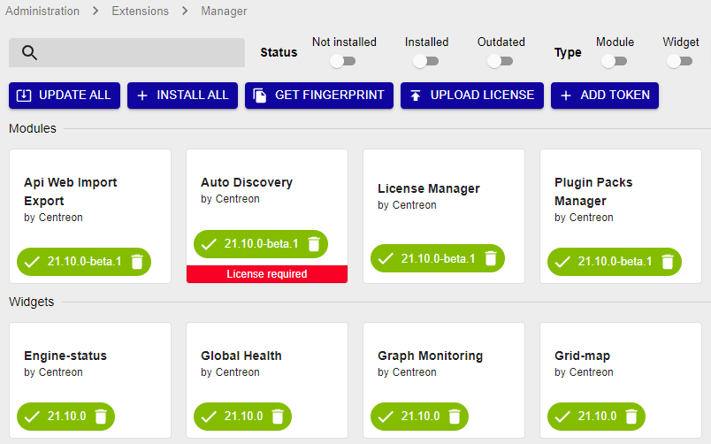

Extensions can be used to add additional features to Centreon. It is
possible to install extensions using the package manager or using source files
(\*.tar.gz).

There are three types of extension:

- **Community**, under license GPL v2, developed by the Centreon community,
- **Core**, under license GPL v2, developed by the Centreon team,
- **Proprietary**, subject to a license, developed by
*[Centreon](http://www.centreon.com)*.

To install an extension:

1. Install the extensions from the associated documentation.
2. Go into the **Administration > Extensions > Manage** menu.

To install all extensions, click **Install all**:

You can also update all extensions by clicking **Update all**, or manage
extension by extension.

Click an extension to see its description:

