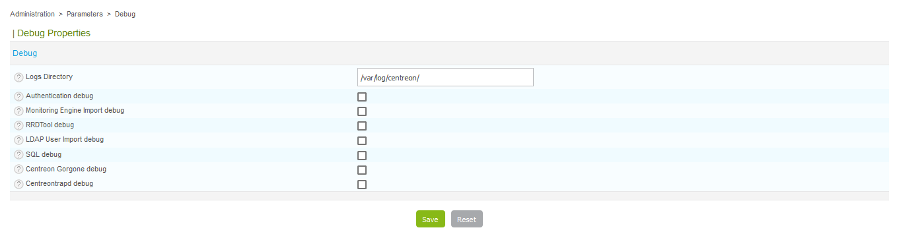

This section describes how to enable debug level logging of Centreon processes.

Go to **Administration > Parameters > Debug**.

- The **Logs Directory** field defines the path where event logs will be recorded
- The **Authentication debug** box can be used to log authentications to the
Centreon interface
- The **Monitoring Engine Import debug** box enables logging of scheduler
debugging
- The **RRDTool debug** box enables logging of RRDTool graph engine debugging
- The **LDAP User Import debug** box enables logging of debugging of the importing of
LDAP users
- The **SQL debug** box enables the logging of SQL requests executed by the
Centreon interface
- The **Centreon Gorgone debug** box enables logging of Gorgone process debugging
- **Centreontrapd debug** box enables logging of Centreontrapd process
debugging
