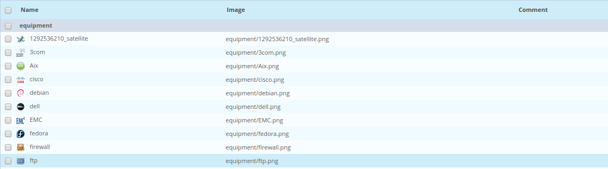
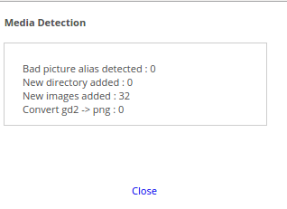

Media are images used by the Centreon web interface. These images are used to
represent the monitored resource in a more intuitive way, propose backgrounds
for cartography modules, etc.

## Image management

All the images are stored in the folder entitled:
**/usr/share/centreon/www/img/media** of the Centreon server.

There are two methods for adding images to this folder:

- Do it manually,
- Use automatic synchronization. This method has the advantage of being able
to import multiple images at the same time.

### Manual addition

To add an image in Centreon, go to **Administration > Parameters > Images** and
click **Add**.

The following window is displayed:

- The **Existing or new directory** field can be used to add a new folder in the
image folder or to choose an existing folder into which the image can be
copied
- The **Image or archive** field can be used to select the image or the set of
images contained in an archive that will be imported
- The **Comments** field can be used to describe the image

### Synchronizing the images

To synchronize one or more images in the Centreon media:

1. Copy your images in the image folder (the images may be located in folders).
2. Make sure the user who executes your web server has the read rights on
these images.
3. Go to **Administration > Parameters > Images**.
4. Click **Synchronize Media Directory**.

The following window imports the new images:

