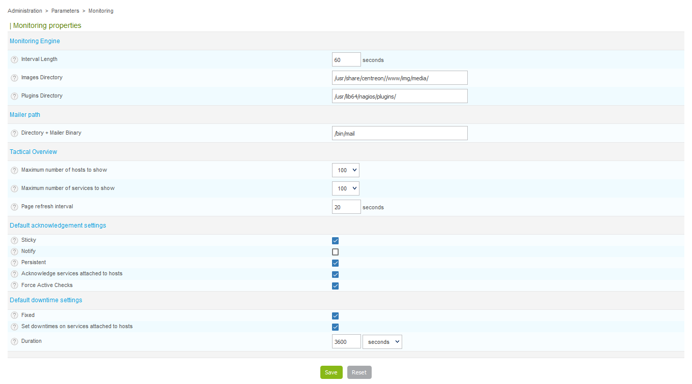

This section covers the general options of the real-time monitoring interface.

Go to **Administration > Parameters > Monitoring**.

- The **Interval Length** field indicates the time interval in seconds used to
program the checks and notifications
- The **Images Directory** field defines the image directory in which the media
are stored
- The **Plugins Directory** field defines the directory where monitoring plugins
are stored
- The **Start script for broker daemon** field contains the path to the init
script of the broker
- The **Directory + Mailer Binary** field contains the path to the executable file
for sending e-mails
- **Maximum number of hosts to show** is a deprecated field
- **Maximum number of services to show** is a deprecated field
- **Page refresh interval** is a deprecated field
- The boxes and fields in the **Default acknowledgment settings** and
**Default downtime settings** categories define the default options that will
be checked or not during definition of an acknowledgment or downtime
