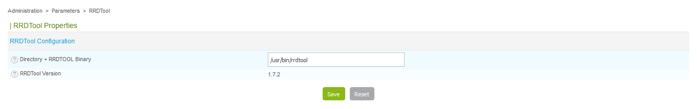

This procedure lets you define the path to the RRDTool binary.

Go to **Administration > Parameters > RRDTool**.

-  The **Directory + RRDTOOL Binary** field defines the path to the RRDTool
binary.
- The **RRDTool Version** tells you the version of RRDTool.
