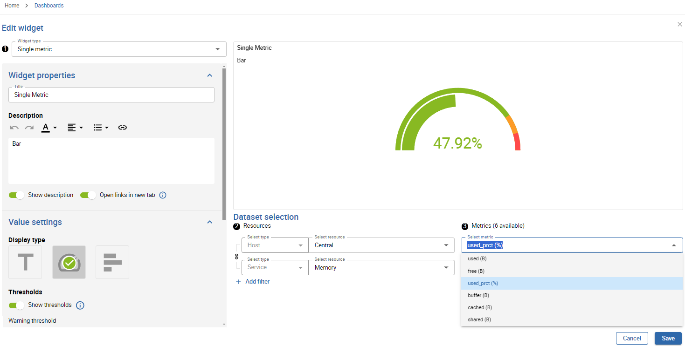

Get started with creating dashboards and adding widgets specially designed to optimize your user experience. Then benefit from data visualization options to display and monitor your resources in real time.

## Activating the Dashboards feature

Access to the Dashboards feature is not managed at the user level, but through access groups or ACLs (Access Control Lists). You allow users to access the feature by granting rights to the ACL to which they belong (read more [about ACLs](../administration/access-control-lists.md)).

### Configure the ACL

> - You must be logged into Centreon as an administrator.
- In this example, we will create a new ACL called **Dashboards users**. This ACL will contain users belonging to the **Guests** user group.

1. Go to **Administration > ACL > Menus Access**.
2. Click the **Add** button. This opens the **Add an ACL** form.
3. Name the **ACL Definition**. In this example: **Dashboards users**.
4. Select **Enabled** in the **Status** parameters.
5. Select the **Linked Groups** to include in this ACL. In this example: **Guests**.
6. In the **Accessible Pages** section, expand the **Home** menu, then the **Dashboards** one. This displays the list of profiles to select.

  > - **Viewer:** can only view dashboards to which they have access.
  > - **Creator:** can create and edit dashboards to which they have access.
  > - **Administrator:** can access and edit all dashboards.

7. Select the profile to be set for this ACL. In this example: **Viewer**.
8. Click **Save** to confirm your changes.

### Check the feature is activated

> You must have a user account with ACL rights to the Dashboards feature.

1. Log into Centreon.
2. You should see in the **Home** menu, the **Dashboards** entry.

## Creating your first dashboard

> You must be logged into Centreon with administrator or creator rights.

1. In the **Dashboard library** page, click the **Create a dashboard** button. This opens the **Create dashboard** window.
2. Name the dashboard and enter a description if needed.
3. Click **Create** to confirm the creation.

Your dashboard is now added! You can directly start adding widgets.

### Add widgets

> Your dashboard must be open in edition mode. 

- If this is your very first widget, click the **Add a widget** area.
- If not, click the **+ Add a widget** on the right of the interface.

Most of the widgets usually follow these steps: 

- **Step 1:** Select the type of widget. The widget parameters then depend on the widget you select.
- **Step 2:** Select resources.
- **Step 3:** Select metrics.

 > Make sure to save your changes. If you leave without saving your dashboard, changes will be permanently lost.

### More actions

Click the **three vertical dots** menu at the top right of the widget to edit it or to access more actions:
- Refresh
- Duplicate
- Delete widget

> In edition mode, you can easily organize your widgets by moving or resizing them. Make sure to save your changes.

### Link to Resources Status page

From the dashboard, you can click a screen pictogram at the top right of a widget: this button allows you to **See more on the Resources Status page**. It opens a new tab on the Resources Status page, with detailed information regarding the specific widget.

## Managing dashboards

> You must be in the **Dashboard library** page to get an overview of your dashboards.

### Edit a dashboard

#### Update properties

Click the **gear** button at the bottom right of the dashboard to update its name and description.

#### Edit dashboard widgets 

1. Click the dashboard to open it in view mode.
2. Click **Edit dashboard** to access and manage widgets in edition mode.

### Delete a dashboard

Click the **trash** button at the bottom left of the dashboard to delete it. Then confirm the deletion.

### Share a dashboard

> You can share dashboards using the **Manage access rights** interface.

#### About access rights

You are using the Dashboards feature with a **viewer** or an **editor** profile:

- **Viewers:** can only view dashboards you share with them.
- **Editors:** can view and edit dashboards you share with them.

#### Manage access rights

1. Click the **share** button at the bottom right of the dashboard.
2. In the **Add contact** dropdown list, select the user to add.
3. Select either **Viewer** or **Editor** profile.
4. Click the **+** button to add it.
5. Repeat the action for each user you want to add.
6. Click the **Update** button to save your changes.

The users you have just added now have access to your dashboard sharing, according to the profile you have set for them.

> Use the **Copy link** feature to share the dashboard URL directly with users who have access to your platform.

## Managing playlists

Playlists are lists of selected dashboards to be broadcast in the order of your choice. This feature is useful for instance when you want to display your dashboards on a full-screen TV in public spaces.

> This feature requires a valid [license](../administration/licenses.md) key. To purchase one and retrieve the necessary repositories, contact [Centreon](mailto:sales@centreon.com).

### Create a playlist

> Before creating a playlist, make sure the dashboards you want to include have been created.

1. Click the **Playlists** link to access the playlists interface.
2. Click the **Create a playlist** button (or the **Add** button if it is not your first playlist).
3. Fill in the properties:
   - **Name**
   - **Description** 
   - Add your dashboards from the **Select dashboards** drop-down list.
   - In the **Define the order of dashboards** section, drag and drop the dashboards as you want.
   - Define the rotation time in seconds.
4. Click **Save**.
Your playlist is now added to the list of playlist.

### Display the playlist

- From the **Playlists** interface, click the row for your playlist.
Your playlist is now displayed and a control banner appears when you hover over the bottom of the interface.

> Get a better visualization by displaying the page in full screen mode (F).

The control banner allows you to:
- Play/Pause the broadcast.
- Go to the previous or next dashboard.
- Go directly to a specific dashboard by clicking its name.

### Share the playlist

> You can only share your playlist with contacts who have access to your Centreon platform and are authorized Dashboards viewers.

- Click the **Share with contacts** button from the line of your playlist.
The **Playlist access rights** window is displayed.
- You can now add contacts or contact groups and define their rights as viewer or editor in the **Share with** section.
- Use the **trash** button in the **User rights** section to remove a contact or contact group.
- Use the **Copy link** button to share the playlist URL directly with users who have access to your platform.

### Edit/Delete a playlist

The three dots action menu at the end of a playlist row allows you to edit properties or delete the playlist.

## List of widgets

| Widget                   | Description                                                                                                                                                                                                                                                                                                    |
|--------------------------|----------------------------------------------------------------------------------------------------------------------------------------------------------------------------------------------------------------------------------------------------------------------------------------------------------------|
| Generic text           | Allows you to add free text to your dashboards (section titles, information, etc.).   |
| Group monitoring           | Displays the distribution of current statuses on selected groups of resources, as a table.   |
| MAP - Display a view            |  Allows you to select and visualize a map created from the MAP module.  |
| Metrics graph         | Displays metrics for a given time period.                                                                                |
| Resource table                 | Displays data on resource status and events, centralized in a table.
| Single metric          | Displays the value of a single metric as a text, a gauge or a bar chart.   |
| Status chart     | Displays the distribution of current statuses on selected resources, as a chart.      |
| Status grid     | Displays the current status of selected resources, as a grid.      |
| Top/bottom              | Displays the top or bottom x hosts, for a selected metric.   |
