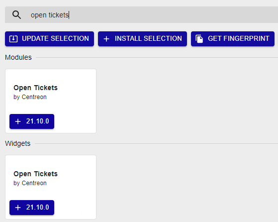

import Tabs from '@theme/Tabs';
import TabItem from '@theme/TabItem';

**Centreon Open Tickets** is a community module developed to create
tickets to an ITSM platform using APIs.

Once a provider is configured, the module allows for an operator to
create tickets for hosts and services in a non-ok state using a
dedicated widget. A button associated with each host or service
allows you to connect to the API and create the ticket while offering
the possibility to acknowledge the object at the same time.

Regarding the widget configuration, it is possible to see the created
tickets by giving the ID and creation date of the tickets.

## Installing packages

Execute the following command:

<Tabs groupId="sync">
<TabItem value="Alma / RHEL / Oracle Linux 8" label="Alma / RHEL / Oracle Linux 8">

``` shell
dnf install centreon-open-tickets
```

</TabItem>
<TabItem value="Alma / RHEL / Oracle Linux 9" label="Alma / RHEL / Oracle Linux 9">

``` shell
dnf install centreon-open-tickets
```

</TabItem>
<TabItem value="Debian 11 & 12" label="Debian 11 & 12">

``` shell
apt install centreon-open-tickets
```

</TabItem>
</Tabs>

## UI installation

After installing the rpm, you must complete the installation of the module
through the web frontend. Go to the **Administration > Extensions > Manager**
menu and search **Open Tickets**. Click **Install selection**:



Your Centreon Open Tickets Module is now installed.

