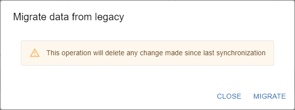

This topic describes how to move from Centreon MAP (Legacy) to Centreon MAP by importing your legacy maps into your MAP module.

## Requirements

- Centreon MAP must be installed in your environment. See the [MAP installation](map-web-install.md) procedure if needed.

- Before you start the procedure to import legacy maps into MAP, you need to switch from MAP (Legacy) to MAP by [activating the MAP module](./map-web-install.md#step-3-activate-the-map-module).

- In case you want to install MAP on the same server as MAP (Legacy), you need to make sure that free disk space is at least equal to used space. This is because after migration, the new database will coexist with the legacy one.

## Importing legacy maps into MAP

> When you import your legacy maps, any content created in MAP is deleted.

### Step 1: Install MAP

You need first to install Centreon MAP. Go to this [page](map-web-install.md) to perform the installation and switch to the MAP Engine server.

### Step 2: Update MAP (Legacy)

For the icons to be displayed properly after you migrate your maps, you need to update your MAP (legacy) by running the following commands:

```shell
systemctl stop centreon-map
yum update centreon-map-server
systemctl daemon-reload
systemctl start centreon-map
```

### Step 3: Migrate maps

1. To import your legacy maps into MAP, go to the **Monitoring > Map** page, then click the **Migrate** button. The following window appears:

  

2. Click **Migrate**.
 
  

3. When the migration has succeeded, you can close the window.

  Your legacy maps are now displayed on the **Map** page. 

## About images

If you had imported images into your MAP (Legacy) desktop client in the **Medias** panel, note that the migration process has also migrated them automatically to Centreon MAP.

The following example explains how the name of the image file is set after the migration:

- In MAP Legacy, your image was located in the **Medias** panel as follows:
  
  ```shell
  countries > france > hardware > hardware_green.png
  ```

- After the migration, this image will be located in Centreon in **Administration > Parameters > Images**, as follows:
 
  ```shell
  countries_france_hardware > hardware_green.png
  ```
