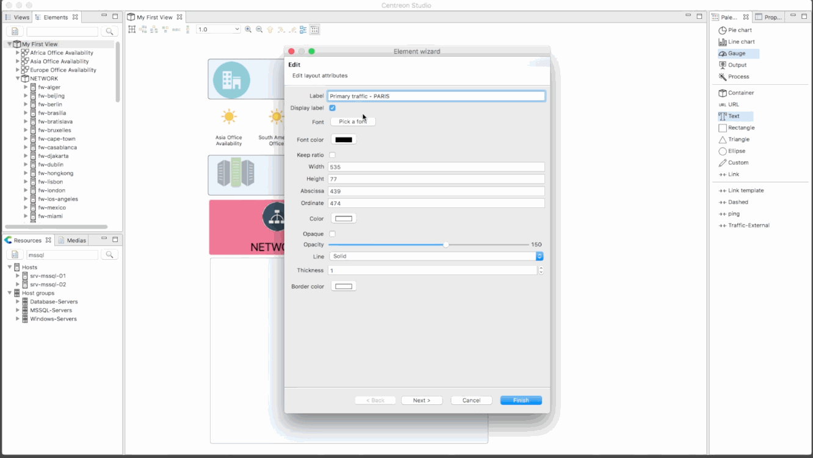
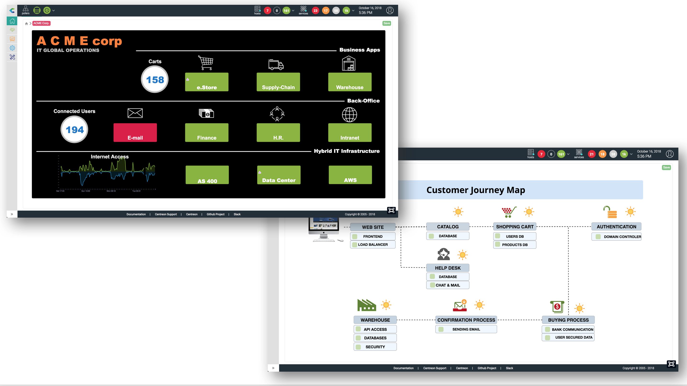

> **From Centreon 24.10, MAP Legacy will no longer be available.** If you are still using MAP Legacy, you will need to migrate to MAP. See [MAP Legacy end of life](https://docs.centreon.com/docs/graph-views/map-legacy-eol/).

Centreon MAP is a data-mapping and visualization tool designed for IT
Operations management (ITOM) administrators and developers. It is
capable of displaying efficient graphic insights and mapping correlated
data in customized user-relevant views.

> Centreon MAP is a Centreon extension that requires a valid [license](../administration/licenses.md).
> To purchase one and retrieve the necessary repositories, contact [Centreon](mailto:sales@centreon.com).

## Overview

Here is an overview of MAP (Legacy). You need first to create logical views using the Desktop client:

Then you can visualize them directly in your browser:

You can also use the geographical view to display resources in the way your IT is spread
over a city, country or world:

Both types of view may be displayed in the same Centreon web user interface:

- Either from the Centreon MAP dedicated user interface, which also includes a search facility.
- Or within a Custom View, using the dedicated Centreon MAP widget.

## Procedures

Use the following procedures to administrate and use Centreon MAP (Legacy).

### Administrating MAP (Legacy)
  - [Installing Centreon MAP (Legacy) extension](install.md) describes prerequisites and procedures to install the MAP (Legacy), also named Map4 desktop client.
  - [Installing on a remote server](remote-server.md) explains how to install MAP (Legacy) on a remote server.
  - [Updating the extension](update.md) describes the update process for MAP (Legacy).
  - [Upgrading the extension](upgrade.md) describes the update process for  MAP (Legacy).
  - [Migrating the extension](migrate.md) describes how to move the MAP (Legacy) server to another server.
  - [Configuring rights](configuration.md) explains how to administer users� rights and describes customization settings.
  - [Advanced configuration](advanced-configuration.md) describes advanced procedures to configure MAP (Legacy).
  
### Using MAP (Legacy)
  - [Creating a standard view](create-standard-view.md) using MAP (Legacy). This topic also describes best practices and limitations.
  - [Creating a geo view](create-geo-views.md) using the web interface. This procedure explains how to display your resources across a defined geographical area.
  - [Displaying views](display-view.md) from the web interface. This topic also describes dedicated features.
  - [Sharing a view](share-view.md) allows you to share views to a limited audience.
  - [MAP (Legacy) known issues](known-issues.md) is a list of issues you may encounter using MAP (Legacy).
  - [MAP (Legacy) troubleshooting](troubleshooter.md) helps you to solve some issues occurring in MAP (Legacy).
