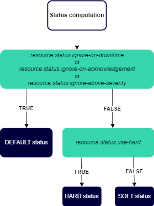

## Define status computation parameters

Centreon MAP Engine gives you the possibility to customize how the inherited status is computed and rendered in views. You may use the following parameters to adapt the behavior of inherited status computation to your use case.

### What's an inherited status?

An inherited status is a Centreon MAP custom status associated with some objects that is based on the worst status of its children. Here are the rules:

- A host has two statuses: its own status (up/down/pending) and an inherited status that is based on the worst status of its services.
- A hostgroup only has an inherited status corresponding to the worst status of its children (hosts, services).
- A servicegroup has only an inherited status: the worst status of its children (services).
- A container has only an inherited status: the worst status of its children (hosts, services, meta-services, hotsgroups, servicegroups, BA, widgets).

### Status computation parameters

| Parameter                           | Possible value | Default value | Description                                                                                  |
| ----------------------------------- | -------------- | ------------- | -------------------------------------------------------------------------------------------- |
| resource.status.use-hard              | true or false  | false         | Only use hard status value for inherited status propagation                                   |
| resource.status.ignore-on-downtime  | true or false  | false         | Do not propagate state for resources in downtime and use the default status                                            |
| resource.status.ignore-on-acknowledgement | true or false  | false         | Do not propagate state for acknowledged resources and use the default status                                           |
| resource.status.ignore-above-severity    | integer        | max value           | Do not propagate state for resources having severity superior to this value and use the default status                 |

If the parameter (downtime, acknowledgement, severity) has the following value:
- **true**: the HARD status value (use-hard parameter) is not used but the DEFAULT one is.
- **false**: if the HARD status is true, then the HARD status is used. If the HARD status is false, then the SOFT status is used.

The diagram below summarizes how the status is computed:

### Edit parameters

- You can configure these parameters in the **/etc/centreon-map/map-config.properties** file.

- If you add, remove or update a parameter, make sure to restart **centreon-map-engine**.
