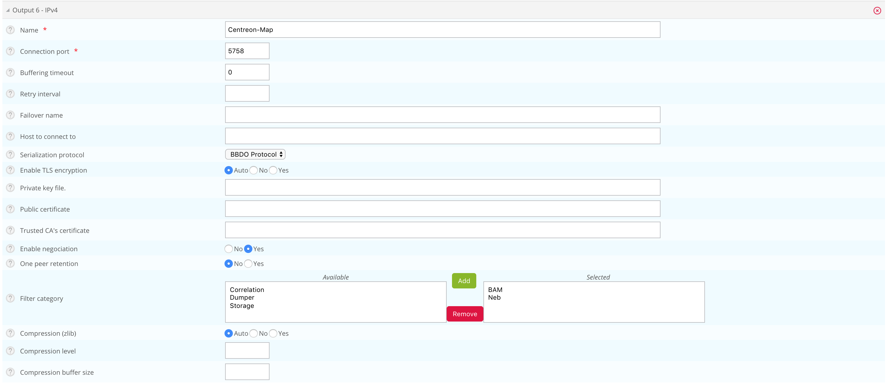

> As MAP (Legacy) will no longer evolve, we suggest you install [Centreon MAP](introduction-map.md) instead. MAP has significant advantages compared to MAP (Legacy), including:
- Web editor: Create and edit your views directly from your web browser.
- New server: Brand new server and data model providing better performance.

## Centreon MAP (Legacy) installation for a Centreon remote server

Installation of Centreon MAP (Legacy) extension on a Centreon
remote server is done exactly like the installation on a
central server, but configuration and uninstallation are different.

If your Centreon remote server has not been installed yet, please refer to
the following
[documentation](../installation/installation-of-a-remote-server/using-packages.md)

Then refer to the [installation procedure](install.md) to install
the two main components:

- The web interface.
- The server.

After that, you will have to perform the additional steps explained below, to finish
installing Centreon Map on your remote server.

## Image synchronization

Add an access to the image synchronization page **Administration  >  Parameters  >  Images**:
```shell
[root@remote ~]# mysql centreon
MariaDB [centreon]> update topology SET topology_show='1' where topology_name='Images' ;
```

## Centreon Broker configuration

In order to display real time statuses, **Centreon MAP (Legacy)** needs to receive this data from the Centreon remote server's Broker.

To do so, you need to log in to your central server and modify the Centreon Broker Master configuration of the
Centreon remote poller. Go to the **Configuration > Pollers > Broker
configuration** menu and edit the **remote server's** configuration.

In the **Output** tab, create a new output with the following parameters:



To complete the installation process, generate and deploy the Centreon remote
server configuration by selecting **Restart**.

## Uninstalling Centreon MAP (Legacy)

On a remote poller, you can uninstall the **Centreon MAP (Legacy)** module the same
way as on the Centreon central server. All Centreon Broker configurations for the Centreon remote server linked to the Centreon
MAP (Legacy) module must be removed manually. Look at the [Centreon Broker configuration](#centreon-broker-configuration) section above to know what output you need to delete for your Centreon remote server(s).
