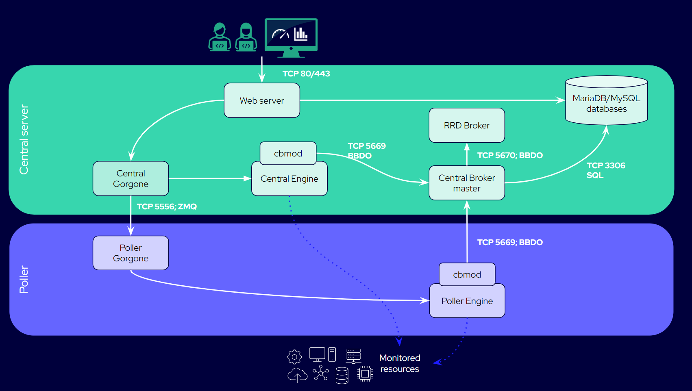

import Tabs from '@theme/Tabs';
import TabItem from '@theme/TabItem';

Here are the bricks that make Centreon work. To find out on which port each brick communicates, see the [Tables of network flows](https://docs.centreon.com/docs/installation/technical/#tables-of-network-flows).

## Schema of a central server

<Tabs groupId="sync">
<TabItem value="Central server with poller" label="Central server with poller">

In this example, we have a central server (without any Business modules installed), and a poller that is directly attached to it.

</TabItem>
</Tabs>

## Elements of a Centreon setup

### Engine

* **Engine**, (the monitoring engine, i.e. the centengine process) is the heart of Centreon: it plans checks, executes them, and [notifies users](https://docs.centreon.com/docs/alerts-notifications/notif-concept.md) if an incident occurs.
* Checks and notifications are done according to the configuration made by users.
* Centreon Engine is present on each server in your [architecture](https://docs.centreon.com/docs/installation/architectures.md): [pollers, remote servers and the central server](https://docs.centreon.com/docs/platform.md).
* To configure Engine, go to **Configuration > Pollers > Engine configuration**. This is for advanced users only.

### cbmod

* Engine’s companion module, **cbmod**, transforms engine events into Broker events, and sends all the data to Broker.
* Events can be check results, a [downtime](https://docs.centreon.com/docs/alerts-notifications/downtimes.md), an [acknowledgment](https://docs.centreon.com/docs/alerts-notifications/acknowledge.md), a change in the configuration.
* **cbmod** is a type of [broker](#broker) and can be configured like any Broker using the **Configuration > Pollers > Broker configuration** page.

### Broker

* There are in fact 2 Brokers: 1 **master broker** and 1 **RRD broker**.
* Only central servers and remote servers contain Brokers.
* Engine sends data to the master Broker:
   * The master Broker writes the data in the [MariaDB/MySQL databases](#a-mariadbmysql-database).
   * It sends a copy of [metrics](https://docs.centreon.com/docs/monitoring/metrics.md) and [statuses](https://docs.centreon.com/docs/alerts-notifications/concepts.md) to the RRD Broker so that it can write them to the [RRD database](#a-rrd-databaserrd-files).
* The data is sent in BBDO format.
* Each Broker has inputs and outputs that you can configure. By default, Broker is installed with mostly IPv4 inputs and outputs (in fact, an IPv4 output to the RRD database and a Unified SQL output to the MariaDB/MySQL database). However, it is recommended to set up a BBDO client and server between Engine and the master Broker, as they are easier to configure.
* To configure a Broker, use the **Configuration > Pollers > Broker configuration** page.
* If you decide that your master Broker is going to [receive data in HTTPS](https://docs.centreon.com/docs/monitoring/monitoring-servers/advanced-configuration.md#centreon-broker-flow-authentication), then you need to configure each Engine that talks to it in HTTPS too.

See also:

* [Centreon Broker in the Developer resources section](https://docs.centreon.com/docs/developer/developer-centreon-broker.md).
* [Advanced configuration of Centreon Broker](https://docs.centreon.com/docs/monitoring/monitoring-servers/advanced-configuration.md#advanced-configuration-of-centreon-broker).

### Gorgone

* **Gorgone** is present on the central server, on your remote servers and on your pollers.
* Gorgone allows the interface to talk to the Engine of the central server, and to talk to the Engines of your remote servers and pollers, synchronizing data between them.
* Configuration data is transferred from the central to the engines of the pollers and remote servers in ZMQ format.
* When you [deploy the configuration](https://docs.centreon.com/docs/monitoring/monitoring-servers/deploying-a-configuration.md), Gorgone takes the files that are generated and copies them to all the engines of the pollers and remote servers, and reloads these.

See also [Centreon Gorgone in the Developer resources section](https://docs.centreon.com/docs/developer/developer-centreon-gorgone.md).

### A MariaDB/MySQL database

The MariaDB or MySQL database contains 2 databases:

   * **centreon** that contains the configuration (i.e. all the objects users have created: hosts, services, etc).
   * **centreon_storage** that contains all the real-time data received by Broker : performance data ([metrics](https://docs.centreon.com/docs/monitoring/metrics.md)), [statuses](https://docs.centreon.com/docs/alerts-notifications/concepts.md) and [states](https://docs.centreon.com/docs/alerts-notifications/concepts.md#states) and the date and time of any change in them, acknowledgements, downtimes.

The MariaDB or MySQL database can be included in your central server, or [remote](https://docs.centreon.com/docs/installation/architectures.md#architecture-with-remote-dbms).

### A RRD database/RRD files

The RRD files contain performance data (metrics) and statuses, and are used to generate the graphs you can see on the Resource status page.
Metrics and statuses stored there are a copy of those stored in **centreon_storage**, used for performance reasons. If for some reason you have lost your graphs, you can [rebuild your RRD database](https://docs.centreon.com/docs/administration/backup.md#graphs-rebuild) from the **centreon_storage** database.

### A web server

The web server (**httpd** process) serves the graphical interface to users. It sends events to the MariaDB/MySQL databases, and to Gorgone.

## Example : what happens when a host is created?

1. A user creates a host in the interface of the central server (using the **Configuration > Hosts > Host**s page).
2. The configuration is written in 2 places:
   * **httpd** sends the configuration of the host to the **centreon** database (inside MariaDB or MySQL).
   * Gorgone??
3. The user [deploys the configuration](https://docs.centreon.com/docs/monitoring/monitoring-servers/deploying-a-configuration.md):
   * Gorgone takes the files that are generated and copies them to all the engines of the pollers and remote servers, and reloads these.
