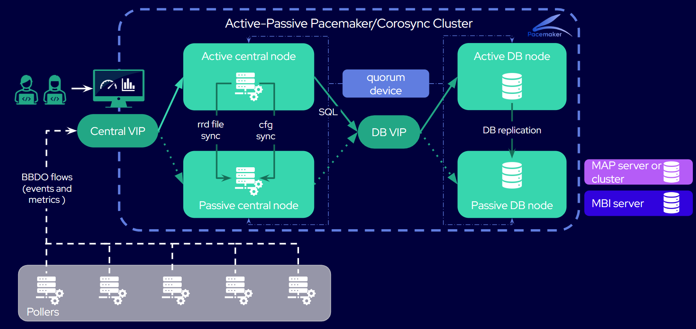

import Tabs from '@theme/Tabs';
import TabItem from '@theme/TabItem';

## Schema of a Centreon HA cluster

## What are the elements of Centreon HA?

Centreon HA consists of a set of clustering tools on top of twin Centreon central servers that manage pollers (in a [distributed architecture](https://docs.centreon.com/docs/installation/architectures/#distributed-architecture)), with remote twin databases. The HA tools manage the processes that would normally be managed by the central servers or the databases themselves. In this HA context, these processes are called "resources".

* There are 5 members in a Centreon HA cluster:

   * 2 Centreon central servers: one active node, one passive node. Thanks to synchronization scripts, the same data will exist on both servers so that if the active node goes down, the passive node will take its place. The central servers do not monitor your resources (the pollers do). In this documentation, we will call the central servers "central node 1" and "central node 2" to differentiate them: bear in mind that both of them can have the role of active or passive node.
   * 2 database nodes. They are remote, replicated databases. There is one active database node and one passive database node, and all of the data is synchronized from one node to another.
   * 1 server called "quorum device", whose sole purpose is to decide which central server/database is the active node and which is the passive node. This is mandatory to avoid split-brain issues. You can define one of your pollers as the quorum device.

   > Although the Centreon HA cluster is technically one cluster with 5 members, it actually works as two independent 2-node clusters: a central cluster and a database cluster (plus a server that acts as a quorum device for both clusters). Location constraints define that only Centreon processes run on the central nodes, and only database processes run on the database nodes. The central server cluster and the database cluster are independent: the database cluster fails over only when the active database node goes down, not when the active central node fails over.

* Clustering tools:
   - Centreon high availability scripts, contained in the **centreon-ha-web** package. They include the **centreon_central_sync** service, that synchronizes all the necessary Centreon processes ("resources"). Also, in the **centreon-ha-common** package, scripts manage the replication of the database and the automation of its failover process.
   - Corosync: allows the members of the cluster to communicate in real time, to check if the active nodes are up, and take the decision to failover if needed (for the central servers or for the databases).
   - Pacemaker: starts, stops and controls the state of Centreon processes. You need to tell Pacemaker which processes should be checked: these processes are called "resources".
      - crm_mon: a command-line tool that allows you to know the state of the cluster in real time.
      - pcs: a command-line tool that allows you to configure Corosync and Pacemaker.

* Pollers, which do the actual monitoring.

* A "central [VIP](https://docs.centreon.com/docs/resources/glossary/#vip)" to which the pollers send the collected data, so that the VIP can forward the data to the current active central node.

* A "database VIP" to which the active central node sends the data, so that the VIP can forward the data to the current active database node.

## What processes are managed by Centreon HA?

Here is the list of processes (resources) that will be managed by the HA tools in the central cluster:

* Central server applicative daemons
  * centreon-engine (scheduler)
  * centreon-broker (multiplexer)
  * centreon-gorgone (task manager)
  * all configuration files (replicated using the centreon-central-sync process)
  * snmptrapd and centreontrapd (system and applicative trap management processes)
* Central Server third-party daemons
  * php-fpm
  * Apache server (webserver)

All these resources are described in the table below.

* Clone resources run on both active and passive nodes.
* Unique resources (primitive services), part of the `centreon` functional group, run on only one node.

### Central cluster

| Name                    | Type                 | Description                                          |
| ----------------------- | -------------------- | ---------------------------------------------------- |
| `php`                   | clone service        | FastCGI Process Manager service (`php-fpm`)          |
| `cbd_rrd`               | clone service        | Broker RRD service (`cbd`)                           |
| `centreon`              | group                | Centreon "primitive services" group                  |
| `vip`                   | primitive service    | VIP address for the central cluster                  |
| `http`                  | primitive service    | Apache service (`httpd24-httpd`)                     |
| `cbd_central_broker`    | primitive service    | Central Broker service (`cbd-sql`)                   |
| `gorgone`               | primitive service    | Gorgone service (`gorgoned`)                         |
| `centreon_central_sync` | primitive service    | File synchronization service                         |
| `centengine`            | primitive service    | Centreon-Engine service (`centengine`)               |
| `centreontrapd`         | primitive service    | SNMP Traps management service (`centreontrapd`)      |
| `snmptrapd`             | primitive service    | SNMP Traps listening service (`snmptrapd`)           |

**Note:** The resources of the `centreon` group are started one after the other in the list order.

### Database cluster

| Name                    | Type                 | Description                                          |
| ----------------------- | -------------------- | ---------------------------------------------------- |
| `ms_mysql`              | multi-state resource | Handles the `mysql` process and performs data replication between the two databases     |
| `ms_mysql-master`       | location             | Defines which database is the active node            |
| `vip_mysql`             | primitive service    | VIP address for the database cluster                 |

## Active/passive nodes or master/slave nodes?

In this chapter, we will refer to active/passive nodes. You may notice that the output of some commands use the terms master and slave: these are Pacemaker and Corosync terms. Master means the active node and slave the passive node.
