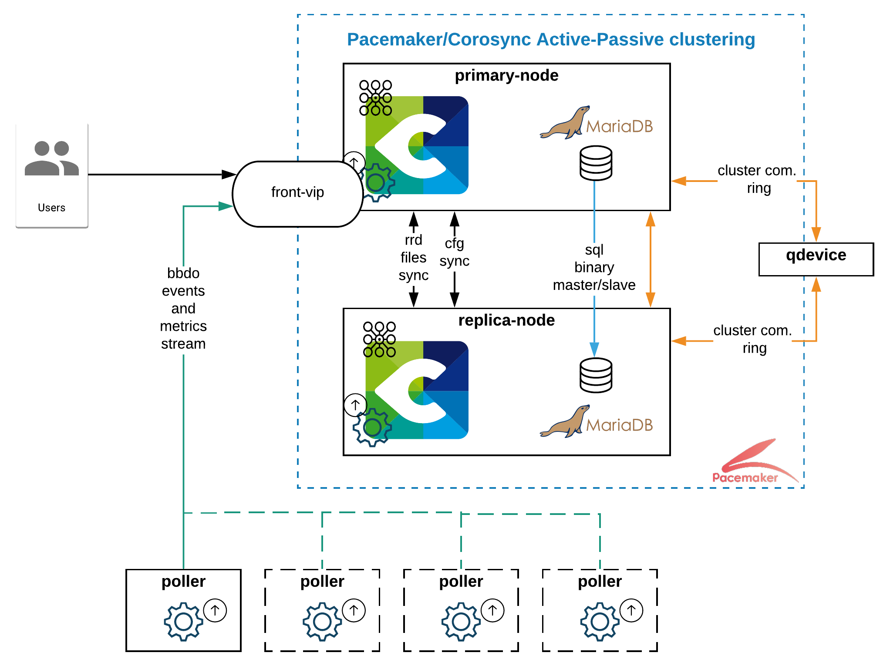

import Tabs from '@theme/Tabs';
import TabItem from '@theme/TabItem';

## What are the elements of Centreon HA?

Centreon HA consists of a set of clustering tools on top of twin Centreon central servers that manage pollers (in a [distributed architecture](../../installation/architectures.md#distributed-architecture)).

* Members of the Centreon HA cluster:

   * 2 Centreon central servers: 1 active node, 1 passive node. Thanks to synchronization scripts, the same data will exist on both servers so that if the active node goes down, the passive node will take its place. The central servers do not monitor your resources (the pollers do). In this documentation, we may call the central servers "node 1" and "node 2" to differentiate them: bear in mind that both of them can have the role of active or passive node.
   * 1 server called "quorum device", whose sole purpose is to decide which central server is the active node and which is the passive node. This is mandatory to avoid split-brain issues. You can define one of your pollers as the quorum device.

* Clustering tools:
   - Centreon high availability scripts, contained in the **centreon-ha-web** package. They include the **centreon_central_sync** service, that synchronizes all the necessary processes ("resources").
   - Corosync: allows the members of the cluster to communicate in real time, to check if the active node is up, and take the decision to failover if needed.
   - Pacemaker: starts, stops and controls the state of Centreon processes. You need to tell Pacemaker which processes should be checked: these processes are called "resources".
      - crm_mon: a command-line tool that allows you to know the state of the cluster in real time.
      - pcs: a command-line tool that allows you to configure Corosync and Pacemaker.

* Pollers, which do the actual monitoring.

* A VIP, to which the pollers send the data, so that the VIP can forward the data to the current active node.

* Remote databases. Setting up redundancy for the database is [the responsibility of the customer](faq.md#what-is-supported-and-what-isnt). The [installation procedure](installation.md) describes the case where you already have a database cluster set up. The Centreon cluster and the database cluster are independent. The Centreon cluster communicates with the database cluster through a dedicated VIP.

## How does the HA cluster work?

In an HA cluster, all processes ("resources") are managed by the clustering tools (Pacemaker and Corosync).

1. Everything is OK : Node 1 (the current active node) receives data from the pollers, and all relevant files are synchronized by a dedicated script  (**centreon_central_sync**) onto node 2 (the current passive node) so that the passive node is ready to become the active node at all times.
2. An incident occurs and node 1 (the active node) goes down.
   - Corosync detects that it is down: after consulting with the quorum device, it tells node 2 to become the active node.
   - An operator is notified that node 1 is down, thanks to the Centreon monitoring that has been set up on the poller.
3. Node 2 is now the active node. It receives data from the pollers. During this time, the operator tries to understand why node 1 is down. They must fix the problem using the cluster management tool pcs, not by manipulating node 1 directly.
4. Node 1 is fixed and comes back online. The **centreon_central_sync** script synchronizes all relevant files from node 2 to node 1, so that node 1 can catch up on what has happened during its down time. Node 1 is ready to become the active node if node 2 goes down.

## How do I know the state of the cluster?

The installation procedure includes a step where you set up the monitoring of the members of the cluster by a poller. This way, you can be notified if a member of the cluster goes down.

You access the interface of the active node via the IP address of the VIP. This means that you always use the same URL to access the interface, whether the interface is that of node 1 or of node 2.

You can also [know the state of the cluster at all times](../../administration/centreon-ha/operating-guide.md#display-the-status-of-the-cluster) by using the `crm_mon` command, or the `pcs status`command.

## What processes are synchronized by Centreon HA?

Here is the list of processes (resources) that will be managed by the HA tools:

* Central server applicative daemons
  * centreon-engine (scheduler)
  * centreon-broker (multiplexer)
  * centreon-gorgone (task manager)
  * all configuration files (replicated using the centreon-central-sync process)
  * snmptrapd and centreontrapd (system and applicative trap management processes)
* Central Server third-party daemons
  * php-fpm
  * Apache server (webserver)

All these resources are described in the table below.

* Clone resources run on both active and passive nodes.
* Unique resources (primitive services), part of the `centreon` functional group, run on only one node.

| Name                    | Type                 | Description                                          |
| ----------------------- | -------------------- | ---------------------------------------------------- |
| `php8`                  | clone service        | FastCGI Process Manager service (`php-fpm`)          |
| `cbd_rrd`               | clone service        | Broker RRD service (`cbd`)                           |
| `centreon`              | group                | Centreon "primitive services" group                  |
| `vip`                   | primitive service    | VIP address for centreon                             |
| `http`                  | primitive service    | Apache service (`httpd24-httpd`)                     |
| `gorgone`               | primitive service    | Gorgone service (`gorgoned`)                         |
| `centreon_central_sync` | primitive service    | File synchronization service                         |
| `cbd_central_broker`    | primitive service    | Central Broker service (`cbd-sql`)                   |
| `centengine`            | primitive service    | Centreon-Engine service (`centengine`)               |
| `centreontrapd`         | primitive service    | SNMP Traps management service (`centreontrapd`)      |
| `snmptrapd`             | primitive service    | SNMP Traps listening service (`snmptrapd`)           |

**Note:** The resources of the `centreon` group are started one after the other in the list order.

## Active/passive nodes or master/slave nodes?

In this chapter, we will refer to active/passive nodes. You may notice that the output of some commands use the terms master and slave: these are Pacemaker and Corosync terms. Master means the active node and slave the passive node.
