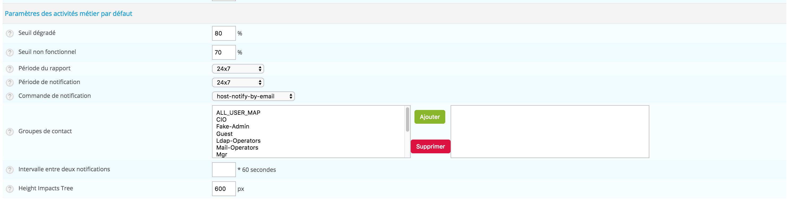

## Default Settings

The default settings are conveniently prefilled to assist you in
creating new BAs and indicators (KPIs). They can be found in
`Monitoring > Business Activity > Default Settings`

### Impact settings

The following parameters correspond to the default values behind the *Weak*,
*Minor*, *Major*, *Critical* and *Blocking* impact types when configuring
indicators in *Regular* mode.

Impact types must be defined as a percentage.

### Business Activity and Boolean rule impact settings

These default parameters are used for prefilling the fields for **Business
Activity** or **Boolean rule**-type indicators in *Advanced* mode.

### Business Activity settings

The default parameters below define values for BAs.

| Column                   | Description                                                                                           |
| ------------------------ | ----------------------------------------------------------------------------------------------------- |
| Warning Threshold        | *Warning* threshold: Corresponds to a warning condition of the BA. A notification can then be sent.   |
| Critical Threshold       | *Critical* threshold: Corresponds to a critical condition of the BA. A notification can then be sent. |
| Reporting Period         | Time Default BA reporting time period                                                                 |
| Notification Time Period | Default BA notification time period                                                                   |
| Contact Groups           | Default BA notified contact groups                                                                    |
| Notification Interval    | Default BA notification interval                                                                      |
| Height Impact Tree       | Default height for window showing impact tree                                                         |

To be able to notify user/external solutions (Slack, OpenDuty etc..) belonging
to the contact group you defined, you must configure the dedicated Business
Activity notification section in the user's form:

## User settings

The **User Settings** are personalized options that belong to each user profile,
you can configure it in **Monitoring > Business Activity > User Settings**.

### Custom Overview

By default, the Centreon BAM module displays the monitoring console with
all authorized BAs. However, the user has the possibility to compose their
own overview by adding the BAs of their choice, chosen from those that are
authorized.

