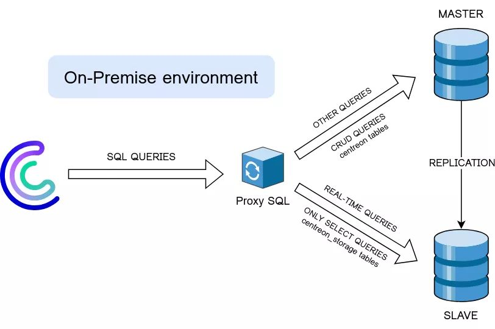

> This procedure concerns very large production environments with numerous users, that face interface response time issues.

When the Centreon platform monitors numerous services and the web application places heavy demands on the real-time database, Broker may have difficulty recording all the metrics. This will create retention files, resulting in a delay between the receipt of new statuses and their availability in the web interface.

The aim of this procedure is to reduce the database load by redirecting part of the requests to a second database server.

The aim is to relieve the real-time database (**centreon_storage**) and avoid Broker retention. All read queries (SELECT) to the real-time database will be redirected to the replicated database.

The minimal use case consists in setting up database replication. To ensure proper routing, we will install an SQLproxy server between the Centreon platform and the databases.



Your architecture will contain the three following elements:

* a central server, with ProxySQL installed on it
* the main database (which will be a remote database, as this is a high-volume platform)
* a secondary database.

> In the event of failure, ProxySQL will not be able to handle database failover automatically, and your site will no longer be functional, so it is up to you to set up a failover strategy.
> You'll need to redirect all SQL queries to your new SQL Master server as quickly as possible, while your incident is being resolved.

> We strongly recommend using FQDNs rather than fixed IP addresses.

## Installation

To make it possible to distribute queries, we'll be using [ProxySQL](https://proxysql.com/).

1. On the central server, [download and install](https://proxysql.com/documentation/installing-proxysql/) the correct version of ProxySQL for your OS.

2. Start the service :

   ```shell
   service proxysql start
   ```

## Configuration

### Proxy SQL

1. On the central server, connect to ProxySQL (the default password is **admin**):

   ```shell
   mysql -h127.0.0.1 -uadmin -P6032 -p
   ```

2. In ProxySQL, define the IP addreses for the two SQL servers (Master & Slave). As a reminder, the Slave SQL server will receive all read queries (SELECT) related to real-time data.

   ```shell
   INSERT INTO mysql_servers (hostgroup_id, hostname) VALUES (0, ip_SQL_server_master);
   INSERT INTO mysql_servers (hostgroup_id, hostname) VALUES (1, ip_SQL_server_slave);
   ```

   Example :

   ```shell
   INSERT INTO mysql_servers (hostgroup_id, hostname) VALUES (0, "192.168.0.2");
   INSERT INTO mysql_servers (hostgroup_id, hostname) VALUES (1, "192.168.0.3");
   ```

3. Create the user who will connect to both servers. This user must be identical on ProxySQL and on your two databases.

   ```shell
   INSERT INTO mysql_users (default_hostgroup, username, password) VALUES (0, SQL_user_login, SQL_user_password);
   ```

   Example :

   ```shell
   INSERT INTO mysql_users (default_hostgroup, username, password) VALUES (0, "centreon", "centreon");
   ```

   (The value **0** assigned to the **default_hostgroup** property corresponds to the index of the SQL Master server. This indicates the default destination server for all SQL queries.)

4. Specify which SQL queries should be redirected to the SQL Slave server:

   ```shell
   INSERT INTO mysql_query_rules (rule_id, active, match_digest, destination_hostgroup, apply) VALUES (1, 1, '.*? AS REALTIME.*', 1,1);
   INSERT INTO mysql_query_rules (rule_id, active, match_digest, destination_hostgroup, apply) VALUES (2, 1, '^SELECT.*FOUND_ROWS\(\).*AS.*REALTIME$', 1,1);
   ```

   **Explanation**: All real-time queries that can be routed by the proxy server contain the **REALTIME** keyword. The above queries contain regexes to identify real-time requests coming from Centreon.

   (The value **1** assigned to the **destination_hostgroup** property corresponds to the index of the previously defined server (SQL Slave server). This indicates the destination server for all real-time SQL queries.)

5. Run the following commands so that ProxySQL takes the new configuration into account.

   ```shell
   LOAD MYSQL SERVERS TO RUNTIME;
   LOAD MYSQL USERS TO RUNTIME;
   LOAD MYSQL QUERY RULES TO RUNTIME;
   ```

6. Save the configuration so that it is retained if the ProxySQL server is restarted.

   ```shell
   SAVE MYSQL SERVERS TO DISK;
   SAVE MYSQL USERS TO DISK;
   SAVE MYSQL QUERY RULES TO DISK;
   ```

### Centreon

Once the ProxySQL server has been correctly configured, modify the Centreon configuration so that all queries go through ProxySQL.

1. Make a backup of the **/etc/centreon/centreon.conf.php** file.

2. Open **/etc/centreon/centreon.conf.php**, then change the IP addresses for the two databases, and the connection port.

   ```shell
   $conf_centreon['hostCentreon'] = ip_serveur_proxy;
   $conf_centreon['hostCentstorage'] = ip_serveur_proxy;
   $conf_centreon['port'] = "6033";
   ```

Example :

   ```shell
   $conf_centreon['hostCentreon'] = "127.0.0.1";
   $conf_centreon['hostCentstorage'] = "127.0.0.1";
   $conf_centreon['port'] = "6033";
   ```